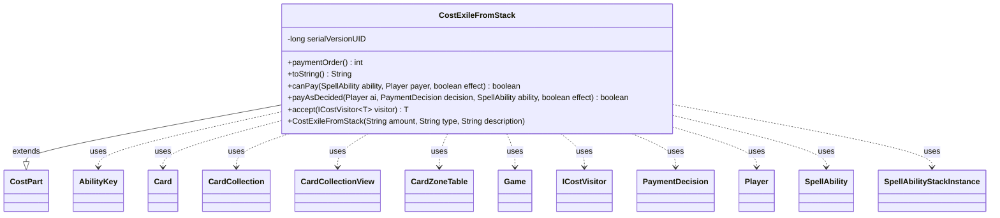

---
aliases:
  - CostExileFromStack
tags:
  - java/class
  - module/forge-game
  - pkg/forge/game/cost
fqn: forge.game.cost.CostExileFromStack
package: forge.game.cost
module: forge-game
kind: Class
---

# CostExileFromStack

**Package:** `forge.game.cost` &nbsp; **Module:** `forge-game` &nbsp; **Kind:** Class



## Relationships
**Extends:**
- [[forge.game.cost.CostPart|CostPart]]
**Uses:**
- [[forge.game.Game|Game]]
- [[forge.game.ability.AbilityKey|AbilityKey]]
- [[forge.game.card.Card|Card]]
- [[forge.game.card.CardCollection|CardCollection]]
- [[forge.game.card.CardCollectionView|CardCollectionView]]
- [[forge.game.card.CardZoneTable|CardZoneTable]]
- [[forge.game.cost.ICostVisitor|ICostVisitor]]
- [[forge.game.cost.PaymentDecision|PaymentDecision]]
- [[forge.game.player.Player|Player]]
- [[forge.game.spellability.SpellAbility|SpellAbility]]
- [[forge.game.spellability.SpellAbilityStackInstance|SpellAbilityStackInstance]]

## Design Description

CostExileFromStack is a concrete cost component representing the act of exiling one or more spells or abilities from the stack as part of paying for a spell or ability. Extending the abstract `CostPart` base, it slots into Forge's composite cost-payment framework: it parses an amount and a card-type filter, reports a `paymentOrder` of 15 to sequence itself among other cost parts, and renders a human-readable "Exile … from stack" label.

Its core behavior is split between `canPay`, which validates that enough matching cards exist in the `Stack` zone (short-circuiting on the special "All" type), and `payAsDecided`, which executes a `PaymentDecision`: it copies each chosen spell's host card for cost-tracking, removes the matching `SpellAbilityStackInstance` from the game stack, then exiles the cards via `Game`'s action layer using an `AbilityKey` move-params map and a `CardZoneTable` to batch and fire zone-change triggers. The `accept` method participates in a visitor pattern over cost types via `ICostVisitor`, keeping cost-specific algorithms decoupled from the cost hierarchy.

## Source
`forge-game/src/main/java/forge/game/cost/CostExileFromStack.java`

```java
/*
 * Forge: Play Magic: the Gathering.
 * Copyright (C) 2011  Forge Team
 *
 * This program is free software: you can redistribute it and/or modify
 * it under the terms of the GNU General Public License as published by
 * the Free Software Foundation, either version 3 of the License, or
 * (at your option) any later version.
 * 
 * This program is distributed in the hope that it will be useful,
 * but WITHOUT ANY WARRANTY; without even the implied warranty of
 * MERCHANTABILITY or FITNESS FOR A PARTICULAR PURPOSE.  See the
 * GNU General Public License for more details.
 * 
 * You should have received a copy of the GNU General Public License
 * along with this program.  If not, see <http://www.gnu.org/licenses/>.
 */
package forge.game.cost;

import forge.game.Game;
import forge.game.ability.AbilityKey;
import forge.game.ability.SpellAbilityEffect;
import forge.game.card.*;
import forge.game.player.Player;
import forge.game.spellability.SpellAbility;
import forge.game.spellability.SpellAbilityStackInstance;
import forge.game.zone.ZoneType;

import java.util.Map;

/**
 * The Class CostExile.
 */
public class CostExileFromStack extends CostPart {

    private static final long serialVersionUID = 1L;

    /**
     * Instantiates a new cost exile.
     * 
     * @param amount
     *            the amount
     * @param type
     *            the type
     * @param description
     *            the description
     */
    public CostExileFromStack(final String amount, final String type, final String description) {
        super(amount, type, description);
    }

    @Override
    public int paymentOrder() { return 15; }

    /*
     * (non-Javadoc)
     * 
     * @see forge.card.cost.CostPart#toString()
     */
    @Override
    public final String toString() {
        final StringBuilder sb = new StringBuilder();
        final Integer i = this.convertAmount();
        sb.append("Exile ");

        final String desc = this.getTypeDescription() == null ? this.getType() : this.getTypeDescription();
        sb.append(Cost.convertAmountTypeToWords(i, this.getAmount(), desc));

        sb.append(" from stack");

        return sb.toString();
    }

    /*
     * (non-Javadoc)
     * 
     * @see
     * forge.card.cost.CostPart#canPay(forge.card.spellability.SpellAbility,
     * forge.Card, forge.Player, forge.card.cost.Cost)
     */
    @Override
    public final boolean canPay(final SpellAbility ability, final Player payer, final boolean effect) {
        final Card source = ability.getHostCard();

        String type = this.getType();
        if (type.equals("All")) {
            return true; // this will always work
        }

        CardCollectionView list = source.getGame().getCardsIn(ZoneType.Stack);

        list = CardLists.getValidCards(list, type.split(";"), payer, source, ability);

        final int amount = this.getAbilityAmount(ability);
        return list.size() >= amount;
    }

    /*
     * (non-Javadoc)
     * 
     * @see forge.card.cost.CostPart#payAI(forge.card.spellability.SpellAbility,
     * forge.Card, forge.card.cost.Cost_Payment)
     */
    @Override
    public final boolean payAsDecided(final Player ai, final PaymentDecision decision, SpellAbility ability, final boolean effect) {
        Game game = ai.getGame();
        CardCollection list = new CardCollection();
        for (final SpellAbility sa : decision.sp) {
            ability.addCostToHashList(CardCopyService.getLKICopy(sa.getHostCard()), "Exiled", true);
            SpellAbilityStackInstance si = game.getStack().getInstanceMatchingSpellAbilityID(sa);
            if (si != null) {
                game.getStack().remove(si);
            }
            list.add(sa.getHostCard());
        }
        if (list.isEmpty()) {
            return true;
        }

        Map<AbilityKey, Object> moveParams = AbilityKey.newMap();
        CardZoneTable zoneMovements = AbilityKey.addCardZoneTableParams(moveParams, ability);
        CardCollection moved = game.getAction().exile(list, ability, moveParams);
        SpellAbilityEffect.handleExiledWith(moved, ability);
        zoneMovements.triggerChangesZoneAll(game, ability);

        return true;
    }

    @Override
    public <T> T accept(ICostVisitor<T> visitor) {
        return visitor.visit(this);
    }

}
```
