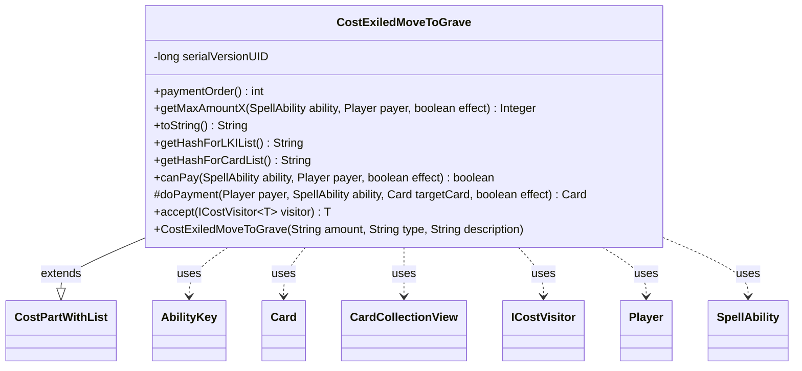

---
aliases:
  - CostExiledMoveToGrave
tags:
  - java/class
  - module/forge-game
  - pkg/forge/game/cost
fqn: forge.game.cost.CostExiledMoveToGrave
package: forge.game.cost
module: forge-game
kind: Class
---

# CostExiledMoveToGrave

**Package:** `forge.game.cost` &nbsp; **Module:** `forge-game` &nbsp; **Kind:** Class



## Relationships
**Extends:**
- [[forge.game.cost.CostPartWithList|CostPartWithList]]
**Uses:**
- [[forge.game.ability.AbilityKey|AbilityKey]]
- [[forge.game.card.Card|Card]]
- [[forge.game.card.CardCollectionView|CardCollectionView]]
- [[forge.game.cost.ICostVisitor|ICostVisitor]]
- [[forge.game.player.Player|Player]]
- [[forge.game.spellability.SpellAbility|SpellAbility]]

## Design Description

`CostExiledMoveToGrave` models the "ExiledMoveToGrave" payment cost, by which a player pays for a spell or ability by moving a specified number of qualifying cards out of exile and into a graveyard. It specializes `CostPartWithList`, inheriting the machinery for paying a cost against a tracked list of affected cards, and overrides the hooks that distinguish this cost: it scopes candidate cards to the exile zone filtered by valid type, reports affordability by comparing that count against the required amount, and performs each payment by moving the target card to the graveyard while threading card-zone-table parameters through `AbilityKey` move params for proper event tracking. A fixed `paymentOrder` of 15 sequences it among other costs, and `accept` integrates it into the `ICostVisitor` traversal, keeping cost-specific behavior cohesive within the visitor-based cost framework.

## Source
`forge-game/src/main/java/forge/game/cost/CostExiledMoveToGrave.java`

```java
/*
 * Forge: Play Magic: the Gathering.
 * Copyright (C) 2011  Forge Team
 *
 * This program is free software: you can redistribute it and/or modify
 * it under the terms of the GNU General Public License as published by
 * the Free Software Foundation, either version 3 of the License, or
 * (at your option) any later version.
 *
 * This program is distributed in the hope that it will be useful,
 * but WITHOUT ANY WARRANTY; without even the implied warranty of
 * MERCHANTABILITY or FITNESS FOR A PARTICULAR PURPOSE.  See the
 * GNU General Public License for more details.
 *
 * You should have received a copy of the GNU General Public License
 * along with this program.  If not, see <http://www.gnu.org/licenses/>.
 */
package forge.game.cost;

import forge.game.ability.AbilityKey;
import forge.game.card.Card;
import forge.game.card.CardCollectionView;
import forge.game.card.CardLists;
import forge.game.player.Player;
import forge.game.spellability.SpellAbility;
import forge.game.zone.ZoneType;

import java.util.Map;

/**
 * This is for the "ExiledMoveToGrave" Cost.
 */
public class CostExiledMoveToGrave extends CostPartWithList {
    /**
     * Serializables need a version ID.
     */
    private static final long serialVersionUID = 1L;

    // ExiledMoveToGrave<Num/Type{/TypeDescription}>
    public CostExiledMoveToGrave(final String amount, final String type, final String description) {
        super(amount, type, description);
    }

    @Override
    public int paymentOrder() { return 15; }

    @Override
    public Integer getMaxAmountX(SpellAbility ability, Player payer, final boolean effect) {
        final Card source = ability.getHostCard();
        CardCollectionView typeList = payer.getGame().getCardsIn(ZoneType.Exile);

        typeList = CardLists.getValidCards(typeList, getType().split(";"), payer, source, ability);

        return typeList.size();
    }

    @Override
    public final String toString() {
        final StringBuilder sb = new StringBuilder();
        final Integer i = convertAmount();
        sb.append("Put ");

        final String desc = getTypeDescription() == null ? getType() : getTypeDescription();
        sb.append(Cost.convertAmountTypeToWords(i, getAmount(), desc));

        sb.append(" from exile into that player's graveyard");

        return sb.toString();
    }

    @Override
    public String getHashForLKIList() {
        return "MovedToGrave";
    }
    @Override
    public String getHashForCardList() {
    	return "MovedToGraveCards";
    }

    @Override
    public final boolean canPay(final SpellAbility ability, final Player payer, final boolean effect) {
        int i = getAbilityAmount(ability);

        return getMaxAmountX(ability, payer, effect) >= i;
    }

    @Override
    protected Card doPayment(Player payer, SpellAbility ability, Card targetCard, final boolean effect) {
        Map<AbilityKey, Object> moveParams = AbilityKey.newMap();
        AbilityKey.addCardZoneTableParams(moveParams, table);
        return targetCard.getGame().getAction().moveToGraveyard(targetCard, null, moveParams);
    }

    public <T> T accept(ICostVisitor<T> visitor) {
        return visitor.visit(this);
    }
}
```

## Python
`forge/game/cost/CostExiledMoveToGrave.py`

```python
from forge.game.cost.CostPartWithList import CostPartWithList
from forge.game.ability.AbilityKey import AbilityKey
from forge.game.card.Card import Card
from forge.game.card.CardCollectionView import CardCollectionView
from forge.game.card.CardLists import CardLists
from forge.game.cost.ICostVisitor import ICostVisitor
from forge.game.player.Player import Player
from forge.game.spellability.SpellAbility import SpellAbility
from forge.game.zone.ZoneType import ZoneType


class CostExiledMoveToGrave(CostPartWithList):
    """
    This is for the "ExiledMoveToGrave" Cost.
    """
    # Serializables need a version ID.
    serialVersionUID = 1

    # ExiledMoveToGrave<Num/Type{/TypeDescription}>
    def __init__(self, amount: str, type: str, description: str):
        super().__init__(amount, type, description)

    def paymentOrder(self) -> int:
        return 15

    def getMaxAmountX(self, ability: SpellAbility, payer: Player, effect: bool):
        source = ability.getHostCard()
        typeList = payer.getGame().getCardsIn(ZoneType.Exile)

        typeList = CardLists.getValidCards(typeList, self.getType().split(";"), payer, source, ability)

        return typeList.size()

    def toString(self) -> str:
        sb = []
        i = self.convertAmount()
        sb.append("Put ")

        desc = self.getType() if self.getTypeDescription() is None else self.getTypeDescription()
        sb.append(Cost.convertAmountTypeToWords(i, self.getAmount(), desc))

        sb.append(" from exile into that player's graveyard")

        return "".join(sb)

    def getHashForLKIList(self) -> str:
        return "MovedToGrave"

    def getHashForCardList(self) -> str:
        return "MovedToGraveCards"

    def canPay(self, ability: SpellAbility, payer: Player, effect: bool) -> bool:
        i = self.getAbilityAmount(ability)

        return self.getMaxAmountX(ability, payer, effect) >= i

    def doPayment(self, payer: Player, ability: SpellAbility, targetCard: Card, effect: bool) -> Card:
        moveParams: dict[AbilityKey, object] = AbilityKey.newMap()
        AbilityKey.addCardZoneTableParams(moveParams, self.table)
        return targetCard.getGame().getAction().moveToGraveyard(targetCard, None, moveParams)

    def accept(self, visitor: ICostVisitor):
        return visitor.visit(self)
```
