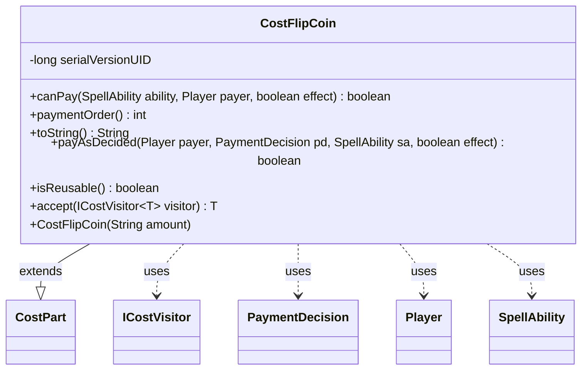

---
aliases:
  - CostFlipCoin
tags:
  - java/class
  - module/forge-game
  - pkg/forge/game/cost
fqn: forge.game.cost.CostFlipCoin
package: forge.game.cost
module: forge-game
kind: Class
---

# CostFlipCoin

**Package:** `forge.game.cost` &nbsp; **Module:** `forge-game` &nbsp; **Kind:** Class



## Relationships
**Extends:**
- [[forge.game.cost.CostPart|CostPart]]
**Uses:**
- [[forge.game.cost.ICostVisitor|ICostVisitor]]
- [[forge.game.cost.PaymentDecision|PaymentDecision]]
- [[forge.game.player.Player|Player]]
- [[forge.game.spellability.SpellAbility|SpellAbility]]

## Design Description

CostFlipCoin models the Magic "flip a coin" payment as a concrete `CostPart` within the `forge.game.cost` cost framework. Constructed with a string `amount` (the number of coins to flip), it always reports itself payable via `canPay`, and resolves payment in `payAsDecided` by delegating to `FlipCoinEffect.flipCoins` using the count carried on the supplied `PaymentDecision`. It collaborates with `SpellAbility` and `Player` to identify the ability and the paying player.

Notable design intent: `paymentOrder` returns a high value (22) so that random-outcome costs are resolved last, after deterministic costs, easing potential cost undo; `isReusable` returns true since coin-flipping imposes no consumable resource. The class participates in a visitor pattern through `accept`, dispatching to `ICostVisitor` so cost-processing logic can be defined externally without modifying each cost type.

## Source
`forge-game/src/main/java/forge/game/cost/CostFlipCoin.java`

```java
/*
 * Forge: Play Magic: the Gathering.
 * Copyright (C) 2011  Forge Team
 *
 * This program is free software: you can redistribute it and/or modify
 * it under the terms of the GNU General Public License as published by
 * the Free Software Foundation, either version 3 of the License, or
 * (at your option) any later version.
 * 
 * This program is distributed in the hope that it will be useful,
 * but WITHOUT ANY WARRANTY; without even the implied warranty of
 * MERCHANTABILITY or FITNESS FOR A PARTICULAR PURPOSE.  See the
 * GNU General Public License for more details.
 * 
 * You should have received a copy of the GNU General Public License
 * along with this program.  If not, see <http://www.gnu.org/licenses/>.
 */
package forge.game.cost;

import forge.game.ability.effects.FlipCoinEffect;
import forge.game.player.Player;
import forge.game.spellability.SpellAbility;

/**
 * This is for the "FlipCoin" Cost
 */
public class CostFlipCoin extends CostPart {

    /**
     * Serializables need a version ID.
     */
    private static final long serialVersionUID = 1L;

    /**
     * Instantiates a new cost FlipCoin.
     * 
     * @param amount
     *            the amount
     */
    public CostFlipCoin(final String amount) {
        this.setAmount(amount);
    }

    /*
     * (non-Javadoc)
     * 
     * @see
     * forge.card.cost.CostPart#canPay(forge.card.spellability.SpellAbility,
     * forge.Card, forge.Player, forge.card.cost.Cost)
     */
    @Override
    public final boolean canPay(final SpellAbility ability, final Player payer, final boolean effect) {
        return true;
    }

    @Override
    public int paymentOrder() {
        // In a world where costs are fully undoable, determining  random information should be done last.
        return 22;
    }

    @Override
    public final String toString() {
        return Cost.convertAmountTypeToWords(this.convertAmount(), this.getAmount(), "Coin");
    }

    @Override
    public boolean payAsDecided(Player payer, PaymentDecision pd, SpellAbility sa, final boolean effect) {
        FlipCoinEffect.flipCoins(payer, sa, pd.c);
        return true;
    }

    @Override
    public boolean isReusable() { return true; }

    public <T> T accept(ICostVisitor<T> visitor) {
        return visitor.visit(this);
    }
}
```

## Python
`forge/game/cost/CostFlipCoin.py`

```python
from forge.game.ability.effects.FlipCoinEffect import FlipCoinEffect
from forge.game.player.Player import Player
from forge.game.spellability.SpellAbility import SpellAbility

from forge.game.cost.CostPart import CostPart
from forge.game.cost.ICostVisitor import ICostVisitor
from forge.game.cost.PaymentDecision import PaymentDecision
from forge.game.cost.Cost import Cost


class CostFlipCoin(CostPart):
    """
    This is for the "FlipCoin" Cost
    """

    serialVersionUID = 1

    def __init__(self, amount: str):
        """
        Instantiates a new cost FlipCoin.

        :param amount: the amount
        """
        self.setAmount(amount)

    def canPay(self, ability: SpellAbility, payer: Player, effect: bool) -> bool:
        return True

    def paymentOrder(self) -> int:
        # In a world where costs are fully undoable, determining random information should be done last.
        return 22

    def toString(self) -> str:
        return Cost.convertAmountTypeToWords(self.convertAmount(), self.getAmount(), "Coin")

    def payAsDecided(self, payer: Player, pd: PaymentDecision, sa: SpellAbility, effect: bool) -> bool:
        FlipCoinEffect.flipCoins(payer, sa, pd.c)
        return True

    def isReusable(self) -> bool:
        return True

    def accept(self, visitor: ICostVisitor):
        return visitor.visit(self)
```
