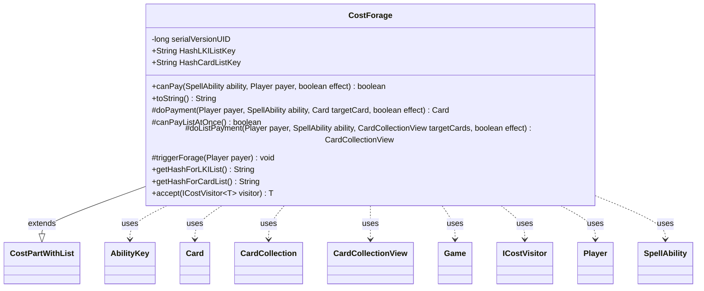

---
aliases:
  - CostForage
tags:
  - java/class
  - module/forge-game
  - pkg/forge/game/cost
fqn: forge.game.cost.CostForage
package: forge.game.cost
module: forge-game
kind: Class
---

# CostForage

**Package:** `forge.game.cost` &nbsp; **Module:** `forge-game` &nbsp; **Kind:** Class



## Relationships
**Extends:**
- [[forge.game.cost.CostPartWithList|CostPartWithList]]
**Uses:**
- [[forge.game.Game|Game]]
- [[forge.game.ability.AbilityKey|AbilityKey]]
- [[forge.game.card.Card|Card]]
- [[forge.game.card.CardCollection|CardCollection]]
- [[forge.game.card.CardCollectionView|CardCollectionView]]
- [[forge.game.cost.ICostVisitor|ICostVisitor]]
- [[forge.game.player.Player|Player]]
- [[forge.game.spellability.SpellAbility|SpellAbility]]

## Design Description

Forage is a sacrifice/exile cost part modeling Magic's "Forage" mechanic, letting a player pay either by exiling three cards from their graveyard or sacrificing a single Food artifact. Extending `CostPartWithList`, it overrides `canPay` to verify one of those two options is available, and implements payment as a batch operation (`canPayListAtOnce` returns true) via `doListPayment`, which branches on the target count—exiling three graveyard cards or sacrificing one Food—and then fires the `Forage` trigger. It collaborates with `Game` for the exile/sacrifice actions, `AbilityKey` for zone-change parameters, and the card collection types for targets. It supplies stable hash keys ("Foraged"/"ForagedCards") for tracking paid cards and accepts an `ICostVisitor`, participating in the visitor-based cost-processing framework.

## Source
`forge-game/src/main/java/forge/game/cost/CostForage.java`

```java
package forge.game.cost;

import forge.game.Game;
import forge.game.ability.AbilityKey;
import forge.game.ability.SpellAbilityEffect;
import forge.game.card.*;
import forge.game.player.Player;
import forge.game.spellability.SpellAbility;
import forge.game.trigger.TriggerType;
import forge.game.zone.ZoneType;

import java.util.Map;

public class CostForage extends CostPartWithList {

    private static final long serialVersionUID = 1L;

    @Override
    public boolean canPay(SpellAbility ability, Player payer, boolean effect) {
        CardCollection graveyard = CardLists.filter(payer.getCardsIn(ZoneType.Graveyard), CardPredicates.canExiledBy(ability, effect));
        if (graveyard.size() >= 3) {
            return true;
        }

        CardCollection food = CardLists.filter(payer.getCardsIn(ZoneType.Battlefield), CardPredicates.isType("Food"), CardPredicates.canBeSacrificedBy(ability, effect));
        if (!food.isEmpty()) {
            return true;
        }

        return false;
    }

    @Override
    public String toString() {
        return "Forage";
    }

    @Override
    protected Card doPayment(Player payer, SpellAbility ability, Card targetCard, final boolean effect) { return null; }
    @Override
    protected boolean canPayListAtOnce() { return true; }
    @Override
    protected CardCollectionView doListPayment(Player payer, SpellAbility ability, CardCollectionView targetCards, final boolean effect) {
        final Game game = payer.getGame();
        if (targetCards.size() == 3) {
            Map<AbilityKey, Object> moveParams = AbilityKey.newMap();
            AbilityKey.addCardZoneTableParams(moveParams, table);
            CardCollection result = new CardCollection();
            for (Card targetCard : targetCards) {
                Card newCard = game.getAction().exile(targetCard, null, moveParams);
                result.add(newCard);
                SpellAbilityEffect.handleExiledWith(newCard, ability);
            }
            triggerForage(payer);
            return result;
        } else if (targetCards.size() == 1) {
            Map<AbilityKey, Object> moveParams = AbilityKey.newMap();
            AbilityKey.addCardZoneTableParams(moveParams, table);
            CardCollection result = game.getAction().sacrifice(targetCards, ability, effect, moveParams);
            triggerForage(payer);
            return result;
        } else {
            return null;
        }
    }

    protected void triggerForage(Player payer) {
        final Map<AbilityKey, Object> runParams = AbilityKey.mapFromPlayer(payer);
        payer.getGame().getTriggerHandler().runTrigger(TriggerType.Forage, runParams, false);
    }

    public static final String HashLKIListKey = "Foraged";
    public static final String HashCardListKey = "ForagedCards";

    @Override
    public String getHashForLKIList() {
        return HashLKIListKey;
    }
    @Override
    public String getHashForCardList() {
        return HashCardListKey;
    }

    public <T> T accept(ICostVisitor<T> visitor) {
        return visitor.visit(this);
    }
}
```
