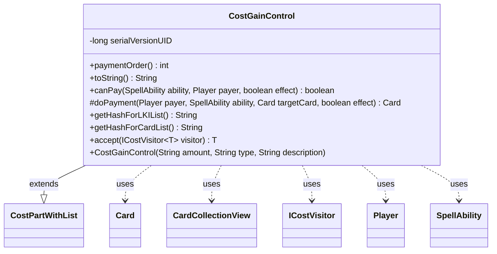

---
aliases:
  - CostGainControl
tags:
  - java/class
  - module/forge-game
  - pkg/forge/game/cost
fqn: forge.game.cost.CostGainControl
package: forge.game.cost
module: forge-game
kind: Class
---

# CostGainControl

**Package:** `forge.game.cost`   **Module:** `forge-game`   **Kind:** Class



## Relationships
**Extends:**
- [[forge.game.cost.CostPartWithList|CostPartWithList]]
**Uses:**
- [[forge.game.card.Card|Card]]
- [[forge.game.card.CardCollectionView|CardCollectionView]]
- [[forge.game.cost.ICostVisitor|ICostVisitor]]
- [[forge.game.player.Player|Player]]
- [[forge.game.spellability.SpellAbility|SpellAbility]]

## Design Description

CostGainControl models a payment cost in which a player gains control of one or more permanents in order to play a spell or ability. As a concrete subclass of CostPartWithList, it plugs into Forge's composite cost framework: it parses the standard `Num/Type/TypeDescription` syntax through its superclass constructor, reports a fixed `paymentOrder` of 8 to sequence itself among other cost parts, and renders a human-readable label ("Gain control of …") via `toString`. Its core responsibility is validating and executing the control-change: `canPay` filters the battlefield for valid, controllable cards and checks that enough exist, while `doPayment` performs the effect by attaching a temporary controller to the target with a fresh game timestamp.

The class collaborates with SpellAbility and Card to resolve the host and targets, Player to scope ownership and game access, and CardCollectionView with CardLists for battlefield filtering. It supports the cost framework's visitor pattern through `accept(ICostVisitor)` and supplies stable hash keys ("ControlGained"/"ControlGainedCards") so the engine can track gained-control cards in last-known-information and card lists.

## Source
`forge-game/src/main/java/forge/game/cost/CostGainControl.java`

```java
/*
 * Forge: Play Magic: the Gathering.
 * Copyright (C) 2011  Forge Team
 *
 * This program is free software: you can redistribute it and/or modify
 * it under the terms of the GNU General Public License as published by
 * the Free Software Foundation, either version 3 of the License, or
 * (at your option) any later version.
 * 
 * This program is distributed in the hope that it will be useful,
 * but WITHOUT ANY WARRANTY; without even the implied warranty of
 * MERCHANTABILITY or FITNESS FOR A PARTICULAR PURPOSE.  See the
 * GNU General Public License for more details.
 * 
 * You should have received a copy of the GNU General Public License
 * along with this program.  If not, see <http://www.gnu.org/licenses/>.
 */
package forge.game.cost;

import forge.game.card.Card;
import forge.game.card.CardCollectionView;
import forge.game.card.CardLists;
import forge.game.player.Player;
import forge.game.spellability.SpellAbility;
import forge.game.zone.ZoneType;

/**
 * The Class CostReturn.
 */
public class CostGainControl extends CostPartWithList {
    // GainControl<Num/Type{/TypeDescription}>

    /**
     * Serializables need a version ID.
     */
    private static final long serialVersionUID = 1L;

    /**
     * Instantiates a new cost return.
     * 
     * @param amount
     *            the amount
     * @param type
     *            the type
     * @param description
     *            the description
     */
    public CostGainControl(final String amount, final String type, final String description) {
        super(amount, type, description);
    }

    @Override
    public int paymentOrder() { return 8; }

    /*
     * (non-Javadoc)
     * 
     * @see forge.card.cost.CostPart#toString()
     */
    @Override
    public final String toString() {
        final StringBuilder sb = new StringBuilder();
        final String desc = this.getTypeDescription() == null ? this.getType() : this.getTypeDescription();
        sb.append("Gain control of ").append(Cost.convertAmountTypeToWords(this.getAmount(), desc));
        return sb.toString();
    }

    /*
     * (non-Javadoc)
     * 
     * @see
     * forge.card.cost.CostPart#canPay(forge.card.spellability.SpellAbility,
     * forge.Card, forge.Player, forge.card.cost.Cost)
     */
    @Override
    public final boolean canPay(final SpellAbility ability, final Player payer, final boolean effect) {
        final Card source = ability.getHostCard();
        CardCollectionView typeList = payer.getGame().getCardsIn(ZoneType.Battlefield);
        typeList = CardLists.getValidCards(typeList, this.getType().split(";"), payer, source, ability);
        typeList = CardLists.filter(typeList, c -> c.canBeControlledBy(payer));

        return typeList.size() >= getAbilityAmount(ability);
    }

    /* (non-Javadoc)
     * @see forge.card.cost.CostPartWithList#executePayment(forge.card.spellability.SpellAbility, forge.Card)
     */
    @Override
    protected Card doPayment(Player payer, SpellAbility ability, Card targetCard, final boolean effect) {
        targetCard.addTempController(payer, payer.getGame().getNextTimestamp());
        return targetCard;
    }

    /* (non-Javadoc)
     * @see forge.card.cost.CostPartWithList#getHashForList()
     */
    @Override
    public String getHashForLKIList() {
        return "ControlGained";
    }
    @Override
    public String getHashForCardList() {
    	return "ControlGainedCards";
    }

    public <T> T accept(ICostVisitor<T> visitor) {
        return visitor.visit(this);
    }

}
```

## Python
`forge/game/cost/CostGainControl.py`

```python
from forge.game.cost.CostPartWithList import CostPartWithList
from forge.game.cost.Cost import Cost
from forge.game.cost.ICostVisitor import ICostVisitor
from forge.game.card.Card import Card
from forge.game.card.CardCollectionView import CardCollectionView
from forge.game.card.CardLists import CardLists
from forge.game.player.Player import Player
from forge.game.spellability.SpellAbility import SpellAbility
from forge.game.zone.ZoneType import ZoneType


class CostGainControl(CostPartWithList):
    # GainControl<Num/Type{/TypeDescription}>

    serialVersionUID = 1

    def __init__(self, amount: str, type: str, description: str):
        super().__init__(amount, type, description)

    def paymentOrder(self) -> int:
        return 8

    def toString(self) -> str:
        sb = []
        desc = self.getType() if self.getTypeDescription() is None else self.getTypeDescription()
        sb.append("Gain control of ")
        sb.append(Cost.convertAmountTypeToWords(self.getAmount(), desc))
        return "".join(sb)

    def __str__(self) -> str:
        return self.toString()

    def canPay(self, ability: SpellAbility, payer: Player, effect: bool) -> bool:
        source = ability.getHostCard()
        typeList = payer.getGame().getCardsIn(ZoneType.Battlefield)
        typeList = CardLists.getValidCards(typeList, self.getType().split(";"), payer, source, ability)
        typeList = CardLists.filter(typeList, lambda c: c.canBeControlledBy(payer))

        return typeList.size() >= self.getAbilityAmount(ability)

    def doPayment(self, payer: Player, ability: SpellAbility, targetCard: Card, effect: bool) -> Card:
        targetCard.addTempController(payer, payer.getGame().getNextTimestamp())
        return targetCard

    def getHashForLKIList(self) -> str:
        return "ControlGained"

    def getHashForCardList(self) -> str:
        return "ControlGainedCards"

    def accept(self, visitor: ICostVisitor):
        return visitor.visit(self)
```
