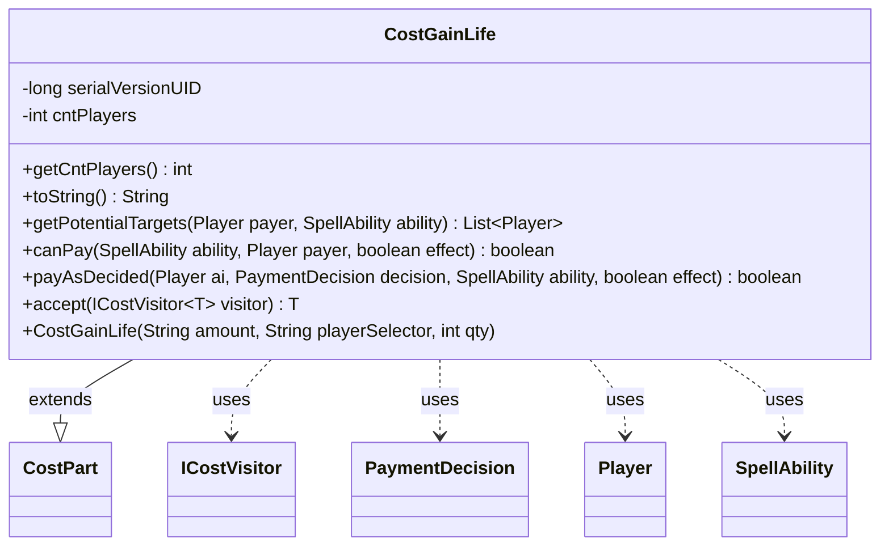

---
aliases:
  - CostGainLife
tags:
  - java/class
  - module/forge-game
  - pkg/forge/game/cost
fqn: forge.game.cost.CostGainLife
package: forge.game.cost
module: forge-game
kind: Class
---

# CostGainLife

**Package:** `forge.game.cost` &nbsp; **Module:** `forge-game` &nbsp; **Kind:** Class



## Relationships
**Extends:**
- [[forge.game.cost.CostPart|CostPart]]
**Uses:**
- [[forge.game.cost.ICostVisitor|ICostVisitor]]
- [[forge.game.cost.PaymentDecision|PaymentDecision]]
- [[forge.game.player.Player|Player]]
- [[forge.game.spellability.SpellAbility|SpellAbility]]

## Design Description

CostGainLife models the in-game cost of having one or more opponents gain life, taking its place in Forge's cost-payment hierarchy as a concrete subtype of `CostPart`. It captures an amount (inherited) and a `cntPlayers` count—where `Integer.MAX_VALUE` denotes "all/each" affected players—and supplies the behavior needed to validate and apply that cost.

It collaborates with `Player` and `SpellAbility` to enumerate valid targets via `getPotentialTargets`, confirm affordability in `canPay` (counting players actually able to gain life), and execute payment in `payAsDecided` using a `PaymentDecision`. Notably, `canPay` treats the "each player" case specially, requiring every potential target be able to gain life. The class participates in a visitor pattern through `accept(ICostVisitor)`, letting external operations dispatch over cost types without modifying this class, reflecting an extensible, double-dispatch design across the cost hierarchy.

## Source
`forge-game/src/main/java/forge/game/cost/CostGainLife.java`

```java
/*
 * Forge: Play Magic: the Gathering.
 * Copyright (C) 2011  Forge Team
 *
 * This program is free software: you can redistribute it and/or modify
 * it under the terms of the GNU General Public License as published by
 * the Free Software Foundation, either version 3 of the License, or
 * (at your option) any later version.
 * 
 * This program is distributed in the hope that it will be useful,
 * but WITHOUT ANY WARRANTY; without even the implied warranty of
 * MERCHANTABILITY or FITNESS FOR A PARTICULAR PURPOSE.  See the
 * GNU General Public License for more details.
 * 
 * You should have received a copy of the GNU General Public License
 * along with this program.  If not, see <http://www.gnu.org/licenses/>.
 */
package forge.game.cost;

import com.google.common.collect.Lists;
import forge.game.player.Player;
import forge.game.spellability.SpellAbility;

import java.util.List;

/**
 * The Class CostGainLife.
 */
public class CostGainLife extends CostPart {

    private static final long serialVersionUID = 1L;
    private final int cntPlayers; // MAX_VALUE means ALL/EACH PLAYERS

    /**
     * Instantiates a new cost gain life.
     * 
     * @param amount
     *            the amount
     */
    public CostGainLife(final String amount, String playerSelector, int qty) {
        super(amount, playerSelector, null);
        cntPlayers = qty;
    }

    /**
     * @return the cntPlayers
     */
    public int getCntPlayers() {
        return cntPlayers;
    }

    /*
     * (non-Javadoc)
     * 
     * @see forge.card.cost.CostPart#toString()
     */
    @Override
    public final String toString() {
        final StringBuilder sb = new StringBuilder();
        sb.append("Have an opponent gain ").append(this.getAmount()).append(" life");
        return sb.toString();
    }

    public List<Player> getPotentialTargets(final Player payer, final SpellAbility ability) {
        List<Player> res = Lists.newArrayList();
        for (Player p : payer.getGame().getPlayers()) {
            if (p.isValid(getType(), payer, ability.getHostCard(), ability))
                res.add(p);
        }
        return res;
    }

    @Override
    public final boolean canPay(final SpellAbility ability, final Player payer, final boolean effect) {
        int cntAbleToGainLife = 0;
        List<Player> possibleTargets = getPotentialTargets(payer, ability);

        for (final Player opp : possibleTargets) {
            if (opp.canGainLife()) {
                cntAbleToGainLife++;
            }
        }

        return cntAbleToGainLife >= cntPlayers || cntPlayers == Integer.MAX_VALUE && cntAbleToGainLife == possibleTargets.size();
    }

    @Override
    public final boolean payAsDecided(final Player ai, final PaymentDecision decision, SpellAbility ability, final boolean effect) {
        int c = this.getAbilityAmount(ability);
        
        int playersLeft = cntPlayers;
        for (final Player opp : decision.players) {
            if (playersLeft == 0)
                break;

            if (!opp.canGainLife()) // you should not have added him to decision.
                return false;

            playersLeft--;
            opp.gainLife(c, ability.getHostCard(), ability);
        }
        return true;
    }

    public <T> T accept(ICostVisitor<T> visitor) {
        return visitor.visit(this);
    }

}
```
