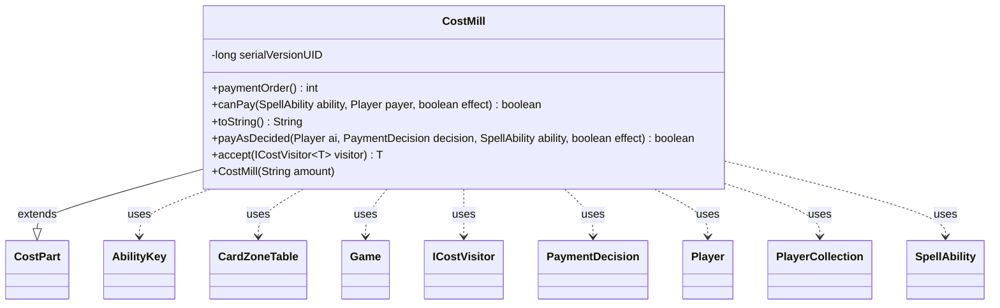

---
aliases:
  - CostMill
tags:
  - java/class
  - module/forge-game
  - pkg/forge/game/cost
fqn: forge.game.cost.CostMill
package: forge.game.cost
module: forge-game
kind: Class
---

# CostMill

**Package:** `forge.game.cost` &nbsp; **Module:** `forge-game` &nbsp; **Kind:** Class



## Relationships
**Extends:**
- [[forge.game.cost.CostPart|CostPart]]
**Uses:**
- [[forge.game.Game|Game]]
- [[forge.game.ability.AbilityKey|AbilityKey]]
- [[forge.game.card.CardZoneTable|CardZoneTable]]
- [[forge.game.cost.ICostVisitor|ICostVisitor]]
- [[forge.game.cost.PaymentDecision|PaymentDecision]]
- [[forge.game.player.Player|Player]]
- [[forge.game.player.PlayerCollection|PlayerCollection]]
- [[forge.game.spellability.SpellAbility|SpellAbility]]

## Design Description

CostMill models the Magic-specific "Mill" cost — paying for a spell or ability by moving a number of cards from the top of a player's library into their graveyard. As a concrete subclass of `CostPart`, it slots into Forge's composite cost framework: it parses an amount string at construction, reports affordability via `canPay` (requiring more cards in the Library zone than the amount), renders a human-readable label through `toString`, and applies the payment in `payAsDecided` by delegating to `Game.getAction().mill`. It collaborates with `Player`/`PlayerCollection` to locate cards, `AbilityKey` and `CardZoneTable` to record and trigger the resulting zone changes, and `PaymentDecision` to carry the chosen count.

Notable design intent: `paymentOrder` returns a high value (20) so this information-revealing cost is paid late, anticipating undoable costs, and `accept` implements the visitor pattern over `ICostVisitor`, letting AI and rules logic process cost types uniformly without instanceof checks.

## Source
`forge-game/src/main/java/forge/game/cost/CostMill.java`

```java
/*
 * Forge: Play Magic: the Gathering.
 * Copyright (C) 2011  Forge Team
 *
 * This program is free software: you can redistribute it and/or modify
 * it under the terms of the GNU General Public License as published by
 * the Free Software Foundation, either version 3 of the License, or
 * (at your option) any later version.
 * 
 * This program is distributed in the hope that it will be useful,
 * but WITHOUT ANY WARRANTY; without even the implied warranty of
 * MERCHANTABILITY or FITNESS FOR A PARTICULAR PURPOSE.  See the
 * GNU General Public License for more details.
 * 
 * You should have received a copy of the GNU General Public License
 * along with this program.  If not, see <http://www.gnu.org/licenses/>.
 */
package forge.game.cost;

import forge.game.Game;
import forge.game.ability.AbilityKey;
import forge.game.card.CardZoneTable;
import forge.game.player.Player;
import forge.game.player.PlayerCollection;
import forge.game.spellability.SpellAbility;
import forge.game.zone.ZoneType;

import java.util.Map;

/**
 * This is for the "Mill" Cost. Putting cards from the top of your library into
 * your graveyard as a cost. This Cost doesn't appear on very many cards, but
 * might appear in more in the future. This will show up in the form of Mill<1>
 */
public class CostMill extends CostPart {

    /**
     * Serializables need a version ID.
     */
    private static final long serialVersionUID = 1L;

    /**
     * Instantiates a new cost mill.
     * 
     * @param amount
     *            the amount
     */
    public CostMill(final String amount) {
        this.setAmount(amount);
    }

    @Override
    public int paymentOrder() {
        // In a world where costs are fully undoable, revealing unknown information should be done last.
        return 20;
    }

    /*
     * (non-Javadoc)
     * 
     * @see
     * forge.card.cost.CostPart#canPay(forge.card.spellability.SpellAbility,
     * forge.Card, forge.Player, forge.card.cost.Cost)
     */
    @Override
    public final boolean canPay(final SpellAbility ability, final Player payer, final boolean effect) {
        return getAbilityAmount(ability) < payer.getZone(ZoneType.Library).size();
    }

    /*
     * (non-Javadoc)
     * 
     * @see forge.card.cost.CostPart#toString()
     */
    @Override
    public final String toString() {
        final StringBuilder sb = new StringBuilder();
        final Integer i = this.convertAmount();
        sb.append("Mill ");

        if (i != null) {
            sb.append(i);
        } else {
            sb.append(this.getAmount());
        }

        sb.append(" card");
        if (i == null || i > 1) {
            sb.append("s");
        }

        return sb.toString();
    }

    @Override
    public final boolean payAsDecided(final Player ai, final PaymentDecision decision, SpellAbility ability, final boolean effect) {
        Game game = ai.getGame();
        Map<AbilityKey, Object> moveParams = AbilityKey.newMap();
        CardZoneTable zoneMovements = AbilityKey.addCardZoneTableParams(moveParams, ability);
        ability.getPaidHash().put("Milled", true, game.getAction().mill(new PlayerCollection(ai), decision.c, ZoneType.Graveyard, ability, moveParams));
        zoneMovements.triggerChangesZoneAll(game, ability);
        return true;
    }

    public <T> T accept(ICostVisitor<T> visitor) {
        return visitor.visit(this);
    }

}
```
