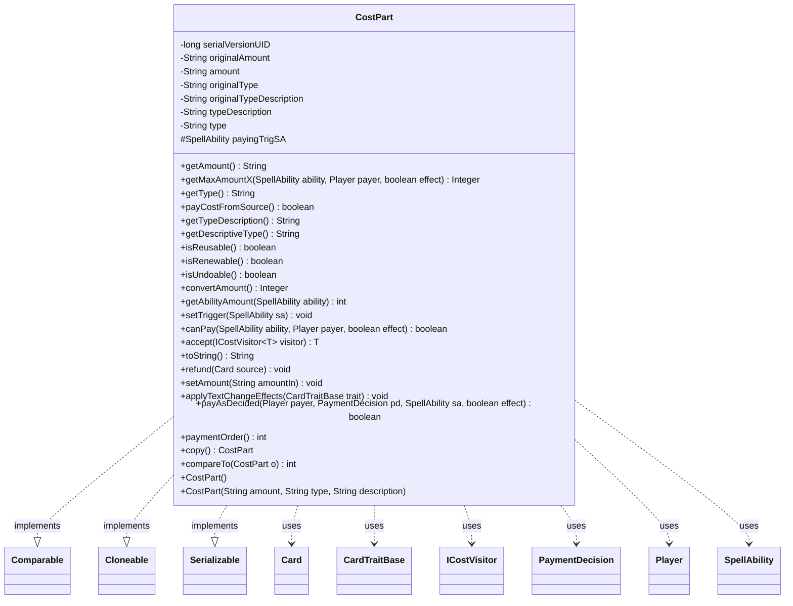

---
aliases:
  - CostPart
tags:
  - java/class
  - module/forge-game
  - pkg/forge/game/cost
fqn: forge.game.cost.CostPart
package: forge.game.cost
module: forge-game
kind: Class
---

# CostPart

**Package:** `forge.game.cost`   **Module:** `forge-game`   **Kind:** Class



## Relationships
**Uses:**
- [[forge.game.CardTraitBase|CardTraitBase]]
- [[forge.game.card.Card|Card]]
- [[forge.game.cost.ICostVisitor|ICostVisitor]]
- [[forge.game.cost.PaymentDecision|PaymentDecision]]
- [[forge.game.player.Player|Player]]
- [[forge.game.spellability.SpellAbility|SpellAbility]]

## Design Description

CostPart is the abstract base class for the individual components of a `Cost` in Forge's payment system, modeling a single payable element with an associated amount, target type, and human-readable description. It centralizes common state and text handling—exposing the amount and type, resolving numeric or descriptive forms, and applying text-change effects via `AbilityUtils`—while delegating the actual payment contract to subclasses through abstract methods (`canPay`, `payAsDecided`, `toString`, and `accept`).

It implements `Comparable` to order itself among other cost parts by `paymentOrder()`, and `Cloneable`/`Serializable` to support copying and persistence. The `accept(ICostVisitor)` method shows a visitor-pattern design that lets operations traverse heterogeneous cost parts without type-checking. It collaborates with `SpellAbility` and `Player` to evaluate and resolve payment, `PaymentDecision` to carry chosen targets, `Card` for refunds, and `CardTraitBase` for text substitution—keeping defaults (non-reusable, non-renewable, non-undoable) overridable by concrete cost types.

## Source
`forge-game/src/main/java/forge/game/cost/CostPart.java`

```java
/*
 * Forge: Play Magic: the Gathering.
 * Copyright (C) 2011  Forge Team
 *
 * This program is free software: you can redistribute it and/or modify
 * it under the terms of the GNU General Public License as published by
 * the Free Software Foundation, either version 3 of the License, or
 * (at your option) any later version.
 *
 * This program is distributed in the hope that it will be useful,
 * but WITHOUT ANY WARRANTY; without even the implied warranty of
 * MERCHANTABILITY or FITNESS FOR A PARTICULAR PURPOSE.  See the
 * GNU General Public License for more details.
 *
 * You should have received a copy of the GNU General Public License
 * along with this program.  If not, see <http://www.gnu.org/licenses/>.
 */
package forge.game.cost;

import forge.card.CardType;
import forge.game.CardTraitBase;
import forge.game.ability.AbilityUtils;
import forge.game.card.Card;
import forge.game.player.Player;
import forge.game.spellability.SpellAbility;
import org.apache.commons.lang3.StringUtils;

import java.io.Serializable;

/**
 * The Class CostPart.
 */
public abstract class CostPart implements Comparable<CostPart>, Cloneable, Serializable {
    /**
     * Serializables need a version ID.
     */
    private static final long serialVersionUID = 1L;
    private String originalAmount;
    private String amount;
    private final String originalType, originalTypeDescription;
    private String typeDescription, type;

    protected transient SpellAbility payingTrigSA;

    /**
     * Instantiates a new cost part.
     */
    public CostPart() {
        this("1", "Card", null);
    }

    /**
     * Instantiates a new cost part.
     *
     * @param amount
     *            the amount
     * @param type
     *            the type
     * @param description
     *            the description
     */
    public CostPart(final String amount, final String type, final String description) {
        this.setAmount(amount);
        this.originalType = type;
        this.type = this.originalType;
        this.originalTypeDescription = description;
        this.typeDescription = originalTypeDescription;
    }

    /**
     * Gets the amount.
     *
     * @return the amount
     */
    public final String getAmount() {
        return this.amount;
    }

    public Integer getMaxAmountX(final SpellAbility ability, final Player payer, final boolean effect) {
        return null;
    }
    /**
     * Gets the type.
     *
     * @return the type
     */
    public final String getType() {
        return this.type;
    }

    /**
     * Gets the this.
     *
     * @return the this
     */
    public final boolean payCostFromSource() {
        return this.getType().equals("CARDNAME") || this.getType().equals("NICKNAME");
    }

    /**
     * Gets the type description.
     *
     * @return the type description
     */
    public final String getTypeDescription() {
        return this.typeDescription;
    }

    public String getDescriptiveType() {
        String typeDesc = this.getTypeDescription();
        if (typeDesc == null) {
            String typeS = this.getType();
            typeDesc = CardType.CoreType.isValidEnum(typeS) || typeS.equals("Card") ? typeS.toLowerCase() : typeS;
        }
        return typeDesc;
    }

    /**
     * Checks if is reusable.
     *
     * @return true, if is reusable
     */
    public boolean isReusable() {
        return false;
    }

    /**
     * Checks if is renewable.
     *
     * @return true, if is renewable
     */
    public boolean isRenewable() {
        return false;
    }

    /**
     * Checks if is undoable.
     *
     * @return true, if is undoable
     */
    public boolean isUndoable() {
        return false;
    }

    /**
     * Convert amount.
     *
     * @return the integer
     */
    public final Integer convertAmount() {
        return StringUtils.isNumeric(amount) ? Integer.parseInt(amount) : null;
    }

    public final int getAbilityAmount(SpellAbility ability) {
        return AbilityUtils.calculateAmount(ability.getHostCard(), getAmount(), ability);
    }

    public void setTrigger(SpellAbility sa) {
        payingTrigSA = sa;
    }

    /**
     * Can pay.
     *
     * @param ability
     *            the ability
     * @param payer
     * @return true, if successful
     */
    public abstract boolean canPay(SpellAbility ability, Player payer, boolean effect);

    public abstract <T> T accept(final ICostVisitor<T> visitor);

    /*
     * (non-Javadoc)
     *
     * @see java.lang.Object#toString()
     */
    @Override
    public abstract String toString();

    /**
     * Refund. Overridden in classes which know how to refund.
     *
     * @param source
     *            the source
     */
    public void refund(Card source) {
    }

    /**
     * Sets the amount.
     *
     * @param amountIn
     *            the amount to set
     */
    public void setAmount(final String amountIn) {
        this.originalAmount = amountIn;
        this.amount = this.originalAmount;
    }

    public final void applyTextChangeEffects(final CardTraitBase trait) {
        this.amount = AbilityUtils.applyAbilityTextChangeEffects(this.originalAmount, trait);
        this.type = AbilityUtils.applyAbilityTextChangeEffects(this.originalType, trait);
        this.typeDescription = AbilityUtils.applyDescriptionTextChangeEffects(this.originalTypeDescription, trait);
    }

    public abstract boolean payAsDecided(Player payer, PaymentDecision pd, SpellAbility sa, final boolean effect);

    public int paymentOrder() { return 5; }

    public CostPart copy() {
    	CostPart clone = null;
        try {
            clone = (CostPart) clone();
        } catch (final CloneNotSupportedException e) {
            System.err.println(e);
        }
        return clone;
    }

    @Override
    public int compareTo(CostPart o) {
        return this.paymentOrder() - o.paymentOrder();
    }
}
```

## Python
`forge/game/cost/CostPart.py`

```python
from forge.card.CardType import CardType
from forge.game.CardTraitBase import CardTraitBase
from forge.game.ability.AbilityUtils import AbilityUtils
from forge.game.card.Card import Card
from forge.game.cost.ICostVisitor import ICostVisitor
from forge.game.cost.PaymentDecision import PaymentDecision
from forge.game.player.Player import Player
from forge.game.spellability.SpellAbility import SpellAbility

from abc import ABC, abstractmethod
from typing import Optional, TypeVar

T = TypeVar("T")


class CostPart(ABC):
    """The Class CostPart."""

    # Serializables need a version ID.
    serialVersionUID = 1

    def __init__(self, amount: str = "1", type: str = "Card", description: Optional[str] = None):
        """Instantiates a new cost part."""
        self.originalAmount: Optional[str] = None
        self.amount: Optional[str] = None
        self.payingTrigSA: Optional[SpellAbility] = None

        self.setAmount(amount)
        self.originalType = type
        self.type = self.originalType
        self.originalTypeDescription = description
        self.typeDescription = self.originalTypeDescription

    def getAmount(self) -> str:
        """Gets the amount."""
        return self.amount

    def getMaxAmountX(self, ability: SpellAbility, payer: Player, effect: bool) -> Optional[int]:
        return None

    def getType(self) -> str:
        """Gets the type."""
        return self.type

    def payCostFromSource(self) -> bool:
        """Gets the this."""
        return self.getType() == "CARDNAME" or self.getType() == "NICKNAME"

    def getTypeDescription(self) -> str:
        """Gets the type description."""
        return self.typeDescription

    def getDescriptiveType(self) -> str:
        typeDesc = self.getTypeDescription()
        if typeDesc is None:
            typeS = self.getType()
            typeDesc = typeS.lower() if (CardType.CoreType.isValidEnum(typeS) or typeS == "Card") else typeS
        return typeDesc

    def isReusable(self) -> bool:
        """Checks if is reusable."""
        return False

    def isRenewable(self) -> bool:
        """Checks if is renewable."""
        return False

    def isUndoable(self) -> bool:
        """Checks if is undoable."""
        return False

    def convertAmount(self) -> Optional[int]:
        """Convert amount."""
        return int(self.amount) if (self.amount is not None and len(self.amount) > 0 and self.amount.isdigit()) else None

    def getAbilityAmount(self, ability: SpellAbility) -> int:
        return AbilityUtils.calculateAmount(ability.getHostCard(), self.getAmount(), ability)

    def setTrigger(self, sa: SpellAbility) -> None:
        self.payingTrigSA = sa

    @abstractmethod
    def canPay(self, ability: SpellAbility, payer: Player, effect: bool) -> bool:
        """Can pay."""

    @abstractmethod
    def accept(self, visitor: ICostVisitor) -> T:
        ...

    @abstractmethod
    def __str__(self) -> str:
        ...

    def refund(self, source: Card) -> None:
        """Refund. Overridden in classes which know how to refund."""

    def setAmount(self, amountIn: str) -> None:
        """Sets the amount."""
        self.originalAmount = amountIn
        self.amount = self.originalAmount

    def applyTextChangeEffects(self, trait: CardTraitBase) -> None:
        self.amount = AbilityUtils.applyAbilityTextChangeEffects(self.originalAmount, trait)
        self.type = AbilityUtils.applyAbilityTextChangeEffects(self.originalType, trait)
        self.typeDescription = AbilityUtils.applyDescriptionTextChangeEffects(self.originalTypeDescription, trait)

    @abstractmethod
    def payAsDecided(self, payer: Player, pd: PaymentDecision, sa: SpellAbility, effect: bool) -> bool:
        ...

    def paymentOrder(self) -> int:
        return 5

    def copy(self) -> "CostPart":
        clone = None
        try:
            clone = self.__clone__()
        except CloneNotSupportedException as e:
            import sys
            print(e, file=sys.stderr)
        return clone

    def compareTo(self, o: "CostPart") -> int:
        return self.paymentOrder() - o.paymentOrder()
```
