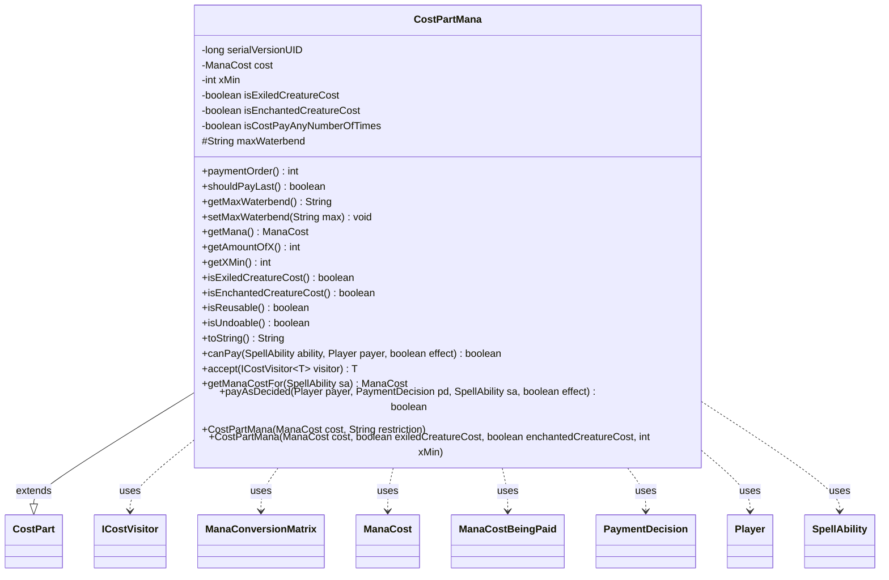

---
aliases:
  - CostPartMana
tags:
  - java/class
  - module/forge-game
  - pkg/forge/game/cost
fqn: forge.game.cost.CostPartMana
package: forge.game.cost
module: forge-game
kind: Class
---

# CostPartMana

**Package:** `forge.game.cost` &nbsp; **Module:** `forge-game` &nbsp; **Kind:** Class



## Relationships
**Extends:**
- [[forge.game.cost.CostPart|CostPart]]
**Uses:**
- [[forge.card.mana.ManaCost|ManaCost]]
- [[forge.game.cost.ICostVisitor|ICostVisitor]]
- [[forge.game.cost.PaymentDecision|PaymentDecision]]
- [[forge.game.mana.ManaConversionMatrix|ManaConversionMatrix]]
- [[forge.game.mana.ManaCostBeingPaid|ManaCostBeingPaid]]
- [[forge.game.player.Player|Player]]
- [[forge.game.spellability.SpellAbility|SpellAbility]]

## Design Description

`CostPartMana` represents the mana component of a spell or ability cost. As a concrete subclass of `CostPart`, it wraps an immutable `ManaCost` and a set of flags that qualify how that cost is derived—`XMin` for minimum X values, plus exiled-creature, enchanted-creature, and pay-any-number-of-times variants parsed from a restriction string. Its central responsibility is computing the effective cost at resolution time via `getManaCostFor`, which augments the base cost using `ManaCostBeingPaid` according to the active flag, and driving interactive payment through `payAsDecided`, where it snapshots and restores the player's `ManaConversionMatrix` to isolate payment chains.

It collaborates with `SpellAbility` and `Player` to resolve context and delegate payment to the controller, and participates in the visitor pattern through `accept(ICostVisitor)`. Design intent is visible in its always-reusable, always-undoable nature, its `paymentOrder`/`shouldPayLast` hooks that defer exiled-creature costs, and the secondary copy constructor that sets flags explicitly.

## Source
`forge-game/src/main/java/forge/game/cost/CostPartMana.java`

```java
/*
 * Forge: Play Magic: the Gathering.
 * Copyright (C) 2011  Forge Team
 *
 * This program is free software: you can redistribute it and/or modify
 * it under the terms of the GNU General Public License as published by
 * the Free Software Foundation, either version 3 of the License, or
 * (at your option) any later version.
 *
 * This program is distributed in the hope that it will be useful,
 * but WITHOUT ANY WARRANTY; without even the implied warranty of
 * MERCHANTABILITY or FITNESS FOR A PARTICULAR PURPOSE.  See the
 * GNU General Public License for more details.
 *
 * You should have received a copy of the GNU General Public License
 * along with this program.  If not, see <http://www.gnu.org/licenses/>.
 */
package forge.game.cost;

import forge.card.mana.ManaCost;
import forge.game.ability.AbilityUtils;
import forge.game.mana.ManaConversionMatrix;
import forge.game.mana.ManaCostBeingPaid;
import forge.game.player.Player;
import forge.game.spellability.SpellAbility;

/**
 * The mana component of any spell or ability cost
 */
public class CostPartMana extends CostPart {
    /**
     * Serializables need a version ID.
     */
    private static final long serialVersionUID = 1L;
    // "Leftover"
    private final ManaCost cost;
    private int xMin = 0;
    private boolean isExiledCreatureCost = false;
    private boolean isEnchantedCreatureCost = false;
    private boolean isCostPayAnyNumberOfTimes = false;

    protected String maxWaterbend;

    public int paymentOrder() { return shouldPayLast() ? 200 : 0; }

    public boolean shouldPayLast() {
        return isExiledCreatureCost;
    }
    /**
     * Instantiates a new cost mana.
     */
    public CostPartMana(final ManaCost cost, String restriction) {
        this.cost = cost;
        if (restriction != null && restriction.startsWith("XMin")) this.xMin = Integer.parseInt(restriction.substring(4));
        this.isExiledCreatureCost = "Exiled".equalsIgnoreCase(restriction);
        this.isEnchantedCreatureCost = "EnchantedCost".equalsIgnoreCase(restriction);
        this.isCostPayAnyNumberOfTimes = "NumTimes".equalsIgnoreCase(restriction);
    }

    // This version of the constructor allows to explicitly set exiledCreatureCost/enchantedCreatureCost, used only when copying costs
    public CostPartMana(final ManaCost cost, boolean exiledCreatureCost, boolean enchantedCreatureCost, int xMin) {
        this.cost = cost;
        this.xMin = xMin;
        this.isExiledCreatureCost = exiledCreatureCost;
        this.isEnchantedCreatureCost = enchantedCreatureCost;
    }

    public String getMaxWaterbend() {
        return maxWaterbend;
    }
    public void setMaxWaterbend(String max) {
        maxWaterbend = max;
    }

    /**
     * Gets the mana.
     *
     * @return the mana
     */
    public final ManaCost getMana() {
        return this.cost;
    }

    public final int getAmountOfX() {
        return this.cost.countX();
    }

    /**
     * @return the xMin
     */
    public int getXMin() {
        return xMin;
    }

    /**
     * @return the isExiledCreatureCost
     */
    public boolean isExiledCreatureCost() {
        return isExiledCreatureCost;
    }

    public boolean isEnchantedCreatureCost() {
        return isEnchantedCreatureCost;
    }

    @Override
    public boolean isReusable() { return true; }

    @Override
    public boolean isUndoable() { return true; }

    @Override
    public String toString() {
        return cost.toString();
    }

    @Override
    public final boolean canPay(final SpellAbility ability, final Player payer, final boolean effect) {
        // For now, always return true. But this should probably be checked at some point
        return true;
    }

    public <T> T accept(ICostVisitor<T> visitor) {
        return visitor.visit(this);
    }

    public ManaCost getManaCostFor(SpellAbility sa) {
        if (isExiledCreatureCost() && sa.getPaidList(CostExile.HashLKIListKey, true) != null && !sa.getPaidList(CostExile.HashLKIListKey, true).isEmpty()) {
            ManaCost mod = sa.getPaidList(CostExile.HashLKIListKey, true).get(0).getManaCost();
            if (mod.isNoCost()) {
                return mod;
            }
            ManaCostBeingPaid manaCostNew = new ManaCostBeingPaid(getMana());
            manaCostNew.addManaCost(mod);
            return manaCostNew.toManaCost();
        }
        if (isEnchantedCreatureCost() && sa.getHostCard().isEnchantingCard()) {
            ManaCost mod = sa.getHostCard().getEnchantingCard().getManaCost();
            if (mod.isNoCost()) {
                return mod;
            }
            ManaCostBeingPaid manaCostNew = new ManaCostBeingPaid(getMana());
            manaCostNew.addManaCost(mod);
            return manaCostNew.toManaCost();
        }
        if (isCostPayAnyNumberOfTimes) {
            int timesToPay = AbilityUtils.calculateAmount(sa.getHostCard(), sa.getSVar("NumTimes"), sa);
            if (timesToPay == 0) {
                return ManaCost.ZERO;
            }
            ManaCostBeingPaid totalMana = new ManaCostBeingPaid(getMana());
            for (int i = 1; i < timesToPay; i++) {
                totalMana.addManaCost(getMana());
            }
            return totalMana.toManaCost();
        }
        return getMana();
    }

    @Override
    public boolean payAsDecided(Player payer, PaymentDecision pd, SpellAbility sa, final boolean effect) {
        sa.clearManaPaid();

        ManaConversionMatrix old = new ManaConversionMatrix();
        old.restoreColorReplacements();
        old.applyCardMatrix(payer.getManaPool());

        // decision not used here, the whole payment is interactive!
        boolean result = payer.getController().payManaCost(this, sa, null, pd.matrix, effect);

        // restore old matrix during payment chains
        payer.getManaPool().restoreColorReplacements();
        payer.getManaPool().applyCardMatrix(old);

        return result;
    }

}
```
