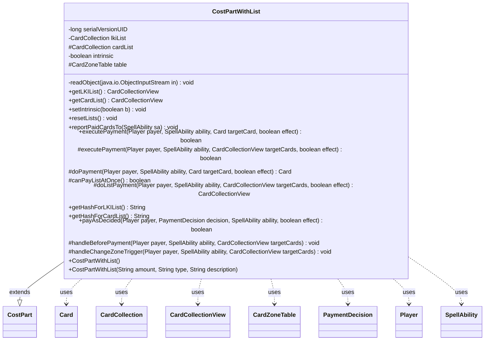

---
aliases:
  - CostPartWithList
tags:
  - java/class
  - module/forge-game
  - pkg/forge/game/cost
fqn: forge.game.cost.CostPartWithList
package: forge.game.cost
module: forge-game
kind: Class
---

# CostPartWithList

**Package:** `forge.game.cost` &nbsp; **Module:** `forge-game` &nbsp; **Kind:** Class



## Relationships
**Extends:**
- [[forge.game.cost.CostPart|CostPart]]
**Uses:**
- [[forge.game.card.Card|Card]]
- [[forge.game.card.CardCollection|CardCollection]]
- [[forge.game.card.CardCollectionView|CardCollectionView]]
- [[forge.game.card.CardZoneTable|CardZoneTable]]
- [[forge.game.cost.PaymentDecision|PaymentDecision]]
- [[forge.game.player.Player|Player]]
- [[forge.game.spellability.SpellAbility|SpellAbility]]

## Design Description

`CostPartWithList` is an abstract specialization of `CostPart` for costs whose payment consumes a set of cards — sacrifice, exile, tap, discard, and the like. It maintains two parallel `CardCollection` lists, one capturing last-known-information copies of the cards as they were paid and one holding the resulting physical cards, exposing both as read-only `CardCollectionView`s so that the paid cards can be reported back to the owning `SpellAbility`'s hash (tagged intrinsic or not) for triggers and replacement effects.

The class centralizes the payment workflow: `payAsDecided` drives `executePayment` over a `PaymentDecision`'s cards, refreshing statics and last-state battlefield/graveyard tracking before delegating per-card work to the abstract `doPayment` hook, with an optional batched `doListPayment` path for costs payable at once. Subtype-specific concerns are left as overridable hooks (`handleBeforePayment`, `handleChangeZoneTrigger`, hash methods). Notably, the `CardZoneTable` is `transient` and rebuilt on deserialization, keeping non-serializable, server-only payment state out of the network graph.

## Source
`forge-game/src/main/java/forge/game/cost/CostPartWithList.java`

```java
/*
 * Forge: Play Magic: the Gathering.
 * Copyright (C) 2011  Forge Team
 *
 * This program is free software: you can redistribute it and/or modify
 * it under the terms of the GNU General Public License as published by
 * the Free Software Foundation, either version 3 of the License, or
 * (at your option) any later version.
 *
 * This program is distributed in the hope that it will be useful,
 * but WITHOUT ANY WARRANTY; without even the implied warranty of
 * MERCHANTABILITY or FITNESS FOR A PARTICULAR PURPOSE.  See the
 * GNU General Public License for more details.
 *
 * You should have received a copy of the GNU General Public License
 * along with this program.  If not, see <http://www.gnu.org/licenses/>.
 */
package forge.game.cost;

import forge.game.card.*;
import forge.game.player.Player;
import forge.game.spellability.SpellAbility;

/**
 * The Class CostPartWithList.
 */
public abstract class CostPartWithList extends CostPart {
    /**
     * Serializables need a version ID.
     */
    private static final long serialVersionUID = 1L;
    /** The lists: one for LKI, one for the actual cards. */
    private final CardCollection lkiList = new CardCollection();
    protected final CardCollection cardList = new CardCollection();

    private boolean intrinsic = true;

    // transient: only used server-side during cost payment, never needed by the client.
    // CardZoneTable is not Serializable and must not enter the network serialization graph.
    protected transient CardZoneTable table = new CardZoneTable();

    private void readObject(java.io.ObjectInputStream in) throws java.io.IOException, ClassNotFoundException {
        in.defaultReadObject();
        table = new CardZoneTable();
    }

    public final CardCollectionView getLKIList() {
        return lkiList;
    }
    // Set is here to avoid duplication because executePayment() adds card to list, while ai's decide payment does the same thing
    public final CardCollectionView getCardList() {
    	return cardList;
    }

    public final void setIntrinsic(boolean b) {
        intrinsic = b;
    }

    /**
     * Reset list.
     */
    public void resetLists() {
        lkiList.clear();
        cardList.clear();
        table.clear();
    }

    /**
     * Adds the list to hash.
     *
     * @param sa
     *            the sa
     */
    public final void reportPaidCardsTo(final SpellAbility sa) {
        if (sa == null) {
            return;
        }
        final String lkiPaymentMethod = getHashForLKIList();
        for (final Card card : lkiList) {
            sa.addCostToHashList(card, lkiPaymentMethod, intrinsic);
        }
        final String cardPaymentMethod = getHashForCardList();
        for (final Card card : cardList) {
            sa.addCostToHashList(card, cardPaymentMethod, intrinsic);
        }
    }

    // public abstract List<Card> getValidCards();

    /**
     * Instantiates a new cost part with list.
     */
    public CostPartWithList() {
    }

    /**
     * Instantiates a new cost part with list.
     *
     * @param amount
     *            the amount
     * @param type
     *            the type
     * @param description
     *            the description
     */
    public CostPartWithList(final String amount, final String type, final String description) {
        super(amount, type, description);
    }

    public final boolean executePayment(Player payer, SpellAbility ability, Card targetCard, final boolean effect) {
        lkiList.add(CardCopyService.getLKICopy(targetCard));
        final Card newCard = doPayment(payer, ability, targetCard, effect);

        // need to update the LKI info to ensure correct interaction with cards which may trigger on this
        // (e.g. Necroskitter + a creature dying from a -1/-1 counter on a cost payment).
        targetCard.getGame().updateLastStateForCard(targetCard);

        if (newCard != null) {
            cardList.add(newCard);
        }
        return true;
    }

    // always returns true, made this to inline with return
    protected boolean executePayment(Player payer, SpellAbility ability, CardCollectionView targetCards, final boolean effect) {
        // need to refresh statics (e.g. sacrificing Omnath, Locus of Mana to Momentous Fall could end up with less toughness)
        payer.getGame().getAction().checkStaticAbilities();
        // costs are paid sequentially, so need to make sure no to miss any LTB from zone changing hosts of previous parts
        payer.getGame().getTriggerHandler().collectTriggerForWaiting();
        table.setLastStateBattlefield(payer.getGame().copyLastStateBattlefield());
        table.setLastStateGraveyard(payer.getGame().copyLastStateGraveyard());

        handleBeforePayment(payer, ability, targetCards);
        // Used by reveal: without it when opponent would reveal hand, you'll get N message boxes
        if (canPayListAtOnce()) {
            for (Card c: targetCards) {
                lkiList.add(CardCopyService.getLKICopy(c));
            }
            cardList.addAll(doListPayment(payer, ability, targetCards, effect));
        } else {
            for (Card c : targetCards) {
                executePayment(payer, ability, c, effect);
            }
        }
        handleChangeZoneTrigger(payer, ability, targetCards);
        return true;
    }

    /**
     * Do a payment with a single card.
     * @param ability the {@link SpellAbility} to pay for.
     * @param targetCard the {@link Card} to pay with.
     * @return The physical card after the payment.
     */
    protected abstract Card doPayment(Player payer, SpellAbility ability, Card targetCard, final boolean effect);
    // Overload these two only together, set to true and perform payment on list
    protected boolean canPayListAtOnce() { return false; }
    protected CardCollectionView doListPayment(Player payer, SpellAbility ability, CardCollectionView targetCards, final boolean effect) { return CardCollection.EMPTY; }

    /**
     * TODO: Write javadoc for this method.
     * @return
     */
    public abstract String getHashForLKIList();
    public abstract String getHashForCardList();

    @Override
    public boolean payAsDecided(Player payer, PaymentDecision decision, SpellAbility ability, final boolean effect) {
        executePayment(payer, ability, decision.cards, effect);
        reportPaidCardsTo(ability);
        return true;
    }

    protected void handleBeforePayment(Player payer, SpellAbility ability, CardCollectionView targetCards) {

    }

    protected void handleChangeZoneTrigger(Player payer, SpellAbility ability, CardCollectionView targetCards) {
        if (table.isEmpty()) {
            return;
        }

        table.triggerChangesZoneAll(payer.getGame(), ability);
    }

}
```
