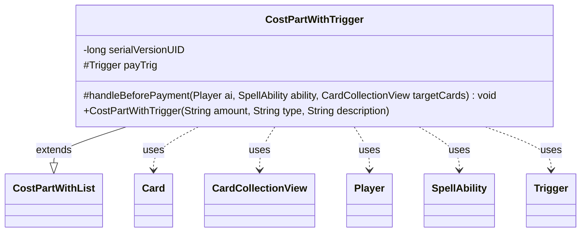

---
aliases:
  - CostPartWithTrigger
tags:
  - java/class
  - module/forge-game
  - pkg/forge/game/cost
fqn: forge.game.cost.CostPartWithTrigger
package: forge.game.cost
module: forge-game
kind: Class
---

# CostPartWithTrigger

**Package:** `forge.game.cost` &nbsp; **Module:** `forge-game` &nbsp; **Kind:** Class



## Relationships
**Extends:**
- [[forge.game.cost.CostPartWithList|CostPartWithList]]
**Uses:**
- [[forge.game.card.Card|Card]]
- [[forge.game.card.CardCollectionView|CardCollectionView]]
- [[forge.game.player.Player|Player]]
- [[forge.game.spellability.SpellAbility|SpellAbility]]
- [[forge.game.trigger.Trigger|Trigger]]

## Design Description

CostPartWithTrigger is an abstract cost component that extends CostPartWithList to model payment costs which themselves spawn a triggered ability when paid. Its sole specialization is overriding the final `handleBeforePayment` hook: when a paying trigger ability is present, it copies that ability, builds an immediate-mode Trigger via TriggerHandler, links it to the activating player and host Card, and registers it as a delayed trigger so it fires as soon as the cost is paid. By collaborating with Trigger, SpellAbility, Player, and the game's TriggerHandler, it cleanly separates the mechanics of trigger creation from the concrete cost subclasses that derive from it. The `final` override and `protected payTrig` field signal a fixed template-method contract, leaving subclasses to supply only the cost-specific paying behavior rather than re-implementing trigger registration.

## Source
`forge-game/src/main/java/forge/game/cost/CostPartWithTrigger.java`

```java
package forge.game.cost;

import com.google.common.collect.Maps;
import forge.game.card.Card;
import forge.game.card.CardCollectionView;
import forge.game.player.Player;
import forge.game.spellability.SpellAbility;
import forge.game.trigger.Trigger;
import forge.game.trigger.TriggerHandler;
import forge.game.trigger.TriggerType;

import java.util.Map;

public abstract class CostPartWithTrigger extends CostPartWithList {
    /**
     * Serializables need a version ID.
     */
    private static final long serialVersionUID = 1L;

    public CostPartWithTrigger(final String amount, final String type, final String description) {
        super(amount, type, description);
    }

    protected Trigger payTrig;

    @Override
    protected final void handleBeforePayment(Player ai, SpellAbility ability, CardCollectionView targetCards) {
        if (payingTrigSA != null) {
            Card source = payingTrigSA.getHostCard();

            Map<String, String> mapParams = Maps.newHashMap();
            mapParams.put("TriggerDescription", payingTrigSA.getParam("SpellDescription"));
            mapParams.put("Mode", TriggerType.Immediate.name());

            SpellAbility sa = payingTrigSA.copy(source, ability.getActivatingPlayer(), false);
            sa.changeText();

            payTrig = TriggerHandler.parseTrigger(mapParams, source, sa.isIntrinsic(), null);
            payTrig.setSpawningAbility(ability); // make the StaticAbility the Spawning one?

            payTrig.setOverridingAbility(sa);

            // Instead of registering this, add to the delayed triggers as an immediate trigger type? Which means it'll fire as soon as possible
            ai.getGame().getTriggerHandler().registerDelayedTrigger(payTrig);
        }
    }
    
}
```
