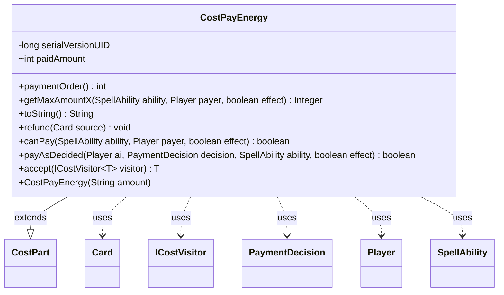

---
aliases:
  - CostPayEnergy
tags:
  - java/class
  - module/forge-game
  - pkg/forge/game/cost
fqn: forge.game.cost.CostPayEnergy
package: forge.game.cost
module: forge-game
kind: Class
---

# CostPayEnergy

**Package:** `forge.game.cost` &nbsp; **Module:** `forge-game` &nbsp; **Kind:** Class



## Relationships
**Extends:**
- [[forge.game.cost.CostPart|CostPart]]
**Uses:**
- [[forge.game.card.Card|Card]]
- [[forge.game.cost.ICostVisitor|ICostVisitor]]
- [[forge.game.cost.PaymentDecision|PaymentDecision]]
- [[forge.game.player.Player|Player]]
- [[forge.game.spellability.SpellAbility|SpellAbility]]

## Design Description

CostPayEnergy models a Magic: the Gathering activation cost paid in {E} (energy counters), as one concrete part of a composite cost system. It extends the abstract CostPart, supplying energy-specific behavior for the standard cost lifecycle: canPay checks the payer holds enough energy counters, getMaxAmountX caps a variable "X" payment at the player's current energy, payAsDecided debits the decided amount and records it, and refund restores it if the payment is rolled back. Its paymentOrder of 7 fixes where energy is settled among other cost parts.

The class collaborates with SpellAbility and Player to resolve and apply amounts, and uses CounterEnumType.ENERGY as the counter backing the cost. Its accept method participates in a visitor pattern over ICostVisitor, letting cost-processing logic (such as AI evaluation or UI rendering) dispatch on concrete cost types without instanceof checks. Storing paidAmount as mutable state is the deliberate mechanism enabling accurate refunds.

## Source
`forge-game/src/main/java/forge/game/cost/CostPayEnergy.java`

```java
/*
 * Forge: Play Magic: the Gathering.
 * Copyright (C) 2011  Forge Team
 *
 * This program is free software: you can redistribute it and/or modify
 * it under the terms of the GNU General Public License as published by
 * the Free Software Foundation, either version 3 of the License, or
 * (at your option) any later version.
 *
 * This program is distributed in the hope that it will be useful,
 * but WITHOUT ANY WARRANTY; without even the implied warranty of
 * MERCHANTABILITY or FITNESS FOR A PARTICULAR PURPOSE.  See the
 * GNU General Public License for more details.
 *
 * You should have received a copy of the GNU General Public License
 * along with this program.  If not, see <http://www.gnu.org/licenses/>.
 */
package forge.game.cost;

import com.google.common.base.Strings;
import forge.game.card.Card;
import forge.game.card.CounterEnumType;
import forge.game.player.Player;
import forge.game.spellability.SpellAbility;


public class CostPayEnergy extends CostPart {
    /**
     * Serializables need a version ID.
     */
    private static final long serialVersionUID = 1L;
    
    int paidAmount = 0;

    /**
     * Instantiates a new cost pay energy.
     *
     * @param amount
     *            the amount
     */
    public CostPayEnergy(final String amount) {
        this.setAmount(amount);
    }

    @Override
    public int paymentOrder() { return 7; }

    @Override
    public Integer getMaxAmountX(final SpellAbility ability, final Player payer, final boolean effect) {
        return payer.getCounters(CounterEnumType.ENERGY);
    }

    /*
     * (non-Javadoc)
     *
     * @see forge.card.cost.CostPart#toString()
     */
    @Override
    public final String toString() {
        final StringBuilder sb = new StringBuilder();
        sb.append("Pay ");
        if (getAmount().equals("X")) {
            sb.append("X {E}");
        } else {
            sb.append(Strings.repeat("{E}", Integer.parseInt(getAmount())));
        }
        return sb.toString();
    }

    /*
     * (non-Javadoc)
     *
     * @see forge.card.cost.CostPart#refund(forge.Card)
     */
    @Override
    public final void refund(final Card source) {
        // Really should be activating player
        source.getController().loseEnergy(this.paidAmount * -1);
    }

    /*
     * (non-Javadoc)
     *
     * @see
     * forge.card.cost.CostPart#canPay(forge.card.spellability.SpellAbility,
     * forge.Card, forge.Player, forge.card.cost.Cost)
     */
    @Override
    public final boolean canPay(final SpellAbility ability, final Player payer, final boolean effect) {
        return payer.getCounters(CounterEnumType.ENERGY) >= this.getAbilityAmount(ability);
    }

    @Override
    public boolean payAsDecided(Player ai, PaymentDecision decision, SpellAbility ability, final boolean effect) {
        paidAmount = decision.c;
        return ai.payEnergy(paidAmount, null);
    }

    public <T> T accept(ICostVisitor<T> visitor) {
        return visitor.visit(this);
    }

}
```

## Python
`forge/game/cost/CostPayEnergy.py`

```python
/*
 * Forge: Play Magic: the Gathering.
 * Copyright (C) 2011  Forge Team
 *
 * This program is free software: you can redistribute it and/or modify
 * it under the terms of the GNU General Public License as published by
 * the Free Software Foundation, either version 3 of the License, or
 * (at your option) any later version.
 *
 * This program is distributed in the hope that it will be useful,
 * but WITHOUT ANY WARRANTY; without even the implied warranty of
 * MERCHANTABILITY or FITNESS FOR A PARTICULAR PURPOSE.  See the
 * GNU General Public License for more details.
 *
 * You should have received a copy of the GNU General Public License
 * along with this program.  If not, see <http://www.gnu.org/licenses/>.
 */

from forge.game.card.Card import Card
from forge.game.card.CounterEnumType import CounterEnumType
from forge.game.player.Player import Player
from forge.game.spellability.SpellAbility import SpellAbility
from forge.game.cost.CostPart import CostPart
from forge.game.cost.ICostVisitor import ICostVisitor
from forge.game.cost.PaymentDecision import PaymentDecision


class CostPayEnergy(CostPart):
    """
    Instantiates a new cost pay energy.
    """
    serialVersionUID = 1

    def __init__(self, amount: str):
        self.paidAmount = 0
        self.setAmount(amount)

    def paymentOrder(self) -> int:
        return 7

    def getMaxAmountX(self, ability: SpellAbility, payer: Player, effect: bool):
        return payer.getCounters(CounterEnumType.ENERGY)

    def toString(self) -> str:
        sb = []
        sb.append("Pay ")
        if self.getAmount() == "X":
            sb.append("X {E}")
        else:
            sb.append("{E}" * int(self.getAmount()))
        return "".join(sb)

    def refund(self, source: Card) -> None:
        # Really should be activating player
        source.getController().loseEnergy(self.paidAmount * -1)

    def canPay(self, ability: SpellAbility, payer: Player, effect: bool) -> bool:
        return payer.getCounters(CounterEnumType.ENERGY) >= self.getAbilityAmount(ability)

    def payAsDecided(self, ai: Player, decision: PaymentDecision, ability: SpellAbility, effect: bool) -> bool:
        self.paidAmount = decision.c
        return ai.payEnergy(self.paidAmount, None)

    def accept(self, visitor: ICostVisitor):
        return visitor.visit(self)
```
