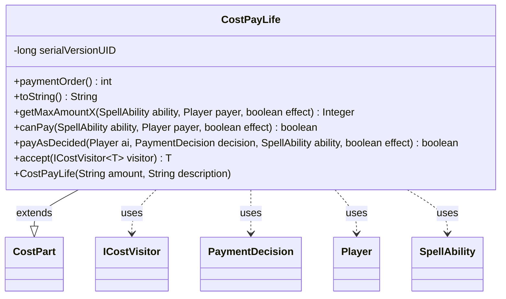

---
aliases:
  - CostPayLife
tags:
  - java/class
  - module/forge-game
  - pkg/forge/game/cost
fqn: forge.game.cost.CostPayLife
package: forge.game.cost
module: forge-game
kind: Class
---

# CostPayLife

**Package:** `forge.game.cost` &nbsp; **Module:** `forge-game` &nbsp; **Kind:** Class



## Relationships
**Extends:**
- [[forge.game.cost.CostPart|CostPart]]
**Uses:**
- [[forge.game.cost.ICostVisitor|ICostVisitor]]
- [[forge.game.cost.PaymentDecision|PaymentDecision]]
- [[forge.game.player.Player|Player]]
- [[forge.game.spellability.SpellAbility|SpellAbility]]

## Design Description

`CostPayLife` models the life-payment component of a spell or ability cost, representing the Magic: the Gathering action of paying life. As a concrete subclass of `CostPart`, it specializes the abstract cost contract for this one resource: it reports a fixed `paymentOrder` of 7 to sequence itself among other cost parts, renders a human-readable form via `toString`, and delegates feasibility and execution to the paying `Player` (`canPayLife`, `payLife`), keying off the parsed amount and the `effect` flag.

The design follows two clear patterns. It collaborates with `SpellAbility` to resolve its dynamic amount and with `PaymentDecision` to carry the chosen value into `payAsDecided`, separating decision-making from payment. Its `accept(ICostVisitor<T>)` method implements the visitor pattern, letting external operations traverse heterogeneous cost parts without the class enumerating them itself.

## Source
`forge-game/src/main/java/forge/game/cost/CostPayLife.java`

```java
/*
 * Forge: Play Magic: the Gathering.
 * Copyright (C) 2011  Forge Team
 *
 * This program is free software: you can redistribute it and/or modify
 * it under the terms of the GNU General Public License as published by
 * the Free Software Foundation, either version 3 of the License, or
 * (at your option) any later version.
 *
 * This program is distributed in the hope that it will be useful,
 * but WITHOUT ANY WARRANTY; without even the implied warranty of
 * MERCHANTABILITY or FITNESS FOR A PARTICULAR PURPOSE.  See the
 * GNU General Public License for more details.
 *
 * You should have received a copy of the GNU General Public License
 * along with this program.  If not, see <http://www.gnu.org/licenses/>.
 */
package forge.game.cost;

import forge.game.player.Player;
import forge.game.spellability.SpellAbility;

/**
 * The Class CostPayLife.
 */
public class CostPayLife extends CostPart {
    /**
     * Serializables need a version ID.
     */
    private static final long serialVersionUID = 1L;

    /**
     * Instantiates a new cost pay life.
     *
     * @param amount
     *            the amount
     */
    public CostPayLife(final String amount, final String description) {
        super(amount, "card", description);
    }

    @Override
    public int paymentOrder() { return 7; }

    /*
     * (non-Javadoc)
     *
     * @see forge.card.cost.CostPart#toString()
     */
    @Override
    public final String toString() {
        final StringBuilder sb = new StringBuilder();
        sb.append("Pay ");
        String desc = this.getTypeDescription();
        if (desc != null) {
            sb.append(desc);
        } else {
            sb.append(this.getAmount()).append(" life");
        }
        return sb.toString();
    }

    @Override
    public Integer getMaxAmountX(SpellAbility ability, Player payer, final boolean effect) {
        if (!payer.canPayLife(1, effect, ability)) {
            return 0;
        }
        return payer.getLife();
    }

    @Override
    public final boolean canPay(final SpellAbility ability, final Player payer, final boolean effect) {
        if (!payer.canPayLife(this.getAbilityAmount(ability), effect, ability)) {
            return false;
        }

        return true;
    }

    @Override
    public boolean payAsDecided(Player ai, PaymentDecision decision, SpellAbility ability, final boolean effect) {
        return ai.payLife(decision.c, ability, effect);
    }

    public <T> T accept(ICostVisitor<T> visitor) {
        return visitor.visit(this);
    }

}
```
