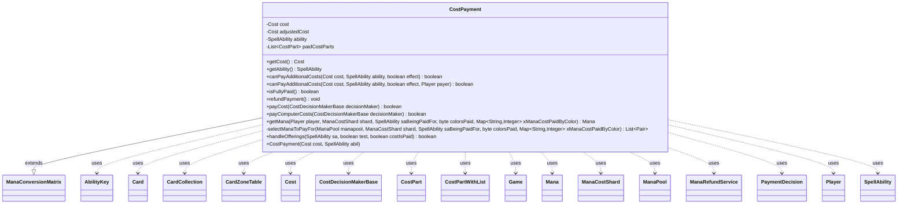

---
aliases:
  - CostPayment
tags:
  - java/class
  - module/forge-game
  - pkg/forge/game/cost
fqn: forge.game.cost.CostPayment
package: forge.game.cost
module: forge-game
kind: Class
---

# CostPayment

**Package:** `forge.game.cost` &nbsp; **Module:** `forge-game` &nbsp; **Kind:** Class



## Relationships
**Extends:**
- [[forge.game.mana.ManaConversionMatrix|ManaConversionMatrix]]
**Uses:**
- [[forge.card.mana.ManaCostShard|ManaCostShard]]
- [[forge.game.Game|Game]]
- [[forge.game.ability.AbilityKey|AbilityKey]]
- [[forge.game.card.Card|Card]]
- [[forge.game.card.CardCollection|CardCollection]]
- [[forge.game.card.CardZoneTable|CardZoneTable]]
- [[forge.game.cost.Cost|Cost]]
- [[forge.game.cost.CostDecisionMakerBase|CostDecisionMakerBase]]
- [[forge.game.cost.CostPart|CostPart]]
- [[forge.game.cost.CostPartWithList|CostPartWithList]]
- [[forge.game.cost.PaymentDecision|PaymentDecision]]
- [[forge.game.mana.Mana|Mana]]
- [[forge.game.mana.ManaPool|ManaPool]]
- [[forge.game.mana.ManaRefundService|ManaRefundService]]
- [[forge.game.player.Player|Player]]
- [[forge.game.spellability.SpellAbility|SpellAbility]]

## Design Description

Cost_Payment encapsulates the act of paying a `Cost` for a given `SpellAbility`, orchestrating the full payment lifecycle from cost adjustment through resolution. It holds the original and adjusted `Cost`, the owning `SpellAbility`, and the list of already-paid `CostPart`s, exposing entry points for both interactive (`payCost`) and AI-driven (`payComputerCosts`) payment, along with `isFullyPaid`, `refundPayment`, and static helpers for validating additional costs and resolving offerings.

By extending `ManaConversionMatrix`, it carries the per-payment color-replacement state used when matching pooled `Mana` to each `ManaCostShard`. It collaborates closely with `CostDecisionMakerBase` and `PaymentDecision` to decide and apply each `CostPart`, pushing them onto the game's `costPaymentStack` so effects can inspect what is being paid, and delegates undo to `CostPartWithList` and `ManaRefundService`. The weighted `selectManaToPayFor` logic reveals deliberate intent to spend the least flexible mana first, preferring colorless, restricted, and non-snow sources.

## Source
`forge-game/src/main/java/forge/game/cost/CostPayment.java`

```java
/*
 * Forge: Play Magic: the Gathering.
 * Copyright (C) 2011  Forge Team
 *
 * This program is free software: you can redistribute it and/or modify
 * it under the terms of the GNU General Public License as published by
 * the Free Software Foundation, either version 3 of the License, or
 * (at your option) any later version.
 * 
 * This program is distributed in the hope that it will be useful,
 * but WITHOUT ANY WARRANTY; without even the implied warranty of
 * MERCHANTABILITY or FITNESS FOR A PARTICULAR PURPOSE.  See the
 * GNU General Public License for more details.
 * 
 * You should have received a copy of the GNU General Public License
 * along with this program.  If not, see <http://www.gnu.org/licenses/>.
 */
package forge.game.cost;

import com.google.common.collect.Lists;
import com.google.common.collect.Maps;
import forge.card.MagicColor;
import forge.card.mana.ManaCostShard;
import forge.game.Game;
import forge.game.ability.AbilityKey;
import forge.game.card.Card;
import forge.game.card.CardCollection;
import forge.game.card.CardZoneTable;
import forge.game.mana.*;
import forge.game.player.Player;
import forge.game.spellability.SpellAbility;
import org.apache.commons.lang3.tuple.Pair;

import java.util.ArrayList;
import java.util.List;
import java.util.Map;

/**
 * <p>
 * Cost_Payment class.
 * </p>
 * 
 * @author Forge
 * @version $Id$
 */
public class CostPayment extends ManaConversionMatrix {
    private final Cost cost;
    private Cost adjustedCost;
    private final SpellAbility ability;
    private final List<CostPart> paidCostParts = Lists.newArrayList();

    /**
     * <p>
     * Getter for the field <code>cost</code>.
     * </p>
     * 
     * @return a {@link forge.game.cost.Cost} object.
     */
    public final Cost getCost() {
        return this.cost;
    }

    public final SpellAbility getAbility() {
        return this.ability;
    }

    /**
     * <p>
     * Constructor for Cost_Payment.
     * </p>
     * 
     * @param cost
     *            a {@link forge.game.cost.Cost} object.
     * @param abil
     *            a {@link forge.game.spellability.SpellAbility} object.
     */
    public CostPayment(final Cost cost, final SpellAbility abil) {
        this.cost = cost;
        this.adjustedCost = cost;
        this.ability = abil;
        restoreColorReplacements();
    }

    /**
     * <p>
     * canPayAdditionalCosts.
     * </p>
     * 
     * @param cost
     *            a {@link forge.game.cost.Cost} object.
     * @param ability
     *            a {@link forge.game.spellability.SpellAbility} object.
     * @return a boolean.
     */
    public static boolean canPayAdditionalCosts(Cost cost, final SpellAbility ability, final boolean effect) {
        return canPayAdditionalCosts(cost, ability, effect, ability.getActivatingPlayer());
    }
    public static boolean canPayAdditionalCosts(Cost cost, final SpellAbility ability, final boolean effect, final Player payer) {
        if (cost == null) {
            return true;
        }

        cost = CostAdjustment.adjust(cost, ability, effect);
        return cost.canPay(ability, payer, effect);
    }

    /**
     * <p>
     * isAllPaid.
     * </p>
     * 
     * @return a boolean.
     */
    public final boolean isFullyPaid() {
        return paidCostParts.containsAll(adjustedCost.getCostParts());
    }

    /**
     * <p>
     * cancelPayment.
     * </p>
     */
    public final void refundPayment() {
        Card sourceCard = this.ability.getHostCard();
        for (final CostPart part : this.paidCostParts) {
            part.refund(sourceCard);
            // Clear lists to prevent accumulation across multiple cancelled activations
            if (part instanceof CostPartWithList) {
                ((CostPartWithList) part).resetLists();
            }
        }

        new ManaRefundService(this.ability).refundManaPaid();
    }

    public boolean payCost(final CostDecisionMakerBase decisionMaker) {
        adjustedCost = CostAdjustment.adjust(cost, ability, decisionMaker.isEffect());
        List<CostPart> costParts = adjustedCost.getCostPartsWithZeroMana();

        if (adjustedCost.getCostParts().size() > 1) {
            // if mana part is shown here it wouldn't include reductions, but that's just a minor inconvenience
            costParts = decisionMaker.getPlayer().getController().orderCosts(costParts);
        }

        final Game game = decisionMaker.getPlayer().getGame();

        for (final CostPart part : costParts) {
            // Wrap the cost and push onto the cost stack
            game.costPaymentStack.push(part, this);

            PaymentDecision pd = part.accept(decisionMaker);

            // Right before we start paying as decided, we need to transfer the CostPayments matrix over?
            if (pd != null) {
                pd.matrix = this;
            }

            if (pd == null || !part.payAsDecided(decisionMaker.getPlayer(), pd, ability, decisionMaker.isEffect())) {
                game.costPaymentStack.pop(); // cost is resolved
                return false;
            }
            this.paidCostParts.add(part);
            game.costPaymentStack.pop(); // cost is resolved
        }

        // clear lists used for undo
        for (final CostPart part : this.paidCostParts) {
            if (part instanceof CostPartWithList listCost) {
                listCost.resetLists();
            }
        }

        return true;
    }

    public final boolean payComputerCosts(final CostDecisionMakerBase decisionMaker) {
        // Just in case it wasn't set, but honestly it shouldn't have gotten
        // here without being set
        if (this.ability.getActivatingPlayer() == null) {
            this.ability.setActivatingPlayer(decisionMaker.getPlayer());
        }

        Map<CostPart, PaymentDecision> decisions = Maps.newHashMap();
        // for Trinisphere make sure to include Zero
        List<CostPart> parts = CostAdjustment.adjust(cost, ability, decisionMaker.isEffect()).getCostPartsWithZeroMana();

        // Set all of the decisions before attempting to pay anything

        final Game game = decisionMaker.getPlayer().getGame();

        for (final CostPart part : parts) {
            PaymentDecision decision = part.accept(decisionMaker);
            if (null == decision) return false;

            // wrap the payment and push onto the cost stack
            game.costPaymentStack.push(part, this);
            if (decisionMaker.paysRightAfterDecision() && !part.payAsDecided(decisionMaker.getPlayer(), decision, ability, decisionMaker.isEffect())) {
                game.costPaymentStack.pop(); // cost is resolved
                return false;
            }

            game.costPaymentStack.pop(); // cost is either paid or deferred
            decisions.put(part, decision);
        }

        for (final CostPart part : parts) {
            // wrap the payment and push onto the cost stack
            game.costPaymentStack.push(part, this);

            if (!part.payAsDecided(decisionMaker.getPlayer(), decisions.get(part), this.ability, decisionMaker.isEffect())) {
                game.costPaymentStack.pop(); // cost is resolved
                return false;
            }
            // abilities care what was used to pay for them
            if (part instanceof CostPartWithList) {
                ((CostPartWithList) part).resetLists();
            }

            game.costPaymentStack.pop(); // cost is resolved
        }
        return true;
    }

    /**
     * <p>
     * getManaFrom.
     * </p>
     *
     * @param saBeingPaidFor
     *            a {@link forge.game.spellability.SpellAbility} object.
     * @return a {@link forge.game.mana.Mana} object.
     */
    public static Mana getMana(final Player player, final ManaCostShard shard, final SpellAbility saBeingPaidFor,
            final byte colorsPaid, Map<String, Integer> xManaCostPaidByColor) {
        final List<Pair<Mana, Integer>> weightedOptions = selectManaToPayFor(player.getManaPool(), shard,
            saBeingPaidFor, colorsPaid, xManaCostPaidByColor);

        // Exclude border case
        if (weightedOptions.isEmpty()) {
            return null; // There is no matching mana in the pool
        }

        // select equal weight possibilities
        List<Mana> manaChoices = new ArrayList<>();
        int bestWeight = Integer.MIN_VALUE;
        for (Pair<Mana, Integer> option : weightedOptions) {
            int thisWeight = option.getRight();
            Mana thisMana = option.getLeft();

            if (thisWeight > bestWeight) {
                manaChoices.clear();
                bestWeight = thisWeight;
            }

            if (thisWeight == bestWeight) {
                // add only distinct Mana-s
                boolean haveDuplicate = false;
                for (Mana m : manaChoices) {
                    if (m.equals(thisMana)) {
                        haveDuplicate = true;
                        break;
                    }
                }
                if (!haveDuplicate) {
                    manaChoices.add(thisMana);
                }
            }
        }

        // got an only one best option?
        if (manaChoices.size() == 1) {
            return manaChoices.get(0);
        }

        // Let them choose then
        return player.getController().chooseManaFromPool(manaChoices);
    }

    private static List<Pair<Mana, Integer>> selectManaToPayFor(final ManaPool manapool, final ManaCostShard shard,
            final SpellAbility saBeingPaidFor, final byte colorsPaid, Map<String, Integer> xManaCostPaidByColor) {
        final List<Pair<Mana, Integer>> weightedOptions = new ArrayList<>();
        for (final Mana thisMana : Lists.newArrayList(manapool)) {
            if (shard == ManaCostShard.COLORED_X && !ManaCostBeingPaid.canColoredXShardBePaidByColor(MagicColor.toShortString(thisMana.getColor()), xManaCostPaidByColor)) {
                continue;
            }

            if (!manapool.canPayForShardWithColor(shard, thisMana.getColor())) {
                continue;
            }

            if (shard.isSnow() && !thisMana.isSnow()) {
                continue;
            }

            if (thisMana.getManaAbility() != null && !thisMana.getManaAbility().meetsSpellAndShardRestrictions(saBeingPaidFor, shard, thisMana.getColor())) {
                continue;
            }

            if (!saBeingPaidFor.allowsPayingWithShard(thisMana.getSourceCard(), thisMana.getColor())) {
                continue;
            }

            int weight = 0;
            if (colorsPaid == -1) {
                // prefer colorless mana to spend
                weight += thisMana.isColorless() ? 5 : 0;
            } else {
                // get more colors for converge
                weight += (thisMana.getColor() | colorsPaid) != colorsPaid ? 5 : 0;
            }

            // prefer restricted mana to spend
            if (thisMana.isRestricted()) {
                weight += 2;
            }

            // Spend non-snow mana first
            if (!thisMana.isSnow()) {
                weight += 1;
            }

            weightedOptions.add(Pair.of(thisMana, weight));
        }
        return weightedOptions;
    }

    public static boolean handleOfferings(final SpellAbility sa, boolean test, boolean costIsPaid) {
        final Game game = sa.getHostCard().getGame();
        final CardZoneTable table = new CardZoneTable(game.getLastStateBattlefield(), game.getLastStateGraveyard());
        Map<AbilityKey, Object> params = AbilityKey.newMap();
        AbilityKey.addCardZoneTableParams(params, table);

        if (sa.isOffering()) {
            if (sa.getSacrificedAsOffering() == null) {
                return false;
            }
            final Card offering = sa.getSacrificedAsOffering();
            offering.setUsedToPay(false);
            if (test) {
                sa.resetSacrificedAsOffering();
            } else if (costIsPaid) {
                game.getAction().sacrifice(new CardCollection(offering), sa, false, params);
            }
        }
        if (sa.isEmerge()) {
            if (sa.getSacrificedAsEmerge() == null) {
                return false;
            }
            final Card emerge = sa.getSacrificedAsEmerge();
            emerge.setUsedToPay(false);
            if (test) {
                sa.resetSacrificedAsEmerge();
            } else if (costIsPaid) {
                game.getAction().sacrifice(new CardCollection(emerge), sa, false, params);
                sa.setSacrificedAsEmerge(game.getChangeZoneLKIInfo(emerge));
            }
        }
        if (!table.isEmpty()) {
            table.triggerChangesZoneAll(sa.getHostCard().getGame(), sa);
        }
        return true;
    }
}
```

## Python
`forge/game/cost/CostPayment.py`

```python
from forge.card.MagicColor import MagicColor
from forge.card.mana.ManaCostShard import ManaCostShard
from forge.game.Game import Game
from forge.game.ability.AbilityKey import AbilityKey
from forge.game.card.Card import Card
from forge.game.card.CardCollection import CardCollection
from forge.game.card.CardZoneTable import CardZoneTable
from forge.game.cost.Cost import Cost
from forge.game.cost.CostAdjustment import CostAdjustment
from forge.game.cost.CostDecisionMakerBase import CostDecisionMakerBase
from forge.game.cost.CostPart import CostPart
from forge.game.cost.CostPartWithList import CostPartWithList
from forge.game.cost.PaymentDecision import PaymentDecision
from forge.game.mana.ManaConversionMatrix import ManaConversionMatrix
from forge.game.mana.Mana import Mana
from forge.game.mana.ManaCostBeingPaid import ManaCostBeingPaid
from forge.game.mana.ManaPool import ManaPool
from forge.game.mana.ManaRefundService import ManaRefundService
from forge.game.player.Player import Player
from forge.game.spellability.SpellAbility import SpellAbility


class CostPayment(ManaConversionMatrix):
    def __init__(self, cost: Cost, abil: SpellAbility):
        self.cost = cost
        self.adjustedCost = cost
        self.ability = abil
        self.paidCostParts: list[CostPart] = []
        self.restoreColorReplacements()

    def getCost(self) -> Cost:
        return self.cost

    def getAbility(self) -> SpellAbility:
        return self.ability

    @staticmethod
    def canPayAdditionalCosts(cost: Cost, ability: SpellAbility, effect: bool, payer: Player = None) -> bool:
        if payer is None:
            payer = ability.getActivatingPlayer()
        if cost is None:
            return True

        cost = CostAdjustment.adjust(cost, ability, effect)
        return cost.canPay(ability, payer, effect)

    def isFullyPaid(self) -> bool:
        return all(part in self.paidCostParts for part in self.adjustedCost.getCostParts())

    def refundPayment(self) -> None:
        sourceCard = self.ability.getHostCard()
        for part in self.paidCostParts:
            part.refund(sourceCard)
            # Clear lists to prevent accumulation across multiple cancelled activations
            if isinstance(part, CostPartWithList):
                part.resetLists()

        ManaRefundService(self.ability).refundManaPaid()

    def payCost(self, decisionMaker: CostDecisionMakerBase) -> bool:
        self.adjustedCost = CostAdjustment.adjust(self.cost, self.ability, decisionMaker.isEffect())
        costParts = self.adjustedCost.getCostPartsWithZeroMana()

        if len(self.adjustedCost.getCostParts()) > 1:
            # if mana part is shown here it wouldn't include reductions, but that's just a minor inconvenience
            costParts = decisionMaker.getPlayer().getController().orderCosts(costParts)

        game = decisionMaker.getPlayer().getGame()

        for part in costParts:
            # Wrap the cost and push onto the cost stack
            game.costPaymentStack.push(part, self)

            pd = part.accept(decisionMaker)

            # Right before we start paying as decided, we need to transfer the CostPayments matrix over?
            if pd is not None:
                pd.matrix = self

            if pd is None or not part.payAsDecided(decisionMaker.getPlayer(), pd, self.ability, decisionMaker.isEffect()):
                game.costPaymentStack.pop()  # cost is resolved
                return False
            self.paidCostParts.append(part)
            game.costPaymentStack.pop()  # cost is resolved

        # clear lists used for undo
        for part in self.paidCostParts:
            if isinstance(part, CostPartWithList):
                part.resetLists()

        return True

    def payComputerCosts(self, decisionMaker: CostDecisionMakerBase) -> bool:
        # Just in case it wasn't set, but honestly it shouldn't have gotten
        # here without being set
        if self.ability.getActivatingPlayer() is None:
            self.ability.setActivatingPlayer(decisionMaker.getPlayer())

        decisions: dict[CostPart, PaymentDecision] = {}
        # for Trinisphere make sure to include Zero
        parts = CostAdjustment.adjust(self.cost, self.ability, decisionMaker.isEffect()).getCostPartsWithZeroMana()

        # Set all of the decisions before attempting to pay anything

        game = decisionMaker.getPlayer().getGame()

        for part in parts:
            decision = part.accept(decisionMaker)
            if decision is None:
                return False

            # wrap the payment and push onto the cost stack
            game.costPaymentStack.push(part, self)
            if decisionMaker.paysRightAfterDecision() and not part.payAsDecided(decisionMaker.getPlayer(), decision, self.ability, decisionMaker.isEffect()):
                game.costPaymentStack.pop()  # cost is resolved
                return False

            game.costPaymentStack.pop()  # cost is either paid or deferred
            decisions[part] = decision

        for part in parts:
            # wrap the payment and push onto the cost stack
            game.costPaymentStack.push(part, self)

            if not part.payAsDecided(decisionMaker.getPlayer(), decisions.get(part), self.ability, decisionMaker.isEffect()):
                game.costPaymentStack.pop()  # cost is resolved
                return False
            # abilities care what was used to pay for them
            if isinstance(part, CostPartWithList):
                part.resetLists()

            game.costPaymentStack.pop()  # cost is resolved
        return True

    @staticmethod
    def getMana(player: Player, shard: ManaCostShard, saBeingPaidFor: SpellAbility,
                colorsPaid: int, xManaCostPaidByColor: dict[str, int]) -> Mana:
        weightedOptions = CostPayment.selectManaToPayFor(player.getManaPool(), shard,
            saBeingPaidFor, colorsPaid, xManaCostPaidByColor)

        # Exclude border case
        if not weightedOptions:
            return None  # There is no matching mana in the pool

        # select equal weight possibilities
        manaChoices: list[Mana] = []
        bestWeight = float('-inf')
        for option in weightedOptions:
            thisWeight = option[1]
            thisMana = option[0]

            if thisWeight > bestWeight:
                manaChoices.clear()
                bestWeight = thisWeight

            if thisWeight == bestWeight:
                # add only distinct Mana-s
                haveDuplicate = False
                for m in manaChoices:
                    if m == thisMana:
                        haveDuplicate = True
                        break
                if not haveDuplicate:
                    manaChoices.append(thisMana)

        # got an only one best option?
        if len(manaChoices) == 1:
            return manaChoices[0]

        # Let them choose then
        return player.getController().chooseManaFromPool(manaChoices)

    @staticmethod
    def selectManaToPayFor(manapool: ManaPool, shard: ManaCostShard,
            saBeingPaidFor: SpellAbility, colorsPaid: int, xManaCostPaidByColor: dict[str, int]):
        weightedOptions = []
        for thisMana in list(manapool):
            if shard == ManaCostShard.COLORED_X and not ManaCostBeingPaid.canColoredXShardBePaidByColor(MagicColor.toShortString(thisMana.getColor()), xManaCostPaidByColor):
                continue

            if not manapool.canPayForShardWithColor(shard, thisMana.getColor()):
                continue

            if shard.isSnow() and not thisMana.isSnow():
                continue

            if thisMana.getManaAbility() is not None and not thisMana.getManaAbility().meetsSpellAndShardRestrictions(saBeingPaidFor, shard, thisMana.getColor()):
                continue

            if not saBeingPaidFor.allowsPayingWithShard(thisMana.getSourceCard(), thisMana.getColor()):
                continue

            weight = 0
            if colorsPaid == -1:
                # prefer colorless mana to spend
                weight += 5 if thisMana.isColorless() else 0
            else:
                # get more colors for converge
                weight += 5 if (thisMana.getColor() | colorsPaid) != colorsPaid else 0

            # prefer restricted mana to spend
            if thisMana.isRestricted():
                weight += 2

            # Spend non-snow mana first
            if not thisMana.isSnow():
                weight += 1

            weightedOptions.append((thisMana, weight))
        return weightedOptions

    @staticmethod
    def handleOfferings(sa: SpellAbility, test: bool, costIsPaid: bool) -> bool:
        game = sa.getHostCard().getGame()
        table = CardZoneTable(game.getLastStateBattlefield(), game.getLastStateGraveyard())
        params = AbilityKey.newMap()
        AbilityKey.addCardZoneTableParams(params, table)

        if sa.isOffering():
            if sa.getSacrificedAsOffering() is None:
                return False
            offering = sa.getSacrificedAsOffering()
            offering.setUsedToPay(False)
            if test:
                sa.resetSacrificedAsOffering()
            elif costIsPaid:
                game.getAction().sacrifice(CardCollection(offering), sa, False, params)
        if sa.isEmerge():
            if sa.getSacrificedAsEmerge() is None:
                return False
            emerge = sa.getSacrificedAsEmerge()
            emerge.setUsedToPay(False)
            if test:
                sa.resetSacrificedAsEmerge()
            elif costIsPaid:
                game.getAction().sacrifice(CardCollection(emerge), sa, False, params)
                sa.setSacrificedAsEmerge(game.getChangeZoneLKIInfo(emerge))
        if not table.isEmpty():
            table.triggerChangesZoneAll(sa.getHostCard().getGame(), sa)
        return True
```
