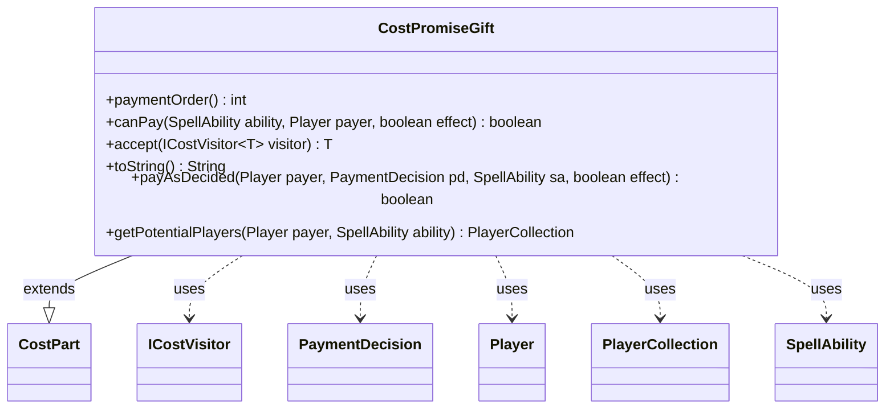

---
aliases:
  - CostPromiseGift
tags:
  - java/class
  - module/forge-game
  - pkg/forge/game/cost
fqn: forge.game.cost.CostPromiseGift
package: forge.game.cost
module: forge-game
kind: Class
---

# CostPromiseGift

**Package:** `forge.game.cost` &nbsp; **Module:** `forge-game` &nbsp; **Kind:** Class



## Relationships
**Extends:**
- [[forge.game.cost.CostPart|CostPart]]
**Uses:**
- [[forge.game.cost.ICostVisitor|ICostVisitor]]
- [[forge.game.cost.PaymentDecision|PaymentDecision]]
- [[forge.game.player.Player|Player]]
- [[forge.game.player.PlayerCollection|PlayerCollection]]
- [[forge.game.spellability.SpellAbility|SpellAbility]]

## Design Description

CostPromiseGift models the "Promise Gift" payment as a concrete `CostPart` subclass, representing the act of choosing an opponent to whom a gift is promised. As a leaf in the cost hierarchy, it overrides the abstract contract: `canPay` always succeeds (any player can make a promise), `paymentOrder` returns -1 since it merely designates a player, and `payAsDecided` records the chosen recipient on the host card via `setPromisedGift`, clearing it when no player is decided.

It collaborates with `SpellAbility` and its host card to persist the decision, consumes a `PaymentDecision` for the selected `Player`, and exposes `getPotentialPlayers` (the payer's opponents) to constrain valid targets. By implementing `accept`, it participates in the `ICostVisitor` double-dispatch scheme used across cost types. A source comment notes the design is intentionally narrow, flagging a possible future generalization to a broader "Choose Player/Opponent" cost.

## Source
`forge-game/src/main/java/forge/game/cost/CostPromiseGift.java`

```java
package forge.game.cost;

import forge.game.player.Player;
import forge.game.player.PlayerCollection;
import forge.game.spellability.SpellAbility;

public class CostPromiseGift extends CostPart {
    // Promise Gift is a very specific cost. A more generic version might be "Choose Player/Opponent"

    @Override
    public int paymentOrder() {
        // Its just choosing a person
        return -1;
    }

    @Override
    public boolean canPay(SpellAbility ability, Player payer, boolean effect) {
        // You can always promise a gift
        return true;
    }

    @Override
    public <T> T accept(ICostVisitor<T> visitor) {
        return visitor.visit(this);
    }

    @Override
    public String toString() {
        // Extract the description from the SA

        return "Gift something";
    }

    @Override
    public boolean payAsDecided(Player payer, PaymentDecision pd, SpellAbility sa, boolean effect) {
        if (pd.players.isEmpty()) {
            sa.getHostCard().setPromisedGift(null);
            return false;
        }

        sa.getHostCard().setPromisedGift(pd.players.get(0));
        return true;
    }

    public PlayerCollection getPotentialPlayers(final Player payer, final SpellAbility ability) {
        return payer.getOpponents();
    }
}
```
