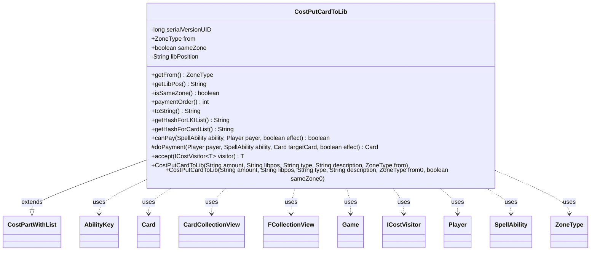

---
aliases:
  - CostPutCardToLib
tags:
  - java/class
  - module/forge-game
  - pkg/forge/game/cost
fqn: forge.game.cost.CostPutCardToLib
package: forge.game.cost
module: forge-game
kind: Class
---

# CostPutCardToLib

**Package:** `forge.game.cost` &nbsp; **Module:** `forge-game` &nbsp; **Kind:** Class



## Relationships
**Extends:**
- [[forge.game.cost.CostPartWithList|CostPartWithList]]
**Uses:**
- [[forge.game.Game|Game]]
- [[forge.game.ability.AbilityKey|AbilityKey]]
- [[forge.game.card.Card|Card]]
- [[forge.game.card.CardCollectionView|CardCollectionView]]
- [[forge.game.cost.ICostVisitor|ICostVisitor]]
- [[forge.game.player.Player|Player]]
- [[forge.game.spellability.SpellAbility|SpellAbility]]
- [[forge.game.zone.ZoneType|ZoneType]]
- [[forge.util.collect.FCollectionView|FCollectionView]]

## Design Description

CostPutCardToLib models the game cost of moving cards from a player's hand or graveyard into a library at a specified position, supporting the "PutCardToLib" cost syntax used by Forge's ability/cost parser. Extending CostPartWithList, it inherits per-card payment tracking while overriding the hooks that define its concrete behavior: canPay validates that enough matching cards exist in the source ZoneType, doPayment relocates each card via the game's action system to the chosen library index, and toString renders human-readable cost text.

A notable design point is the sameZone flag, which switches the search and ownership semantics from the payer's own zone to any shared zone across all players, checking per-controller payability. The class collaborates with Card, Player, SpellAbility, and Game for resolution, and participates in the visitor pattern through accept(ICostVisitor), keeping cost-type dispatch external to the cost hierarchy.

## Source
`forge-game/src/main/java/forge/game/cost/CostPutCardToLib.java`

```java
/*
 * Forge: Play Magic: the Gathering.
 * Copyright (C) 2011  Forge Team
 *
 * This program is free software: you can redistribute it and/or modify
 * it under the terms of the GNU General Public License as published by
 * the Free Software Foundation, either version 3 of the License, or
 * (at your option) any later version.
 * 
 * This program is distributed in the hope that it will be useful,
 * but WITHOUT ANY WARRANTY; without even the implied warranty of
 * MERCHANTABILITY or FITNESS FOR A PARTICULAR PURPOSE.  See the
 * GNU General Public License for more details.
 * 
 * You should have received a copy of the GNU General Public License
 * along with this program.  If not, see <http://www.gnu.org/licenses/>.
 */
package forge.game.cost;

import forge.game.Game;
import forge.game.ability.AbilityKey;
import forge.game.card.Card;
import forge.game.card.CardCollectionView;
import forge.game.card.CardLists;
import forge.game.card.CardPredicates;
import forge.game.player.Player;
import forge.game.spellability.SpellAbility;
import forge.game.zone.ZoneType;
import forge.util.collect.FCollectionView;

import java.util.Map;

/**
 * This is for the "PutCardToLib" Cost. 
 */
public class CostPutCardToLib extends CostPartWithList {
    // PutCardToLibFromHand<Num/LibPos/Type{/TypeDescription}>
    // PutCardToLibFromSameGrave<Num/LibPos/Type{/TypeDescription}>
    // PutCardToLibFromGrave<Num/LibPos/Type{/TypeDescription}>

    /**
     * Serializables need a version ID.
     */
    private static final long serialVersionUID = 1L;
    public final ZoneType from;
    public final boolean sameZone;
    private String libPosition = "0";

    public final ZoneType getFrom() {
        return from;
    }

    public final String getLibPos() {
        return libPosition;
    }

    public final boolean isSameZone() {
        return sameZone;
    }

    public CostPutCardToLib(final String amount, final String libpos, final String type, final String description, final ZoneType from) {
        this(amount, libpos, type, description, from, false);
    }
    
    public CostPutCardToLib(final String amount, final String libpos, final String type, final String description, final ZoneType from0, final boolean sameZone0) {
        super(amount, type, description);
        from = from0 == null ? ZoneType.Hand : from0;
        libPosition = libpos;
        sameZone = sameZone0;
    }

    @Override
    public int paymentOrder() { return 10; }

    @Override
    public final String toString() {
        final StringBuilder sb = new StringBuilder();
        final Integer i = convertAmount();
        sb.append("Put ");
        
        final String desc = getTypeDescription() == null ? getType() : getTypeDescription();
        if (this.payCostFromSource()) {
            sb.append(this.getType());
        } else {
            sb.append(Cost.convertAmountTypeToWords(i, getAmount(), desc));
        }

        if (sameZone) {
            sb.append(" from the same ").append(from);
        } else if (!this.payCostFromSource()) {
            sb.append(" from your ").append(from);
        }

        sb.append(" on ");
        
        if (libPosition.equals("0")) {
            sb.append("top of");
        } else {
            sb.append("the bottom of");
        }
        
        if (sameZone) {
            sb.append(" their owner's library");
        } else if (this.payCostFromSource()) {
            sb.append(" its owner's library");
        } else {
            sb.append(" your library");
        }

        return sb.toString();
    }

    @Override
    public String getHashForLKIList() {
        return "CardPutToLib";
    }
    @Override
    public String getHashForCardList() {
    	return "CardPutToLibCards";
    }

    @Override
    public final boolean canPay(final SpellAbility ability, final Player payer, final boolean effect) {
        final Card source = ability.getHostCard();
        final Game game = source.getGame();

        int i = getAbilityAmount(ability);

        CardCollectionView typeList;
        if (sameZone) {
            typeList = game.getCardsIn(getFrom());
        }
        else {
            typeList = payer.getCardsIn(getFrom());
        }

        if (this.payCostFromSource()) {
            return typeList.contains(source);
        }

        typeList = CardLists.getValidCards(typeList, getType().split(";"), payer, source, ability);

        if (typeList.size() < i) {
            return false;
        }

        if (sameZone) {
            boolean foundPayable = false;
            FCollectionView<Player> players = game.getPlayers();
            for (Player p : players) {
                if (CardLists.count(typeList, CardPredicates.isController(p)) >= i) {
                    foundPayable = true;
                    break;
                }
            }
            return foundPayable;
        }
        return true;
    }

    @Override
    protected Card doPayment(Player payer, SpellAbility ability, Card targetCard, final boolean effect) {
        Map<AbilityKey, Object> moveParams = AbilityKey.newMap();
        AbilityKey.addCardZoneTableParams(moveParams, table);
        return targetCard.getGame().getAction().moveToLibrary(targetCard, Integer.parseInt(getLibPos()), null, moveParams);
    }

    public <T> T accept(ICostVisitor<T> visitor) {
        return visitor.visit(this);
    }
}
```

## Python
`forge/game/cost/CostPutCardToLib.py`

```python
from forge.game.Game import Game
from forge.game.ability.AbilityKey import AbilityKey
from forge.game.card.Card import Card
from forge.game.card.CardCollectionView import CardCollectionView
from forge.game.cost.ICostVisitor import ICostVisitor
from forge.game.player.Player import Player
from forge.game.spellability.SpellAbility import SpellAbility
from forge.game.zone.ZoneType import ZoneType
from forge.util.collect.FCollectionView import FCollectionView

from forge.game.card.CardLists import CardLists
from forge.game.card.CardPredicates import CardPredicates
from forge.game.cost.CostPartWithList import CostPartWithList
from forge.game.cost.Cost import Cost


class CostPutCardToLib(CostPartWithList):
    # PutCardToLibFromHand<Num/LibPos/Type{/TypeDescription}>
    # PutCardToLibFromSameGrave<Num/LibPos/Type{/TypeDescription}>
    # PutCardToLibFromGrave<Num/LibPos/Type{/TypeDescription}>

    # Serializables need a version ID.
    serialVersionUID = 1

    def getFrom(self) -> ZoneType:
        return self.from_

    def getLibPos(self) -> str:
        return self.libPosition

    def isSameZone(self) -> bool:
        return self.sameZone

    def __init__(self, amount: str, libpos: str, type: str, description: str, from0: ZoneType, sameZone0: bool = False):
        super().__init__(amount, type, description)
        self.from_ = ZoneType.Hand if from0 is None else from0
        self.libPosition = libpos
        self.sameZone = sameZone0

    def paymentOrder(self) -> int:
        return 10

    def toString(self) -> str:
        sb = []
        i = self.convertAmount()
        sb.append("Put ")

        desc = self.getType() if self.getTypeDescription() is None else self.getTypeDescription()
        if self.payCostFromSource():
            sb.append(self.getType())
        else:
            sb.append(Cost.convertAmountTypeToWords(i, self.getAmount(), desc))

        if self.sameZone:
            sb.append(" from the same ")
            sb.append(str(self.from_))
        elif not self.payCostFromSource():
            sb.append(" from your ")
            sb.append(str(self.from_))

        sb.append(" on ")

        if self.libPosition == "0":
            sb.append("top of")
        else:
            sb.append("the bottom of")

        if self.sameZone:
            sb.append(" their owner's library")
        elif self.payCostFromSource():
            sb.append(" its owner's library")
        else:
            sb.append(" your library")

        return "".join(sb)

    def __str__(self) -> str:
        return self.toString()

    def getHashForLKIList(self) -> str:
        return "CardPutToLib"

    def getHashForCardList(self) -> str:
        return "CardPutToLibCards"

    def canPay(self, ability: SpellAbility, payer: Player, effect: bool) -> bool:
        source = ability.getHostCard()
        game = source.getGame()

        i = self.getAbilityAmount(ability)

        if self.sameZone:
            typeList = game.getCardsIn(self.getFrom())
        else:
            typeList = payer.getCardsIn(self.getFrom())

        if self.payCostFromSource():
            return typeList.contains(source)

        typeList = CardLists.getValidCards(typeList, self.getType().split(";"), payer, source, ability)

        if typeList.size() < i:
            return False

        if self.sameZone:
            foundPayable = False
            players = game.getPlayers()
            for p in players:
                if CardLists.count(typeList, CardPredicates.isController(p)) >= i:
                    foundPayable = True
                    break
            return foundPayable
        return True

    def doPayment(self, payer: Player, ability: SpellAbility, targetCard: Card, effect: bool) -> Card:
        moveParams = AbilityKey.newMap()
        AbilityKey.addCardZoneTableParams(moveParams, self.table)
        return targetCard.getGame().getAction().moveToLibrary(targetCard, int(self.getLibPos()), None, moveParams)

    def accept(self, visitor: ICostVisitor):
        return visitor.visit(self)
```
