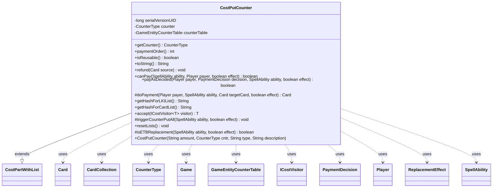

---
aliases:
  - CostPutCounter
tags:
  - java/class
  - module/forge-game
  - pkg/forge/game/cost
fqn: forge.game.cost.CostPutCounter
package: forge.game.cost
module: forge-game
kind: Class
---

# CostPutCounter

**Package:** `forge.game.cost` &nbsp; **Module:** `forge-game` &nbsp; **Kind:** Class



## Relationships
**Extends:**
- [[forge.game.cost.CostPartWithList|CostPartWithList]]
**Uses:**
- [[forge.game.Game|Game]]
- [[forge.game.GameEntityCounterTable|GameEntityCounterTable]]
- [[forge.game.card.Card|Card]]
- [[forge.game.card.CardCollection|CardCollection]]
- [[forge.game.card.CounterType|CounterType]]
- [[forge.game.cost.ICostVisitor|ICostVisitor]]
- [[forge.game.cost.PaymentDecision|PaymentDecision]]
- [[forge.game.player.Player|Player]]
- [[forge.game.replacement.ReplacementEffect|ReplacementEffect]]
- [[forge.game.spellability.SpellAbility|SpellAbility]]

## Design Description

CostPutCounter models the "put one or more counters of a given type onto a permanent" portion of an ability or spell cost. Extending CostPartWithList, it tracks the cards it has affected and reuses that list for refunds, hashing, and reset, while delegating the numeric amount and valid-target type parsing to its supertype. Its responsibility is to validate payability (canPay) and execute the counter placement (doPayment), routing counters either directly onto a target Card or, during an enter-the-battlefield replacement, into the replacement's GameEntityCounterTable.

Notable design intent includes special handling for self-targeting ETB replacements via an LKI copy and static-ability check to predict whether the permanent could receive counters; loyalty-counter costs rendered as "+N"; treating −1/−1 counters as non-reusable; and batching placements through a GameEntityCounterTable so triggerCounterPutAll can fire counter-related replacement effects collectively. It accepts ICostVisitor for double-dispatch over cost types.

## Source
`forge-game/src/main/java/forge/game/cost/CostPutCounter.java`

```java
/*
 * Forge: Play Magic: the Gathering.
 * Copyright (C) 2011  Forge Team
 *
 * This program is free software: you can redistribute it and/or modify
 * it under the terms of the GNU General Public License as published by
 * the Free Software Foundation, either version 3 of the License, or
 * (at your option) any later version.
 *
 * This program is distributed in the hope that it will be useful,
 * but WITHOUT ANY WARRANTY; without even the implied warranty of
 * MERCHANTABILITY or FITNESS FOR A PARTICULAR PURPOSE.  See the
 * GNU General Public License for more details.
 *
 * You should have received a copy of the GNU General Public License
 * along with this program.  If not, see <http://www.gnu.org/licenses/>.
 */
package forge.game.cost;

import com.google.common.collect.Sets;
import forge.game.Game;
import forge.game.GameEntityCounterTable;
import forge.game.ability.AbilityKey;
import forge.game.card.*;
import forge.game.player.Player;
import forge.game.replacement.ReplacementEffect;
import forge.game.replacement.ReplacementType;
import forge.game.spellability.SpellAbility;
import forge.game.zone.ZoneType;

import java.util.List;

/**
 * The Class CostPutCounter.
 */
public class CostPutCounter extends CostPartWithList {
     /**
     * Serializables need a version ID.
     */
    private static final long serialVersionUID = 1L;
    // Put Counter doesn't really have a "Valid" portion of the cost
    private final CounterType counter;

    private final GameEntityCounterTable counterTable = new GameEntityCounterTable();

    public final CounterType getCounter() {
        return this.counter;
    }

    /**
     * Instantiates a new cost put counter.
     *
     * @param amount
     *            the amount
     * @param cntr
     *            the cntr
     * @param type
     *            the type
     * @param description
     *            the description
     */
    public CostPutCounter(final String amount, final CounterType cntr, final String type, final String description) {
        super(amount, type, description);
        this.counter = cntr;
    }

    @Override
    public int paymentOrder() { return 6; }

    @Override
    public boolean isReusable() {
        return !counter.is(CounterEnumType.M1M1);
    }

    /*
     * (non-Javadoc)
     *
     * @see forge.card.cost.CostPart#toString()
     */
    @Override
    public String toString() {
        final StringBuilder sb = new StringBuilder();
        if (this.counter.is(CounterEnumType.LOYALTY)) {
            if (this.getAmount().equals("0")) {
                sb.append("0");
            } else {
                sb.append("+").append(this.getAmount());
            }
        } else {
            sb.append("Put ");
            final Integer i = this.convertAmount();
            sb.append(Cost.convertAmountTypeToWords(i, this.getAmount(), this.counter.getName() + " counter"));

            sb.append(" on ");
            if (this.payCostFromSource()) {
                sb.append(this.getType());
            } else {
                final String desc = this.getTypeDescription() == null ? this.getType() : this.getTypeDescription();
                sb.append(desc);
            }
        }
        return sb.toString();
    }

    /*
     * (non-Javadoc)
     *
     * @see forge.card.cost.CostPart#refund(forge.Card)
     */
    @Override
    public final void refund(final Card source) {
        final Integer i = this.convertAmount();
        for (final Card c : this.getCardList()) {
            c.subtractCounter(this.counter, i, null);
        }
    }

    /*
     * (non-Javadoc)
     *
     * @see
     * forge.card.cost.CostPart#canPay(forge.card.spellability.SpellAbility,
     * forge.Card, forge.Player, forge.card.cost.Cost)
     */
    @Override
    public final boolean canPay(final SpellAbility ability, final Player payer, final boolean effect) {
        final Card source = ability.getHostCard();
        final Game game = source.getGame();
        if (this.payCostFromSource()) {
            if (isETBReplacement(ability, effect)) {
                final Card copy = CardCopyService.getLKICopy(source);
                copy.setLastKnownZone(payer.getZone(ZoneType.Battlefield));

                // check state it would have on the battlefield
                CardCollection preList = new CardCollection(copy);
                game.getAction().checkStaticAbilities(false, Sets.newHashSet(copy), preList);
                // reset again?
                game.getAction().checkStaticAbilities(false);
                if (copy.canReceiveCounters(getCounter())) {
                    return true;
                }
            } else {
                if (!source.isInPlay()) {
                    return false;
                }
                if (source.canReceiveCounters(getCounter())) {
                    return true;
                }
            }
            return getAbilityAmount(ability) == 0;
        }

        // 3 Cards have Put a -1/-1 Counter on a Creature you control.
        List<Card> typeList = CardLists.getValidCards(source.getGame().getCardsIn(ZoneType.Battlefield),
                this.getType().split(";"), payer, source, ability);

        typeList = CardLists.filter(typeList, CardPredicates.canReceiveCounters(getCounter()));

        return !typeList.isEmpty();
    }

    /*
     * (non-Javadoc)
     *
     * @see forge.card.cost.CostPart#payAI(forge.card.spellability.SpellAbility,
     * forge.Card, forge.card.cost.Cost_Payment)
     */
    @Override
    public boolean payAsDecided(Player payer, PaymentDecision decision, SpellAbility ability, final boolean effect) {
        super.payAsDecided(payer, decision, ability, effect);
        triggerCounterPutAll(ability, effect);
        return true;
    }

    @Override
    protected Card doPayment(Player payer, SpellAbility ability, Card targetCard, final boolean effect) {
        final int i = getAbilityAmount(ability);
        if (isETBReplacement(ability, effect)) {
            GameEntityCounterTable etbTable = (GameEntityCounterTable) ability.getReplacingObject(AbilityKey.CounterTable);
            etbTable.put(payer, targetCard, getCounter(), i);
        } else {
            targetCard.addCounter(getCounter(), i, payer, counterTable);
        }
        return targetCard;
    }

    @Override
    public String getHashForLKIList() {
        return "CounterPut";
    }
    @Override
    public String getHashForCardList() {
    	return "CounterPutCards";
    }

    public <T> T accept(ICostVisitor<T> visitor) {
        return visitor.visit(this);
    }

    protected void triggerCounterPutAll(final SpellAbility ability, final boolean effect) {
        if (counterTable.isEmpty()) {
            return;
        }

        GameEntityCounterTable tempTable = new GameEntityCounterTable(counterTable);
        tempTable.replaceCounterEffect(ability.getHostCard().getGame(), ability, effect, false, null);
    }

    /* (non-Javadoc)
     * @see forge.game.cost.CostPartWithList#resetLists()
     */
    @Override
    public void resetLists() {
        super.resetLists();
        counterTable.clear();
    }

    protected boolean isETBReplacement(final SpellAbility ability, final boolean effect) {
       if (!effect) {
           return false;
       }
       // only for itself?
       if (!payCostFromSource()) {
           return false;
       }
       if (ability == null) {
           return false;
       }
       if (!ability.isReplacementAbility()) {
           return false;
       }
       ReplacementEffect re = ability.getReplacementEffect();
       if (re.getMode() != ReplacementType.Moved) {
           return false;
       }
       if (!ability.getHostCard().equals(ability.getReplacingObject(AbilityKey.Card))) {
           return false;
       }
       return true;
   }
}
```

## Python
`forge/game/cost/CostPutCounter.py`

```python
from forge.game.Game import Game
from forge.game.GameEntityCounterTable import GameEntityCounterTable
from forge.game.ability.AbilityKey import AbilityKey
from forge.game.card.Card import Card
from forge.game.card.CardCollection import CardCollection
from forge.game.card.CardCopyService import CardCopyService
from forge.game.card.CardLists import CardLists
from forge.game.card.CardPredicates import CardPredicates
from forge.game.card.CounterEnumType import CounterEnumType
from forge.game.card.CounterType import CounterType
from forge.game.cost.Cost import Cost
from forge.game.cost.CostPartWithList import CostPartWithList
from forge.game.cost.ICostVisitor import ICostVisitor
from forge.game.cost.PaymentDecision import PaymentDecision
from forge.game.player.Player import Player
from forge.game.replacement.ReplacementEffect import ReplacementEffect
from forge.game.replacement.ReplacementType import ReplacementType
from forge.game.spellability.SpellAbility import SpellAbility
from forge.game.zone.ZoneType import ZoneType


class CostPutCounter(CostPartWithList):
    """The Class CostPutCounter."""

    # Serializables need a version ID.
    serialVersionUID = 1

    def __init__(self, amount: str, cntr: CounterType, type: str, description: str):
        """Instantiates a new cost put counter.

        :param amount: the amount
        :param cntr: the cntr
        :param type: the type
        :param description: the description
        """
        super().__init__(amount, type, description)
        # Put Counter doesn't really have a "Valid" portion of the cost
        self.counter = cntr
        self.counterTable = GameEntityCounterTable()

    def getCounter(self) -> CounterType:
        return self.counter

    def paymentOrder(self) -> int:
        return 6

    def isReusable(self) -> bool:
        return not self.counter.is_(CounterEnumType.M1M1)

    def toString(self) -> str:
        sb = []
        if self.counter.is_(CounterEnumType.LOYALTY):
            if self.getAmount() == "0":
                sb.append("0")
            else:
                sb.append("+")
                sb.append(self.getAmount())
        else:
            sb.append("Put ")
            i = self.convertAmount()
            sb.append(Cost.convertAmountTypeToWords(i, self.getAmount(), self.counter.getName() + " counter"))

            sb.append(" on ")
            if self.payCostFromSource():
                sb.append(self.getType())
            else:
                desc = self.getType() if self.getTypeDescription() is None else self.getTypeDescription()
                sb.append(desc)
        return "".join(sb)

    def refund(self, source: Card) -> None:
        i = self.convertAmount()
        for c in self.getCardList():
            c.subtractCounter(self.counter, i, None)

    def canPay(self, ability: SpellAbility, payer: Player, effect: bool) -> bool:
        source = ability.getHostCard()
        game = source.getGame()
        if self.payCostFromSource():
            if self.isETBReplacement(ability, effect):
                copy = CardCopyService.getLKICopy(source)
                copy.setLastKnownZone(payer.getZone(ZoneType.Battlefield))

                # check state it would have on the battlefield
                preList = CardCollection(copy)
                game.getAction().checkStaticAbilities(False, {copy}, preList)
                # reset again?
                game.getAction().checkStaticAbilities(False)
                if copy.canReceiveCounters(self.getCounter()):
                    return True
            else:
                if not source.isInPlay():
                    return False
                if source.canReceiveCounters(self.getCounter()):
                    return True
            return self.getAbilityAmount(ability) == 0

        # 3 Cards have Put a -1/-1 Counter on a Creature you control.
        typeList = CardLists.getValidCards(source.getGame().getCardsIn(ZoneType.Battlefield),
                self.getType().split(";"), payer, source, ability)

        typeList = CardLists.filter(typeList, CardPredicates.canReceiveCounters(self.getCounter()))

        return len(typeList) != 0

    def payAsDecided(self, payer: Player, decision: PaymentDecision, ability: SpellAbility, effect: bool) -> bool:
        super().payAsDecided(payer, decision, ability, effect)
        self.triggerCounterPutAll(ability, effect)
        return True

    def doPayment(self, payer: Player, ability: SpellAbility, targetCard: Card, effect: bool) -> Card:
        i = self.getAbilityAmount(ability)
        if self.isETBReplacement(ability, effect):
            etbTable = ability.getReplacingObject(AbilityKey.CounterTable)
            etbTable.put(payer, targetCard, self.getCounter(), i)
        else:
            targetCard.addCounter(self.getCounter(), i, payer, self.counterTable)
        return targetCard

    def getHashForLKIList(self) -> str:
        return "CounterPut"

    def getHashForCardList(self) -> str:
        return "CounterPutCards"

    def accept(self, visitor: ICostVisitor):
        return visitor.visit(self)

    def triggerCounterPutAll(self, ability: SpellAbility, effect: bool) -> None:
        if self.counterTable.isEmpty():
            return

        tempTable = GameEntityCounterTable(self.counterTable)
        tempTable.replaceCounterEffect(ability.getHostCard().getGame(), ability, effect, False, None)

    def resetLists(self) -> None:
        super().resetLists()
        self.counterTable.clear()

    def isETBReplacement(self, ability: SpellAbility, effect: bool) -> bool:
        if not effect:
            return False
        # only for itself?
        if not self.payCostFromSource():
            return False
        if ability is None:
            return False
        if not ability.isReplacementAbility():
            return False
        re = ability.getReplacementEffect()
        if re.getMode() != ReplacementType.Moved:
            return False
        if not ability.getHostCard().equals(ability.getReplacingObject(AbilityKey.Card)):
            return False
        return True
```
