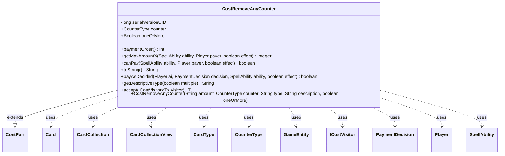

---
aliases:
  - CostRemoveAnyCounter
tags:
  - java/class
  - module/forge-game
  - pkg/forge/game/cost
fqn: forge.game.cost.CostRemoveAnyCounter
package: forge.game.cost
module: forge-game
kind: Class
---

# CostRemoveAnyCounter

**Package:** `forge.game.cost` &nbsp; **Module:** `forge-game` &nbsp; **Kind:** Class



## Relationships
**Extends:**
- [[forge.game.cost.CostPart|CostPart]]
**Uses:**
- [[forge.card.CardType|CardType]]
- [[forge.game.GameEntity|GameEntity]]
- [[forge.game.card.Card|Card]]
- [[forge.game.card.CardCollection|CardCollection]]
- [[forge.game.card.CardCollectionView|CardCollectionView]]
- [[forge.game.card.CounterType|CounterType]]
- [[forge.game.cost.ICostVisitor|ICostVisitor]]
- [[forge.game.cost.PaymentDecision|PaymentDecision]]
- [[forge.game.player.Player|Player]]
- [[forge.game.spellability.SpellAbility|SpellAbility]]

## Design Description

CostRemoveAnyCounter models the payment cost of removing counters from permanents, implementing the abstract `CostPart` contract within Forge's cost framework. It represents card-text costs such as "Remove a counter from a permanent you control" or "Remove one or more +1/+1 counters from among artifacts you control," parameterized by an amount, an optional `CounterType`, a valid-target type expression, and an `oneOrMore` flag.

As a `CostPart`, it supplies the standard hooks: `paymentOrder` fixes its sequencing among other cost parts, `getMaxAmountX` tallies removable counters across the source or the payer's valid battlefield permanents, `canPay` compares the required amount against that total, and `payAsDecided` applies an AI/engine `PaymentDecision` by subtracting counters from each `GameEntity` and recording the count in the `CostCountersRemoved` SVar. It collaborates with `Card`/`CardCollection`, `CounterType`, `SpellAbility`, and `Player`, builds human-readable rules text via `toString`/`getDescriptiveType`, and participates in the visitor pattern through `accept(ICostVisitor)`. A null `counter` deliberately generalizes the cost to counters of any type.

## Source
`forge-game/src/main/java/forge/game/cost/CostRemoveAnyCounter.java`

```java
/*
 * Forge: Play Magic: the Gathering.
 * Copyright (C) 2011  Forge Team
 *
 * This program is free software: you can redistribute it and/or modify
 * it under the terms of the GNU General Public License as published by
 * the Free Software Foundation, either version 3 of the License, or
 * (at your option) any later version.
 *
 * This program is distributed in the hope that it will be useful,
 * but WITHOUT ANY WARRANTY; without even the implied warranty of
 * MERCHANTABILITY or FITNESS FOR A PARTICULAR PURPOSE.  See the
 * GNU General Public License for more details.
 *
 * You should have received a copy of the GNU General Public License
 * along with this program.  If not, see <http://www.gnu.org/licenses/>.
 */
package forge.game.cost;

import forge.card.CardType;
import forge.game.GameEntity;
import forge.game.ability.AbilityUtils;
import forge.game.card.Card;
import forge.game.card.CardCollection;
import forge.game.card.CardCollectionView;
import forge.game.card.CardLists;
import forge.game.card.CounterType;
import forge.game.player.Player;
import forge.game.spellability.SpellAbility;
import forge.game.zone.ZoneType;
import forge.util.Lang;

import java.util.Arrays;
import java.util.Collection;
import java.util.Map;
import java.util.Map.Entry;
import java.util.Optional;
import java.util.stream.Collectors;

/**
 * The Class CostRemoveAnyCounter.
 */
public class CostRemoveAnyCounter extends CostPart {
    /**
     * Serializables need a version ID.
     */
    private static final long serialVersionUID = 1L;
    // RemoveAnyCounter<Num/Type/{TypeDescription}>
    // things like "Remove a counter from a permanent you control"
    // or "Remove one or more +1/+1 counters from among artifacts you control"

    public final CounterType counter;
    public final Boolean oneOrMore;

    /**
     * Instantiates a new cost CostRemoveAnyCounter.
     *
     * @param amount
     *            the amount
     */
    public CostRemoveAnyCounter(final String amount, final CounterType counter, final String type, final String description, final boolean oneOrMore) {
        super(amount, type, description);
        this.counter = counter;
        this.oneOrMore = oneOrMore;
    }

    @Override
    public int paymentOrder() { return 8; }

    @Override
    public Integer getMaxAmountX(final SpellAbility ability, final Player payer, final boolean effect) {
        final Card source = ability.getHostCard();

        CardCollectionView validCards;
        if (payCostFromSource()) {
            validCards = new CardCollection(source);
        } else {
            validCards = CardLists.getValidCards(payer.getCardsIn(ZoneType.Battlefield), this.getType().split(";"), payer, source, ability);
        }
        if (this.counter != null) {
            return validCards.stream().mapToInt(c -> c.canRemoveCounters(this.counter) ? c.getCounters(this.counter) : 0).sum();
        }
        // use flatMap instead of mapMulti for Android 13 and below
        //https://developer.android.com/reference/java/util/stream/Stream#mapMulti
        return validCards.stream().flatMap(c -> c.getCounters().entrySet().stream().filter(e -> c.canRemoveCounters(e.getKey())))
                .collect(Collectors.summingInt(e -> e.getValue()));
    }

    /*
     * (non-Javadoc)
     *
     * @see
     * forge.card.cost.CostPart#canPay(forge.card.spellability.SpellAbility,
     * forge.Card, forge.Player, forge.card.cost.Cost)
     */
    @Override
    public final boolean canPay(final SpellAbility ability, final Player payer, final boolean effect) {
        return AbilityUtils.calculateAmount(ability.getHostCard(), this.getAmount(), ability) <= getMaxAmountX(ability, payer, effect);
    }

    /*
     * (non-Javadoc)
     *
     * @see forge.card.cost.CostPart#toString()
     */
    @Override
    public final String toString() {
        final StringBuilder sb = new StringBuilder();

        final String counters =  this.counter == null ? "counter" : this.counter.getName().toLowerCase() + " counter";
        boolean multiple = !"1".equals(getAmount());

        sb.append("Remove ");
        if (oneOrMore) {
            sb.append("one or more ").append(Lang.getPlural(counters));
        } else {
            sb.append(Cost.convertAmountTypeToWords(this.convertAmount(), this.getAmount(), counters));
        }
        sb.append(" from ");
        if (payCostFromSource()) { // TODO use THISTYPE
            sb.append(getDescriptiveType(multiple));
        } else {
            if (multiple) {
                sb.append(" among ");
            }
            sb.append(getDescriptiveType(multiple));
            sb.append(" you control");
        }

        return sb.toString();
    }

    @Override
    public boolean payAsDecided(Player ai, PaymentDecision decision, SpellAbility ability, final boolean effect) {
        int removed = 0;
        for (Entry<GameEntity, Map<CounterType, Integer>> e : decision.counterTable.row(Optional.empty()).entrySet()) {
            for (Entry<CounterType, Integer> v : e.getValue().entrySet()) {
                removed += v.getValue();
                e.getKey().subtractCounter(v.getKey(), v.getValue(), ai);
            }
            if (e.getKey() instanceof Card c) {
                e.getKey().getGame().updateLastStateForCard(c);
            }
        }

        ability.setSVar("CostCountersRemoved", Integer.toString(removed));
        return true;
    }


    public String getDescriptiveType(boolean multiple) {
        String typeDesc = this.getTypeDescription();
        if (typeDesc == null) {
            if (payCostFromSource()) {
                return getType();
            }
            Collection<String> types = Arrays.asList(getType().split(";"));
            if (multiple)
                types = types.stream().map(CardType::getPluralType).collect(Collectors.toList());
            typeDesc = Lang.getInstance().buildValidDesc(types, multiple);
        }
        if (!multiple && !typeDesc.startsWith("an")) { // skip adding to "another"
            typeDesc = (Lang.startsWithVowel(typeDesc) ? "an " : "a ") + typeDesc;
        }
        return typeDesc;
    }

    @Override
    public <T> T accept(ICostVisitor<T> visitor) {
        return visitor.visit(this);
    }
}
```

## Python
`forge/game/cost/CostRemoveAnyCounter.py`

```python
from forge.game.cost.CostPart import CostPart
from forge.card.CardType import CardType
from forge.game.GameEntity import GameEntity
from forge.game.ability.AbilityUtils import AbilityUtils
from forge.game.card.Card import Card
from forge.game.card.CardCollection import CardCollection
from forge.game.card.CardCollectionView import CardCollectionView
from forge.game.card.CardLists import CardLists
from forge.game.card.CounterType import CounterType
from forge.game.player.Player import Player
from forge.game.spellability.SpellAbility import SpellAbility
from forge.game.zone.ZoneType import ZoneType
from forge.util.Lang import Lang
from forge.game.cost.Cost import Cost
from forge.game.cost.ICostVisitor import ICostVisitor
from forge.game.cost.PaymentDecision import PaymentDecision


class CostRemoveAnyCounter(CostPart):
    """
    The Class CostRemoveAnyCounter.
    """
    # Serializables need a version ID.
    serialVersionUID = 1

    # RemoveAnyCounter<Num/Type/{TypeDescription}>
    # things like "Remove a counter from a permanent you control"
    # or "Remove one or more +1/+1 counters from among artifacts you control"

    def __init__(self, amount: str, counter: CounterType, type: str, description: str, oneOrMore: bool):
        """
        Instantiates a new cost CostRemoveAnyCounter.

        :param amount: the amount
        """
        super().__init__(amount, type, description)
        self.counter = counter
        self.oneOrMore = oneOrMore

    def paymentOrder(self) -> int:
        return 8

    def getMaxAmountX(self, ability: SpellAbility, payer: Player, effect: bool):
        source = ability.getHostCard()

        if self.payCostFromSource():
            validCards = CardCollection(source)
        else:
            validCards = CardLists.getValidCards(payer.getCardsIn(ZoneType.Battlefield), self.getType().split(";"), payer, source, ability)
        if self.counter is not None:
            return sum(c.getCounters(self.counter) if c.canRemoveCounters(self.counter) else 0 for c in validCards)
        # use flatMap instead of mapMulti for Android 13 and below
        # https://developer.android.com/reference/java/util/stream/Stream#mapMulti
        total = 0
        for c in validCards:
            for k, v in c.getCounters().items():
                if c.canRemoveCounters(k):
                    total += v
        return total

    def canPay(self, ability: SpellAbility, payer: Player, effect: bool) -> bool:
        return AbilityUtils.calculateAmount(ability.getHostCard(), self.getAmount(), ability) <= self.getMaxAmountX(ability, payer, effect)

    def toString(self) -> str:
        sb = []

        counters = "counter" if self.counter is None else self.counter.getName().lower() + " counter"
        multiple = "1" != self.getAmount()

        sb.append("Remove ")
        if self.oneOrMore:
            sb.append("one or more ")
            sb.append(Lang.getPlural(counters))
        else:
            sb.append(Cost.convertAmountTypeToWords(self.convertAmount(), self.getAmount(), counters))
        sb.append(" from ")
        if self.payCostFromSource():  # TODO use THISTYPE
            sb.append(self.getDescriptiveType(multiple))
        else:
            if multiple:
                sb.append(" among ")
            sb.append(self.getDescriptiveType(multiple))
            sb.append(" you control")

        return "".join(sb)

    def payAsDecided(self, ai: Player, decision: PaymentDecision, ability: SpellAbility, effect: bool) -> bool:
        removed = 0
        for entity, counterMap in decision.counterTable.row(None).items():
            for k, v in counterMap.items():
                removed += v
                entity.subtractCounter(k, v, ai)
            if isinstance(entity, Card):
                entity.getGame().updateLastStateForCard(entity)

        ability.setSVar("CostCountersRemoved", str(removed))
        return True

    def getDescriptiveType(self, multiple: bool) -> str:
        typeDesc = self.getTypeDescription()
        if typeDesc is None:
            if self.payCostFromSource():
                return self.getType()
            types = self.getType().split(";")
            if multiple:
                types = [CardType.getPluralType(t) for t in types]
            typeDesc = Lang.getInstance().buildValidDesc(types, multiple)
        if not multiple and not typeDesc.startswith("an"):  # skip adding to "another"
            typeDesc = ("an " if Lang.startsWithVowel(typeDesc) else "a ") + typeDesc
        return typeDesc

    def accept(self, visitor: ICostVisitor):
        return visitor.visit(self)
```
