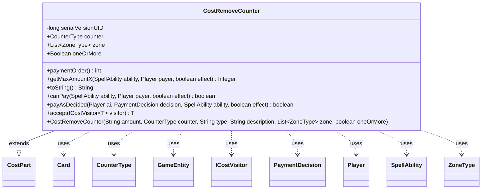

---
aliases:
  - CostRemoveCounter
tags:
  - java/class
  - module/forge-game
  - pkg/forge/game/cost
fqn: forge.game.cost.CostRemoveCounter
package: forge.game.cost
module: forge-game
kind: Class
---

# CostRemoveCounter

**Package:** `forge.game.cost` &nbsp; **Module:** `forge-game` &nbsp; **Kind:** Class



## Relationships
**Extends:**
- [[forge.game.cost.CostPart|CostPart]]
**Uses:**
- [[forge.game.GameEntity|GameEntity]]
- [[forge.game.card.Card|Card]]
- [[forge.game.card.CounterType|CounterType]]
- [[forge.game.cost.ICostVisitor|ICostVisitor]]
- [[forge.game.cost.PaymentDecision|PaymentDecision]]
- [[forge.game.player.Player|Player]]
- [[forge.game.spellability.SpellAbility|SpellAbility]]
- [[forge.game.zone.ZoneType|ZoneType]]

## Design Description

`CostRemoveCounter` models a payment cost that is satisfied by removing counters from one or more cards, implemented as a concrete subclass of the abstract `CostPart` cost hierarchy. It captures the `CounterType` to remove (null meaning any counter), the eligible source `ZoneType`s, and an `oneOrMore` flag, while delegating shared amount/type/description handling to its supertype. Its core responsibility is determining feasibility and capacity—`canPay` and `getMaxAmountX` inspect a `SpellAbility`'s host card or valid target cards via `CardLists`, accounting for "All"/"X" amounts, phased-out permanents, and counter totals—then `payAsDecided` applies a `PaymentDecision`'s counter table to the affected `GameEntity` objects and records the total removed in an SVar.

The class collaborates with `Card`, `Player`, and `GameEntity` to query and mutate game state, and produces human-readable rules text in `toString` (special-casing loyalty as planeswalker-style "-N"). Its `accept` method participates in a visitor pattern over `ICostVisitor`, keeping cost-type-specific dispatch external to the cost hierarchy.

## Source
`forge-game/src/main/java/forge/game/cost/CostRemoveCounter.java`

```java
/*
 * Forge: Play Magic: the Gathering.
 * Copyright (C) 2011  Forge Team
 *
 * This program is free software: you can redistribute it and/or modify
 * it under the terms of the GNU General Public License as published by
 * the Free Software Foundation, either version 3 of the License, or
 * (at your option) any later version.
 *
 * This program is distributed in the hope that it will be useful,
 * but WITHOUT ANY WARRANTY; without even the implied warranty of
 * MERCHANTABILITY or FITNESS FOR A PARTICULAR PURPOSE.  See the
 * GNU General Public License for more details.
 *
 * You should have received a copy of the GNU General Public License
 * along with this program.  If not, see <http://www.gnu.org/licenses/>.
 */
package forge.game.cost;

import com.google.common.collect.Lists;
import forge.game.GameEntity;
import forge.game.card.Card;
import forge.game.card.CardLists;
import forge.game.card.CounterEnumType;
import forge.game.card.CounterType;
import forge.game.player.Player;
import forge.game.spellability.SpellAbility;
import forge.game.zone.ZoneType;
import forge.util.Lang;

import java.util.List;
import java.util.Map;
import java.util.Optional;

/**
 * The Class CostRemoveCounter.
 */
public class CostRemoveCounter extends CostPart {
    // SubCounter<Num/Counter/{Type/TypeDescription/Zone}>

    /**
     * Serializables need a version ID.
     */
    private static final long serialVersionUID = 1L;
    public final CounterType counter;
    public final List<ZoneType> zone;
    public final Boolean oneOrMore;

    /**
     * Instantiates a new cost remove counter.
     *
     * @param amount
     *            the amount
     * @param counter
     *            the counter
     * @param type
     *            the type
     * @param description
     *            the description
     * @param zone the zone.
     */
    public CostRemoveCounter(final String amount, final CounterType counter, final String type, final String description, final List<ZoneType> zone, final boolean oneOrMore) {
        super(amount, type, description);

        this.counter = counter;
        this.zone = zone;
        this.oneOrMore = oneOrMore;
    }

    @Override
    public int paymentOrder() { return 8; }

    @Override
    public Integer getMaxAmountX(final SpellAbility ability, final Player payer, final boolean effect) {
        final CounterType cntrs = this.counter;
        final Card source = ability.getHostCard();
        final String type = this.getType();
        final boolean anyCounters = cntrs == null;

        if (this.payCostFromSource()) {
            return anyCounters ? source.getNumAllCounters() : source.getCounters(cntrs);
        }

        List<Card> typeList;
        if (type.equals("OriginalHost")) {
            typeList = Lists.newArrayList(ability.getOriginalHost());
        } else {
            typeList = CardLists.getValidCards(payer.getCardsIn(this.zone), type.split(";"), payer, source, ability);
        }

        // Single Target
        int maxcount = 0;
        for (Card c : typeList) {
            maxcount = anyCounters ? Math.max(maxcount, c.getNumAllCounters()) : Math.max(maxcount, c.getCounters(cntrs));
        }
        return maxcount;
    }

    /*
     * (non-Javadoc)
     *
     * @see forge.card.cost.CostPart#toString()
     */
    @Override
    public final String toString() {
        final StringBuilder sb = new StringBuilder();
        final boolean anyCounter = this.counter == null;
        final String ctrName = anyCounter ? "counters" : this.counter.getName().toLowerCase() + " counters";
        if (this.counter != null && this.counter.is(CounterEnumType.LOYALTY) && payCostFromSource()) {
            sb.append("-").append(this.getAmount());
        } else {
            sb.append("Remove ");
            if (this.getAmount().equals("X")) {
                if (oneOrMore) {
                    sb.append("one or more ");
                } else if (anyCounter) {
                    sb.append ("X ");
                } else {
                    sb.append("any number of ");
                }
                sb.append(ctrName);
            } else if (this.getAmount().equals("All")) {
                sb.append("all ").append(ctrName);
            } else {
                sb.append(Lang.nounWithNumeralExceptOne(this.getAmount(),
                        anyCounter ? "counter" : this.counter.getName().toLowerCase() + " counter"));
            }

            sb.append(" from ");

            if (this.payCostFromSource()) {
                sb.append(this.getType());
            } else {
                final String desc = this.getTypeDescription() == null ? this.getType() : this.getTypeDescription();
                sb.append(desc);
            }
        }
        return sb.toString();
    }

    /*
     * (non-Javadoc)
     *
     * @see
     * forge.card.cost.CostPart#canPay(forge.card.spellability.SpellAbility,
     * forge.Card, forge.Player, forge.card.cost.Cost)
     */
    @Override
    public final boolean canPay(final SpellAbility ability, final Player payer, final boolean effect) {
        final CounterType cntrs = this.counter;
        final Card source = ability.getHostCard();
        final String type = this.getType();
        final boolean anyCounters = cntrs == null;

        final int amount;
        if (getAmount().equals("All")) {
            amount = anyCounters ? source.getNumAllCounters() : source.getCounters(cntrs);
        } else {
            amount = getAbilityAmount(ability);
        }
        if (this.payCostFromSource()) {
            return !source.isPhasedOut() && ((anyCounters ? source.getNumAllCounters() : source.getCounters(cntrs)) - amount) >= 0;
        }

        List<Card> typeList;
        if (type.equals("OriginalHost")) {
            typeList = Lists.newArrayList(ability.getOriginalHost());
        } else {
            typeList = CardLists.getValidCards(payer.getCardsIn(this.zone), type.split(";"), payer, source, ability);
        }

        // (default logic) remove X counters from a single permanent
        for (Card c : typeList) {
            if ((anyCounters ? c.getNumAllCounters() : c.getCounters(cntrs)) - amount >= 0) {
                return true;
            }
        }

        return false;
    }

    @Override
    public boolean payAsDecided(Player ai, PaymentDecision decision, SpellAbility ability, final boolean effect) {
        int removed = 0;
        for (Map.Entry<GameEntity, Map<CounterType, Integer>> e : decision.counterTable.row(Optional.empty()).entrySet()) {
            for (Map.Entry<CounterType, Integer> v : e.getValue().entrySet()) {
                removed += v.getValue();
                e.getKey().subtractCounter(v.getKey(), v.getValue(), ai);
            }
            if (e.getKey() instanceof Card c) {
                e.getKey().getGame().updateLastStateForCard(c);
            }
        }

        ability.setSVar("CostCountersRemoved", Integer.toString(removed));
        return true;
    }

    public <T> T accept(ICostVisitor<T> visitor) {
        return visitor.visit(this);
    }

}
```
