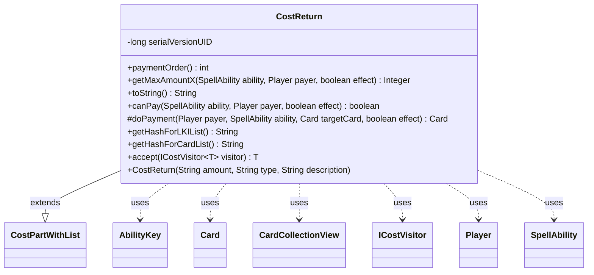

---
aliases:
  - CostReturn
tags:
  - java/class
  - module/forge-game
  - pkg/forge/game/cost
fqn: forge.game.cost.CostReturn
package: forge.game.cost
module: forge-game
kind: Class
---

# CostReturn

**Package:** `forge.game.cost` &nbsp; **Module:** `forge-game` &nbsp; **Kind:** Class



## Relationships
**Extends:**
- [[forge.game.cost.CostPartWithList|CostPartWithList]]
**Uses:**
- [[forge.game.ability.AbilityKey|AbilityKey]]
- [[forge.game.card.Card|Card]]
- [[forge.game.card.CardCollectionView|CardCollectionView]]
- [[forge.game.cost.ICostVisitor|ICostVisitor]]
- [[forge.game.player.Player|Player]]
- [[forge.game.spellability.SpellAbility|SpellAbility]]

## Design Description

CostReturn models the "return a permanent to its owner's hand" component of a Magic: the Gathering ability cost. Extending `CostPartWithList`, it inherits the machinery for paying a cost by collecting a list of affected cards, supplying only the behavior specific to returning: it counts how many controlled permanents match its type filter (`getMaxAmountX`), validates affordability in `canPay`, and in `doPayment` moves each chosen card to its owner's hand via the game's action interface. It renders human-readable rules text through `toString`, distinguishing the self-return case (`payCostFromSource`) from returning other controlled permanents.

It collaborates with `SpellAbility` and `Player` to resolve the host card, payer, and valid targets via `CardCollectionView`, and threads `AbilityKey` move parameters during payment. Distinct list hashes ("Returned"/"ReturnedCards") let other systems track returned cards, and the `accept(ICostVisitor)` method integrates it into a visitor-based traversal over cost parts.

## Source
`forge-game/src/main/java/forge/game/cost/CostReturn.java`

```java
/*
 * Forge: Play Magic: the Gathering.
 * Copyright (C) 2011  Forge Team
 *
 * This program is free software: you can redistribute it and/or modify
 * it under the terms of the GNU General Public License as published by
 * the Free Software Foundation, either version 3 of the License, or
 * (at your option) any later version.
 * 
 * This program is distributed in the hope that it will be useful,
 * but WITHOUT ANY WARRANTY; without even the implied warranty of
 * MERCHANTABILITY or FITNESS FOR A PARTICULAR PURPOSE.  See the
 * GNU General Public License for more details.
 * 
 * You should have received a copy of the GNU General Public License
 * along with this program.  If not, see <http://www.gnu.org/licenses/>.
 */
package forge.game.cost;

import forge.game.ability.AbilityKey;
import forge.game.card.Card;
import forge.game.card.CardCollectionView;
import forge.game.card.CardLists;
import forge.game.player.Player;
import forge.game.spellability.SpellAbility;
import forge.game.zone.ZoneType;

import java.util.Map;

/**
 * The Class CostReturn.
 */
public class CostReturn extends CostPartWithList {
    // Return<Num/Type{/TypeDescription}>

    /**
     * Serializables need a version ID.
     */
    private static final long serialVersionUID = 1L;

    /**
     * Instantiates a new cost return.
     * 
     * @param amount
     *            the amount
     * @param type
     *            the type
     * @param description
     *            the description
     */
    public CostReturn(final String amount, final String type, final String description) {
        super(amount, type, description);
    }

    @Override
    public int paymentOrder() { return 10; }

    @Override
    public Integer getMaxAmountX(SpellAbility ability, Player payer, final boolean effect) {
        final Card source = ability.getHostCard();

        CardCollectionView typeList = payer.getCardsIn(ZoneType.Battlefield);
        typeList = CardLists.getValidCards(typeList, getType().split(";"), payer, source, ability);

        return typeList.size();
    }

    /*
     * (non-Javadoc)
     * 
     * @see forge.card.cost.CostPart#toString()
     */
    @Override
    public final String toString() {
        final StringBuilder sb = new StringBuilder();
        sb.append("Return ");

        final Integer i = this.convertAmount();
        String pronoun = "its";

        if (this.payCostFromSource()) {
            sb.append(this.getType());
        } else {
            final String desc = this.getDescriptiveType();
            if (i != null) {
                sb.append(Cost.convertIntAndTypeToWords(i, desc));
                if (i > 1) {
                    pronoun = "their";
                }
            } else {
                sb.append(Cost.convertAmountTypeToWords(this.getAmount(), desc));
            }

            sb.append(" you control");
        }
        sb.append(" to ").append(pronoun).append(" owner's hand");
        return sb.toString();
    }

    /*
     * (non-Javadoc)
     * 
     * @see
     * forge.card.cost.CostPart#canPay(forge.card.spellability.SpellAbility,
     * forge.Card, forge.Player, forge.card.cost.Cost)
     */
    @Override
    public final boolean canPay(final SpellAbility ability, final Player payer, final boolean effect) {
        final Card source = ability.getHostCard();
        if (payCostFromSource()) {
            return source.isInPlay();
        }

        return getMaxAmountX(ability, payer, effect) >= getAbilityAmount(ability);
    }

    /* (non-Javadoc)
     * @see forge.card.cost.CostPartWithList#executePayment(forge.card.spellability.SpellAbility, forge.Card)
     */
    @Override
    protected Card doPayment(Player payer, SpellAbility ability, Card targetCard, final boolean effect) {
        Map<AbilityKey, Object> moveParams = AbilityKey.newMap();
        AbilityKey.addCardZoneTableParams(moveParams, table);
        return targetCard.getGame().getAction().moveToHand(targetCard, null, moveParams);
    }

    /* (non-Javadoc)
     * @see forge.card.cost.CostPartWithList#getHashForList()
     */
    @Override
    public String getHashForLKIList() {
        return "Returned";
    }
    @Override
    public String getHashForCardList() {
    	return "ReturnedCards";
    }

    public <T> T accept(ICostVisitor<T> visitor) {
        return visitor.visit(this);
    }

}
```
