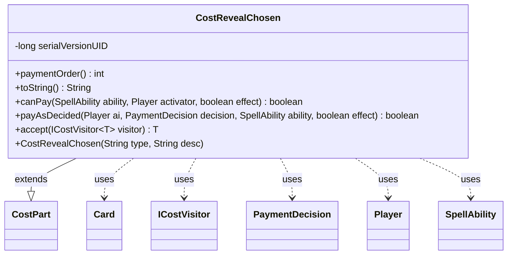

---
aliases:
  - CostRevealChosen
tags:
  - java/class
  - module/forge-game
  - pkg/forge/game/cost
fqn: forge.game.cost.CostRevealChosen
package: forge.game.cost
module: forge-game
kind: Class
---

# CostRevealChosen

**Package:** `forge.game.cost`   **Module:** `forge-game`   **Kind:** Class



## Relationships
**Extends:**
- [[forge.game.cost.CostPart|CostPart]]
**Uses:**
- [[forge.game.card.Card|Card]]
- [[forge.game.cost.ICostVisitor|ICostVisitor]]
- [[forge.game.cost.PaymentDecision|PaymentDecision]]
- [[forge.game.player.Player|Player]]
- [[forge.game.spellability.SpellAbility|SpellAbility]]

## Design Description

`CostRevealChosen` represents a non-mana spell cost requiring the controller to reveal a previously chosen player or named type, satisfying Magic abilities whose effects hinge on that earlier choice. As a concrete subclass of `CostPart`, it plugs into Forge's compositional cost model, declaring a fixed `paymentOrder()` of 20 and branching all behavior on its string `type` ("Player" or "Type"). It collaborates with the host `Card` to test (`canPay`) and act on (`payAsDecided`) the stored choice—calling `revealChosenPlayer`/`revealChosenType` and broadcasting a localized notification through the `Player`'s game action—using the `SpellAbility` only to reach that host card.

Notable design intent includes the visitor pattern via `accept(ICostVisitor)`, which externalizes cost-type dispatch (e.g., AI payment decisions yielding `PaymentDecision`), and a deliberately fail-safe `canPay` returning false for unrecognized types, with `toString` emitting an "Update CostRevealChosen.java" placeholder to flag any unhandled variant.

## Source
`forge-game/src/main/java/forge/game/cost/CostRevealChosen.java`

```java
/*
 * Forge: Play Magic: the Gathering.
 * Copyright (C) 2011  Forge Team
 *
 * This program is free software: you can redistribute it and/or modify
 * it under the terms of the GNU General Public License as published by
 * the Free Software Foundation, either version 3 of the License, or
 * (at your option) any later version.
 *
 * This program is distributed in the hope that it will be useful,
 * but WITHOUT ANY WARRANTY; without even the implied warranty of
 * MERCHANTABILITY or FITNESS FOR A PARTICULAR PURPOSE.  See the
 * GNU General Public License for more details.
 *
 * You should have received a copy of the GNU General Public License
 * along with this program.  If not, see <http://www.gnu.org/licenses/>.
 */
package forge.game.cost;

import forge.game.card.Card;
import forge.game.player.Player;
import forge.game.spellability.SpellAbility;
import forge.util.Localizer;

public class CostRevealChosen extends CostPart {

    private static final long serialVersionUID = 1L;

    public CostRevealChosen(final String type, final String desc) {
        super("1", type, desc);
    }

    @Override
    public int paymentOrder() { return 20; }

    /*
     * (non-Javadoc)
     *
     * @see forge.card.cost.CostPart#toString()
     */
    @Override
    public final String toString() {
        if (getType().equals("Player")) {
            return "Reveal the player you chose";
        } else if (getType().equals("Type")) {
            return "Reveal the chosen " + getDescriptiveType().toLowerCase();
        }
        return "Update CostRevealChosen.java";
    }

    @Override
    public final boolean canPay(final SpellAbility ability, final Player activator, final boolean effect) {
        final Card source = ability.getHostCard();

        if (getType().equals("Player")) {
            return source.hasChosenPlayer() && source.getTurnInController().equals(activator);
        }
        if (getType().equals("Type")) {
            return source.hasChosenType() && source.getTurnInController().equals(activator);
        }
        return false;
    }

    @Override
    public boolean payAsDecided(Player ai, PaymentDecision decision, SpellAbility ability, final boolean effect) {
        Card host = ability.getHostCard();
        String o = "";
        if (getType().equals("Player")) {
            o = host.getChosenPlayer().toString();
            host.revealChosenPlayer();
        } else if (getType().equals("Type")) {
            o = host.getChosenType();
            host.revealChosenType();
        }
        final String message = Localizer.getInstance().getMessage("lblPlayerReveals", ai, o);
        ai.getGame().getAction().notifyOfValue(ability, host, message, ai);
        return true;
    }

    // Inputs
    public <T> T accept(ICostVisitor<T> visitor) {
        return visitor.visit(this);
    }

}
```

## Python
`forge/game/cost/CostRevealChosen.py`

```python
from forge.game.cost.CostPart import CostPart
from forge.game.card.Card import Card
from forge.game.player.Player import Player
from forge.game.spellability.SpellAbility import SpellAbility
from forge.game.cost.ICostVisitor import ICostVisitor
from forge.game.cost.PaymentDecision import PaymentDecision
from forge.util.Localizer import Localizer


class CostRevealChosen(CostPart):

    serialVersionUID = 1

    def __init__(self, type: str, desc: str):
        super().__init__("1", type, desc)

    def paymentOrder(self) -> int:
        return 20

    def toString(self) -> str:
        if self.getType() == "Player":
            return "Reveal the player you chose"
        elif self.getType() == "Type":
            return "Reveal the chosen " + self.getDescriptiveType().lower()
        return "Update CostRevealChosen.java"

    def canPay(self, ability: SpellAbility, activator: Player, effect: bool) -> bool:
        source = ability.getHostCard()

        if self.getType() == "Player":
            return source.hasChosenPlayer() and source.getTurnInController() == activator
        if self.getType() == "Type":
            return source.hasChosenType() and source.getTurnInController() == activator
        return False

    def payAsDecided(self, ai: Player, decision: PaymentDecision, ability: SpellAbility, effect: bool) -> bool:
        host = ability.getHostCard()
        o = ""
        if self.getType() == "Player":
            o = host.getChosenPlayer().toString()
            host.revealChosenPlayer()
        elif self.getType() == "Type":
            o = host.getChosenType()
            host.revealChosenType()
        message = Localizer.getInstance().getMessage("lblPlayerReveals", ai, o)
        ai.getGame().getAction().notifyOfValue(ability, host, message, ai)
        return True

    # Inputs
    def accept(self, visitor: ICostVisitor):
        return visitor.visit(self)
```
