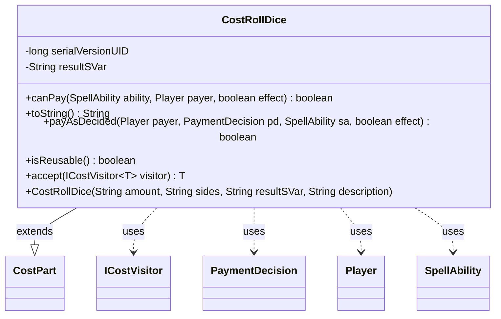

---
aliases:
  - CostRollDice
tags:
  - java/class
  - module/forge-game
  - pkg/forge/game/cost
fqn: forge.game.cost.CostRollDice
package: forge.game.cost
module: forge-game
kind: Class
---

# CostRollDice

**Package:** `forge.game.cost`   **Module:** `forge-game`   **Kind:** Class



## Relationships
**Extends:**
- [[forge.game.cost.CostPart|CostPart]]
**Uses:**
- [[forge.game.cost.ICostVisitor|ICostVisitor]]
- [[forge.game.cost.PaymentDecision|PaymentDecision]]
- [[forge.game.player.Player|Player]]
- [[forge.game.spellability.SpellAbility|SpellAbility]]

## Design Description

CostRollDice models the "RollDice" payment cost in Forge's cost system, representing a die-roll a player makes to satisfy an ability's cost. As a concrete subclass of `CostPart`, it reuses the inherited amount/type/description fields—repurposing `amount` as the number of dice and `type` as the number of sides—and supplies a small, focused set of overrides. It is always payable (`canPay` returns `true`) and reusable, reflecting that rolling dice imposes no precondition or consumed resource. Payment delegates to `RollDiceEffect.rollDiceForPlayer` and stores the outcome into a named SVar (`resultSVar`) on the SpellAbility, letting later effects reference the rolled value.

Collaborating with `Player`, `SpellAbility`, and `PaymentDecision` during resolution, it also implements the visitor hook `accept(ICostVisitor)`, participating in the double-dispatch traversal used across cost types for type-safe processing without instanceof checks.

## Source
`forge-game/src/main/java/forge/game/cost/CostRollDice.java`

```java
package forge.game.cost;

import forge.game.ability.effects.RollDiceEffect;
import forge.game.player.Player;
import forge.game.spellability.SpellAbility;

/**
 * This is for the "RollDice" Cost
 */
public class CostRollDice extends CostPart {

    private static final long serialVersionUID = 1L;

    private final String resultSVar;

    /**
     * Instantiates a new cost RollDice.
     *
     * @param amount
     *            the amount
     */
    public CostRollDice(final String amount, final String sides, final String resultSVar, final String description) {
        super(amount, sides, description);
        this.resultSVar = resultSVar;
    }

    @Override
    public final boolean canPay(final SpellAbility ability, final Player payer, final boolean effect) {
        return true;
    }

    @Override
    public final String toString() {
        final StringBuilder sb = new StringBuilder();

        sb.append("Roll ").append(getAmount());

        if (this.getTypeDescription() == null) {
            sb.append("d").append(getType());
        } else {
            sb.append(" ").append(this.getTypeDescription());
        }

        return sb.toString();
    }

    @Override
    public boolean payAsDecided(Player payer, PaymentDecision pd, SpellAbility sa, final boolean effect) {
        int sides = Integer.parseInt(getType());
        int result = RollDiceEffect.rollDiceForPlayer(sa, payer, pd.c, sides);
        sa.setSVar(resultSVar, Integer.toString(result));
        return true;
    }

    @Override
    public boolean isReusable() { return true; }

    public <T> T accept(ICostVisitor<T> visitor) {
        return visitor.visit(this);
    }
}
```

## Python
`forge/game/cost/CostRollDice.py`

```python
from forge.game.cost.CostPart import CostPart
from forge.game.cost.ICostVisitor import ICostVisitor
from forge.game.cost.PaymentDecision import PaymentDecision
from forge.game.ability.effects.RollDiceEffect import RollDiceEffect
from forge.game.player.Player import Player
from forge.game.spellability.SpellAbility import SpellAbility


class CostRollDice(CostPart):
    """This is for the "RollDice" Cost"""

    serialVersionUID = 1

    def __init__(self, amount: str, sides: str, resultSVar: str, description: str):
        """
        Instantiates a new cost RollDice.

        :param amount: the amount
        """
        super().__init__(amount, sides, description)
        self.resultSVar = resultSVar

    def canPay(self, ability: SpellAbility, payer: Player, effect: bool) -> bool:
        return True

    def toString(self) -> str:
        sb = []

        sb.append("Roll ")
        sb.append(str(self.getAmount()))

        if self.getTypeDescription() is None:
            sb.append("d")
            sb.append(str(self.getType()))
        else:
            sb.append(" ")
            sb.append(str(self.getTypeDescription()))

        return "".join(sb)

    def payAsDecided(self, payer: Player, pd: PaymentDecision, sa: SpellAbility, effect: bool) -> bool:
        sides = int(self.getType())
        result = RollDiceEffect.rollDiceForPlayer(sa, payer, pd.c, sides)
        sa.setSVar(self.resultSVar, str(result))
        return True

    def isReusable(self) -> bool:
        return True

    def accept(self, visitor: ICostVisitor):
        return visitor.visit(self)
```
