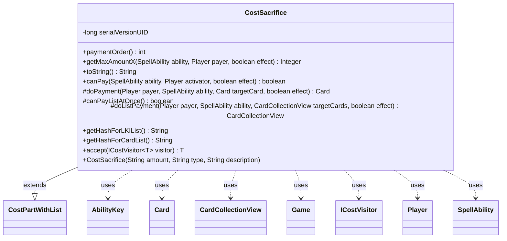

---
aliases:
  - CostSacrifice
tags:
  - java/class
  - module/forge-game
  - pkg/forge/game/cost
fqn: forge.game.cost.CostSacrifice
package: forge.game.cost
module: forge-game
kind: Class
---

# CostSacrifice

**Package:** `forge.game.cost`   **Module:** `forge-game`   **Kind:** Class



## Relationships
**Extends:**
- [[forge.game.cost.CostPartWithList|CostPartWithList]]
**Uses:**
- [[forge.game.Game|Game]]
- [[forge.game.ability.AbilityKey|AbilityKey]]
- [[forge.game.card.Card|Card]]
- [[forge.game.card.CardCollectionView|CardCollectionView]]
- [[forge.game.cost.ICostVisitor|ICostVisitor]]
- [[forge.game.player.Player|Player]]
- [[forge.game.spellability.SpellAbility|SpellAbility]]

## Design Description

CostSacrifice models the Magic: the Gathering "sacrifice" cost — the requirement that a player put one or more of their own permanents into the graveyard to activate an ability or cast a spell. As a concrete subclass of CostPartWithList, it slots into Forge's composite cost system, contributing a fixed payment order (15) and reusing the base class's list-oriented payment machinery. It interprets its `amount`/`type` specification against the payer's battlefield, counting sacrificeable candidates (with support for `X`, `All`, `OriginalHost`, and `+WithDifferentNames` variants) to validate affordability via canPay/getMaxAmountX and to render human-readable cost text in toString.

Its design intent favors batch resolution: it overrides canPayListAtOnce to sacrifice all targeted Cards in a single Game action call rather than card-by-card, routing the move through AbilityKey zone-change parameters. It also participates in the visitor pattern via accept(ICostVisitor) and exposes stable hash keys ("Sacrificed"/"SacrificedCards") so resolved sacrifices can be referenced later in ability processing.

## Source
`forge-game/src/main/java/forge/game/cost/CostSacrifice.java`

```java
/*
 * Forge: Play Magic: the Gathering.
 * Copyright (C) 2011  Forge Team
 *
 * This program is free software: you can redistribute it and/or modify
 * it under the terms of the GNU General Public License as published by
 * the Free Software Foundation, either version 3 of the License, or
 * (at your option) any later version.
 *
 * This program is distributed in the hope that it will be useful,
 * but WITHOUT ANY WARRANTY; without even the implied warranty of
 * MERCHANTABILITY or FITNESS FOR A PARTICULAR PURPOSE.  See the
 * GNU General Public License for more details.
 *
 * You should have received a copy of the GNU General Public License
 * along with this program.  If not, see <http://www.gnu.org/licenses/>.
 */
package forge.game.cost;

import forge.card.CardType;
import forge.game.Game;
import forge.game.ability.AbilityKey;
import forge.game.card.Card;
import forge.game.card.CardCollectionView;
import forge.game.card.CardLists;
import forge.game.card.CardPredicates;
import forge.game.player.Player;
import forge.game.spellability.SpellAbility;
import forge.game.zone.ZoneType;
import forge.util.Lang;

import java.util.Map;

/**
 * The Class CostSacrifice.
 */
public class CostSacrifice extends CostPartWithList {

    private static final long serialVersionUID = 1L;

    /**
     * Instantiates a new cost sacrifice.
     *
     * @param amount
     *            the amount
     * @param type
     *            the type
     * @param description
     *            the description
     */
    public CostSacrifice(final String amount, final String type, final String description) {
        super(amount, type, description);
    }

    @Override
    public int paymentOrder() { return 15; }

    @Override
    public Integer getMaxAmountX(SpellAbility ability, Player payer, final boolean effect) {
        final Card source = ability.getHostCard();

        String type = getType();
        boolean differentNames = false;
        if (type.contains("+WithDifferentNames")) {
            type = type.replace("+WithDifferentNames", "");
            differentNames = true;
        }

        CardCollectionView typeList = payer.getCardsIn(ZoneType.Battlefield);
        if (!type.contains("X")) {
            typeList = CardLists.getValidCards(typeList, type.split(";"), payer, source, ability);
        }
        typeList = CardLists.filter(typeList, CardPredicates.canBeSacrificedBy(ability, effect));
        if (differentNames) {
            return CardLists.getDifferentNamesCount(typeList);
        }
        return typeList.size();
    }

    /*
     * (non-Javadoc)
     *
     * @see forge.card.cost.CostPart#toString()
     */
    @Override
    public final String toString() {
        final StringBuilder sb = new StringBuilder();
        if (getAmount().equals("X")) {
            sb.append("You may sacrifice ");
        } else {
            sb.append("Sacrifice ");
        }

        if (payCostFromSource()) {
            sb.append(getTypeDescription() == null || !getTypeDescription().startsWith("this")
                    ? getType() : getTypeDescription());
        } else if (getAmount().equals("X")) {
            String typeDesc = getType().toLowerCase().replace(";","s and/or ");
            sb.append("any number of ").append(typeDesc).append("s");
        } else {
            String desc;
            if (this.getTypeDescription() == null) {
                final String typeS = this.getType();
                desc = typeS.equals("Permanent") || CardType.CoreType.isValidEnum(typeS) ? typeS.toLowerCase() : typeS;
            } else {
                desc = this.getTypeDescription();
            }

            if (desc.startsWith("another")) sb.append(desc);
            else sb.append(convertAmount() == null ? Lang.nounWithNumeralExceptOne(getAmount(), desc)
                    : Lang.nounWithNumeralExceptOne(convertAmount(), desc));
        }
        return sb.toString();
    }

    /*
     * (non-Javadoc)
     *
     * @see
     * forge.card.cost.CostPart#canPay(forge.card.spellability.SpellAbility,
     * forge.Card, forge.Player, forge.card.cost.Cost)
     */
    @Override
    public final boolean canPay(final SpellAbility ability, final Player activator, final boolean effect) {
        final Card source = ability.getHostCard();

        if (getType().equals("OriginalHost")) {
            Card originalEquipment = ability.getOriginalHost();
            return originalEquipment.isEquipping() && originalEquipment.canBeSacrificedBy(ability, effect);
        }

        if (payCostFromSource()) {
            return source.canBeSacrificedBy(ability, effect);
        }

        // You can always sac all
        if ("All".equalsIgnoreCase(getAmount())) {
            CardCollectionView typeList = activator.getCardsIn(ZoneType.Battlefield);
            typeList = CardLists.getValidCards(typeList, getType().split(";"), activator, source, ability);
            // it needs to check if everything can be sacrificed
            return typeList.allMatch(CardPredicates.canBeSacrificedBy(ability, effect));
        }

        int amount = getAbilityAmount(ability);

        // If amount is null, it's either "ALL" or "X"
        // if X is defined, it needs to be calculated and checked, if X is
        // choice, it can be Paid even if it's 0
        return getMaxAmountX(ability, activator, effect) >= amount;
    }

    @Override
    protected Card doPayment(Player payer, SpellAbility ability, Card targetCard, final boolean effect) { return null; }
    @Override
    protected boolean canPayListAtOnce() { return true; }
    @Override
    protected CardCollectionView doListPayment(Player payer, SpellAbility ability, CardCollectionView targetCards, final boolean effect) {
        final Game game = ability.getHostCard().getGame();
        Map<AbilityKey, Object> moveParams = AbilityKey.newMap();
        AbilityKey.addCardZoneTableParams(moveParams, table);

        return game.getAction().sacrifice(targetCards, ability, effect, moveParams);
    }

    /* (non-Javadoc)
     * @see forge.card.cost.CostPartWithList#getHashForList()
     */
    @Override
    public String getHashForLKIList() {
        return "Sacrificed";
    }
    @Override
    public String getHashForCardList() {
    	return "SacrificedCards";
    }

    // Inputs
    public <T> T accept(ICostVisitor<T> visitor) {
        return visitor.visit(this);
    }

}
```

## Python
`forge/game/cost/CostSacrifice.py`

```python
from forge.card.CardType import CardType
from forge.game.Game import Game
from forge.game.ability.AbilityKey import AbilityKey
from forge.game.card.Card import Card
from forge.game.card.CardCollectionView import CardCollectionView
from forge.game.card.CardLists import CardLists
from forge.game.card.CardPredicates import CardPredicates
from forge.game.player.Player import Player
from forge.game.spellability.SpellAbility import SpellAbility
from forge.game.zone.ZoneType import ZoneType
from forge.util.Lang import Lang
from forge.game.cost.CostPartWithList import CostPartWithList
from forge.game.cost.ICostVisitor import ICostVisitor


class CostSacrifice(CostPartWithList):
    """The Class CostSacrifice."""

    serialVersionUID = 1

    def __init__(self, amount: str, type: str, description: str):
        """
        Instantiates a new cost sacrifice.

        :param amount: the amount
        :param type: the type
        :param description: the description
        """
        super().__init__(amount, type, description)

    def paymentOrder(self) -> int:
        return 15

    def getMaxAmountX(self, ability: SpellAbility, payer: Player, effect: bool):
        source = ability.getHostCard()

        type = self.getType()
        differentNames = False
        if "+WithDifferentNames" in type:
            type = type.replace("+WithDifferentNames", "")
            differentNames = True

        typeList = payer.getCardsIn(ZoneType.Battlefield)
        if "X" not in type:
            typeList = CardLists.getValidCards(typeList, type.split(";"), payer, source, ability)
        typeList = CardLists.filter(typeList, CardPredicates.canBeSacrificedBy(ability, effect))
        if differentNames:
            return CardLists.getDifferentNamesCount(typeList)
        return typeList.size()

    def toString(self) -> str:
        sb = []
        if self.getAmount() == "X":
            sb.append("You may sacrifice ")
        else:
            sb.append("Sacrifice ")

        if self.payCostFromSource():
            sb.append(self.getType() if (self.getTypeDescription() is None or not self.getTypeDescription().startswith("this"))
                      else self.getTypeDescription())
        elif self.getAmount() == "X":
            typeDesc = self.getType().lower().replace(";", "s and/or ")
            sb.append("any number of ")
            sb.append(typeDesc)
            sb.append("s")
        else:
            if self.getTypeDescription() is None:
                typeS = self.getType()
                desc = typeS.lower() if (typeS == "Permanent" or CardType.CoreType.isValidEnum(typeS)) else typeS
            else:
                desc = self.getTypeDescription()

            if desc.startswith("another"):
                sb.append(desc)
            else:
                sb.append(Lang.nounWithNumeralExceptOne(self.getAmount(), desc) if self.convertAmount() is None
                          else Lang.nounWithNumeralExceptOne(self.convertAmount(), desc))
        return "".join(sb)

    def canPay(self, ability: SpellAbility, activator: Player, effect: bool) -> bool:
        source = ability.getHostCard()

        if self.getType() == "OriginalHost":
            originalEquipment = ability.getOriginalHost()
            return originalEquipment.isEquipping() and originalEquipment.canBeSacrificedBy(ability, effect)

        if self.payCostFromSource():
            return source.canBeSacrificedBy(ability, effect)

        # You can always sac all
        if "All".lower() == self.getAmount().lower():
            typeList = activator.getCardsIn(ZoneType.Battlefield)
            typeList = CardLists.getValidCards(typeList, self.getType().split(";"), activator, source, ability)
            # it needs to check if everything can be sacrificed
            return typeList.allMatch(CardPredicates.canBeSacrificedBy(ability, effect))

        amount = self.getAbilityAmount(ability)

        # If amount is null, it's either "ALL" or "X"
        # if X is defined, it needs to be calculated and checked, if X is
        # choice, it can be Paid even if it's 0
        return self.getMaxAmountX(ability, activator, effect) >= amount

    def doPayment(self, payer: Player, ability: SpellAbility, targetCard: Card, effect: bool) -> Card:
        return None

    def canPayListAtOnce(self) -> bool:
        return True

    def doListPayment(self, payer: Player, ability: SpellAbility, targetCards: CardCollectionView, effect: bool) -> CardCollectionView:
        game = ability.getHostCard().getGame()
        moveParams = AbilityKey.newMap()
        AbilityKey.addCardZoneTableParams(moveParams, self.table)

        return game.getAction().sacrifice(targetCards, ability, effect, moveParams)

    def getHashForLKIList(self) -> str:
        return "Sacrificed"

    def getHashForCardList(self) -> str:
        return "SacrificedCards"

    # Inputs
    def accept(self, visitor: ICostVisitor):
        return visitor.visit(self)
```
