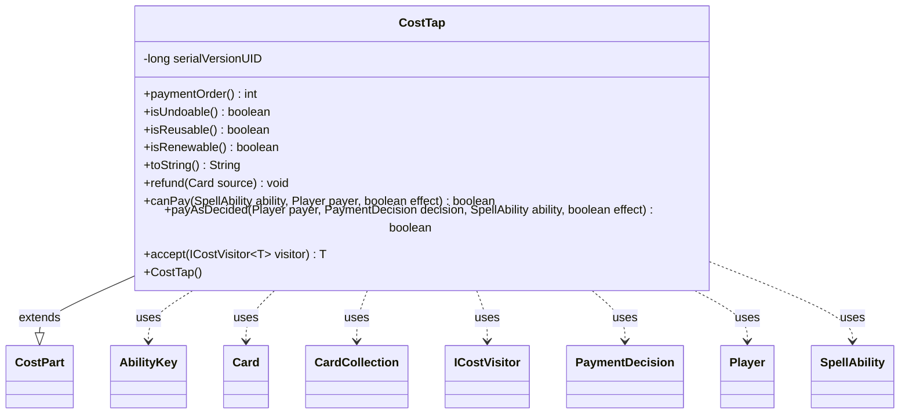

---
aliases:
  - CostTap
tags:
  - java/class
  - module/forge-game
  - pkg/forge/game/cost
fqn: forge.game.cost.CostTap
package: forge.game.cost
module: forge-game
kind: Class
---

# CostTap

**Package:** `forge.game.cost` &nbsp; **Module:** `forge-game` &nbsp; **Kind:** Class



## Relationships
**Extends:**
- [[forge.game.cost.CostPart|CostPart]]
**Uses:**
- [[forge.game.ability.AbilityKey|AbilityKey]]
- [[forge.game.card.Card|Card]]
- [[forge.game.card.CardCollection|CardCollection]]
- [[forge.game.cost.ICostVisitor|ICostVisitor]]
- [[forge.game.cost.PaymentDecision|PaymentDecision]]
- [[forge.game.player.Player|Player]]
- [[forge.game.spellability.SpellAbility|SpellAbility]]

## Design Description

Tapping the host card is a self-cost: paying it taps the source rather than consuming external resources.

CostTap models the `{T}` (tap) component of a spell or ability's cost, extending the abstract `CostPart` to plug into Forge's cost-payment framework. It declares itself undoable, reusable, and renewable, and reports a `paymentOrder` of -1 so it resolves early relative to other cost parts. `canPay` confirms the host card can tap and is not affected by summoning sickness, while `payAsDecided` taps the host through `Card.tap` and, on success, fires a `TapAll` trigger via the game's `TriggerHandler` using an `AbilityKey` parameter map. It collaborates with `SpellAbility` to reach the host `Card`, `Player` for game access, and `PaymentDecision` when executing a chosen payment. The `accept(ICostVisitor)` method supports visitor-based traversal of cost structures, and `refund` cleanly reverses payment by untapping the source.

## Source
`forge-game/src/main/java/forge/game/cost/CostTap.java`

```java
/*
 * Forge: Play Magic: the Gathering.
 * Copyright (C) 2011  Forge Team
 *
 * This program is free software: you can redistribute it and/or modify
 * it under the terms of the GNU General Public License as published by
 * the Free Software Foundation, either version 3 of the License, or
 * (at your option) any later version.
 * 
 * This program is distributed in the hope that it will be useful,
 * but WITHOUT ANY WARRANTY; without even the implied warranty of
 * MERCHANTABILITY or FITNESS FOR A PARTICULAR PURPOSE.  See the
 * GNU General Public License for more details.
 * 
 * You should have received a copy of the GNU General Public License
 * along with this program.  If not, see <http://www.gnu.org/licenses/>.
 */
package forge.game.cost;

import forge.game.ability.AbilityKey;
import forge.game.card.Card;
import forge.game.card.CardCollection;
import forge.game.player.Player;
import forge.game.spellability.SpellAbility;
import forge.game.trigger.TriggerType;

import java.util.Map;

/**
 * The Class CostTap.
 */
public class CostTap extends CostPart {

    /**
     * Serializables need a version ID.
     */
    private static final long serialVersionUID = 1L;

    /**
     * Instantiates a new cost tap.
     */
    public CostTap() {
    }

    public int paymentOrder() { return -1; }

    @Override
    public boolean isUndoable() { return true; }

    @Override
    public boolean isReusable() { return true; }

    @Override
    public boolean isRenewable() { return true; }

    @Override
    public final String toString() {
        return "{T}";
    }

    @Override
    public final void refund(final Card source) {
        source.setTapped(false);
    }

    @Override
    public final boolean canPay(final SpellAbility ability, final Player payer, final boolean effect) {
        final Card source = ability.getHostCard();
        return source.canTap() && !source.isAbilitySick();
    }

    @Override
    public boolean payAsDecided(Player payer, PaymentDecision decision, SpellAbility ability, final boolean effect) {
        Card hostCard = ability.getHostCard();
        if (hostCard.tap(true, ability, payer)) {
            final Map<AbilityKey, Object> runParams = AbilityKey.newMap();
            runParams.put(AbilityKey.Cards, new CardCollection(hostCard));
            payer.getGame().getTriggerHandler().runTrigger(TriggerType.TapAll, runParams, false);
        }
        return true;
    }

    public <T> T accept(ICostVisitor<T> visitor) {
        return visitor.visit(this);
    }
}
```

## Python
`forge/game/cost/CostTap.py`

```python
from forge.game.cost.CostPart import CostPart
from forge.game.ability.AbilityKey import AbilityKey
from forge.game.card.Card import Card
from forge.game.card.CardCollection import CardCollection
from forge.game.cost.ICostVisitor import ICostVisitor
from forge.game.cost.PaymentDecision import PaymentDecision
from forge.game.player.Player import Player
from forge.game.spellability.SpellAbility import SpellAbility
from forge.game.trigger.TriggerType import TriggerType


class CostTap(CostPart):
    """The Class CostTap."""

    serialVersionUID = 1

    def __init__(self):
        """Instantiates a new cost tap."""
        pass

    def paymentOrder(self) -> int:
        return -1

    def isUndoable(self) -> bool:
        return True

    def isReusable(self) -> bool:
        return True

    def isRenewable(self) -> bool:
        return True

    def toString(self) -> str:
        return "{T}"

    def refund(self, source: Card) -> None:
        source.setTapped(False)

    def canPay(self, ability: SpellAbility, payer: Player, effect: bool) -> bool:
        source = ability.getHostCard()
        return source.canTap() and not source.isAbilitySick()

    def payAsDecided(self, payer: Player, decision: PaymentDecision, ability: SpellAbility, effect: bool) -> bool:
        hostCard = ability.getHostCard()
        if hostCard.tap(True, ability, payer):
            runParams = AbilityKey.newMap()
            runParams[AbilityKey.Cards] = CardCollection(hostCard)
            payer.getGame().getTriggerHandler().runTrigger(TriggerType.TapAll, runParams, False)
        return True

    def accept(self, visitor: ICostVisitor):
        return visitor.visit(self)
```
