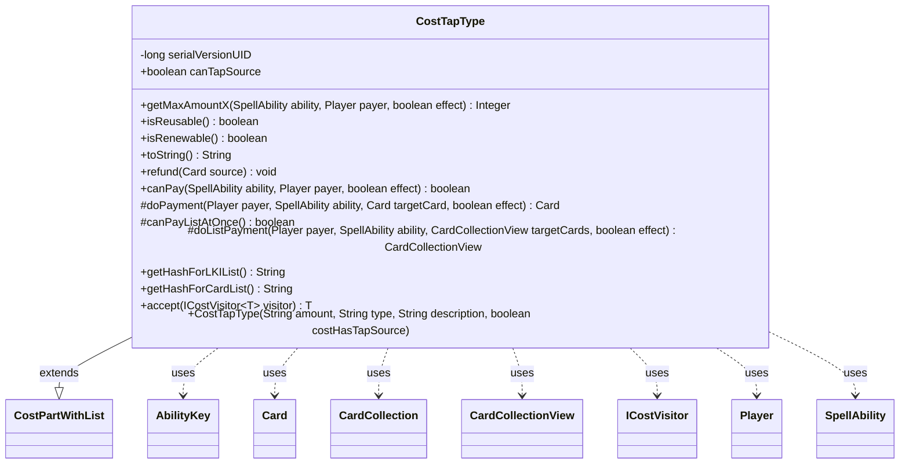

---
aliases:
  - CostTapType
tags:
  - java/class
  - module/forge-game
  - pkg/forge/game/cost
fqn: forge.game.cost.CostTapType
package: forge.game.cost
module: forge-game
kind: Class
---

# CostTapType

**Package:** `forge.game.cost` &nbsp; **Module:** `forge-game` &nbsp; **Kind:** Class



## Relationships
**Extends:**
- [[forge.game.cost.CostPartWithList|CostPartWithList]]
**Uses:**
- [[forge.game.ability.AbilityKey|AbilityKey]]
- [[forge.game.card.Card|Card]]
- [[forge.game.card.CardCollection|CardCollection]]
- [[forge.game.card.CardCollectionView|CardCollectionView]]
- [[forge.game.cost.ICostVisitor|ICostVisitor]]
- [[forge.game.player.Player|Player]]
- [[forge.game.spellability.SpellAbility|SpellAbility]]

## Design Description

CostTapType represents a tap-based payment within Forge's cost system, modeling abilities and spells that require tapping one or more qualifying permanents (e.g., "Tap two untapped creatures you control"). As a concrete subclass of CostPartWithList, it tracks the specific cards tapped so the cost can be paid, refunded, and hashed for game state comparison.

Its core responsibility is validating and executing the tap: getMaxAmountX and canPay filter the payer's battlefield via CardLists into a list of valid, tappable targets — honoring the canTapSource flag and special clauses like sharesCreatureTypeWith and withTotalPowerGE — while doPayment and doListPayment perform the actual tapping and fire the TapAll trigger. Overriding canPayListAtOnce signals batch payment of multiple cards. It collaborates with Player, SpellAbility, and Card for game context, reports itself reusable and renewable, and supports double-dispatch traversal through accept(ICostVisitor).

## Source
`forge-game/src/main/java/forge/game/cost/CostTapType.java`

```java
/*
 * Forge: Play Magic: the Gathering.
 * Copyright (C) 2011  Forge Team
 *
 * This program is free software: you can redistribute it and/or modify
 * it under the terms of the GNU General Public License as published by
 * the Free Software Foundation, either version 3 of the License, or
 * (at your option) any later version.
 * 
 * This program is distributed in the hope that it will be useful,
 * but WITHOUT ANY WARRANTY; without even the implied warranty of
 * MERCHANTABILITY or FITNESS FOR A PARTICULAR PURPOSE.  See the
 * GNU General Public License for more details.
 * 
 * You should have received a copy of the GNU General Public License
 * along with this program.  If not, see <http://www.gnu.org/licenses/>.
 */
package forge.game.cost;

import forge.card.CardType;
import forge.game.ability.AbilityKey;
import forge.game.card.*;
import forge.game.player.Player;
import forge.game.spellability.SpellAbility;
import forge.game.trigger.TriggerType;
import forge.game.zone.ZoneType;
import forge.util.Lang;
import forge.util.TextUtil;

import java.util.Map;

/**
 * The Class CostTapType.
 */
public class CostTapType extends CostPartWithList {

    /**
     * Serializables need a version ID.
     */
    private static final long serialVersionUID = 1L;
    public final boolean canTapSource;

    /**
     * Instantiates a new cost tap type.
     * 
     * @param amount
     *            the amount
     * @param type
     *            the type
     * @param description
     *            the description
     */
    public CostTapType(final String amount, final String type, final String description, boolean costHasTapSource) {
        super(amount, type, description);
        canTapSource  = !costHasTapSource;
    }

    @Override
    public Integer getMaxAmountX(SpellAbility ability, Player payer, final boolean effect) {
        final Card source = ability.getHostCard();

        // extend if cards use X with different conditions

        CardCollection typeList = CardLists.getValidCards(payer.getCardsIn(ZoneType.Battlefield), getType().split(";"), payer, source, ability);

        if (!canTapSource) {
            typeList.remove(source);
        }
        typeList = CardLists.filter(typeList, ability.isCrew() ? CardPredicates.CAN_CREW : CardPredicates.CAN_TAP);

        return typeList.size();
    }

    @Override
    public boolean isReusable() { return true; }

    @Override
    public boolean isRenewable() { return true; }

    /*
     * (non-Javadoc)
     * 
     * @see forge.card.cost.CostPart#toString()
     */
    @Override
    public final String toString() {
        final StringBuilder sb = new StringBuilder();

        final String desc = this.getDescriptiveType();
        final String type = this.getType();
        final String amt = this.getAmount();

        if (type.contains("+withTotalPowerGE")) {
            String num = type.split("\\+withTotalPowerGE")[1];
            sb.append("Tap any number of untapped creatures you control other than CARDNAME with total power ");
            sb.append(num).append("or greater");
            return sb.toString();
        }

        sb.append("Tap ");
        if (type.contains("Other")) {
            String rep = type.contains(".Other") ? ".Other" : "+Other";
            String descTrim = desc.replace(rep, "");
            if (CardType.CoreType.isValidEnum(descTrim)) {
                descTrim = descTrim.toLowerCase();
            }
            sb.append(amt.equals("1") ? "another untapped " + descTrim : 
                Lang.nounWithNumeral(amt, "other untapped " + descTrim));
            if (!descTrim.contains("you control")) {
                sb.append(" you control");
            }
        } else if (amt.equals("X")) {
            sb.append("any number of untapped ").append(desc).append("s you control");
        } else {
            sb.append(Lang.nounWithNumeralExceptOne(amt, "untapped " + desc)).append(" you control");
        }
        if (type.contains("sharesCreatureTypeWith")) {
            sb.append(" that share a creature type");
        }
        return sb.toString();
    }

    /*
     * (non-Javadoc)
     * 
     * @see forge.card.cost.CostPart#refund(forge.Card)
     */
    @Override
    public final void refund(final Card source) {
        for (final Card c : cardList) {
            c.setTapped(false);
        }
        cardList.clear();
    }

    /*
     * (non-Javadoc)
     * 
     * @see
     * forge.card.cost.CostPart#canPay(forge.card.spellability.SpellAbility,
     * forge.Card, forge.Player, forge.card.cost.Cost)
     */
    @Override
    public final boolean canPay(final SpellAbility ability, final Player payer, final boolean effect) {
        final Card source = ability.getHostCard();

        String type = this.getType();
        boolean sameType = false;

        if (type.equals("OriginalHost")) {
            return ability.getOriginalHost().canTap();
        }

        if (type.contains(".sharesCreatureTypeWith")) {
            sameType = true;
            type = TextUtil.fastReplace(type, ".sharesCreatureTypeWith", "");
        }
        boolean totalPower = false;
        String totalP = "";
        if (type.contains("+withTotalPowerGE")) {
            totalPower = true;
            totalP = type.split("withTotalPowerGE")[1];
            type = TextUtil.fastReplace(type, TextUtil.concatNoSpace("+withTotalPowerGE", totalP), "");
        }

        CardCollection typeList = CardLists.getValidCards(payer.getCardsIn(ZoneType.Battlefield), type.split(";"), payer, source, ability);

        if (!canTapSource) {
            typeList.remove(source);
        }
        typeList = CardLists.filter(typeList, ability.isCrew() ? CardPredicates.CAN_CREW : CardPredicates.CAN_TAP);

        if (sameType) {
            for (final Card card : typeList) {
                if (CardLists.count(typeList, CardPredicates.sharesCreatureTypeWith(card)) > 1) {
                    return true;
                }
            }
            return false;
        }

        if (totalPower) {
            final int i = Integer.parseInt(totalP);
            return CardLists.getTotalPower(typeList, ability) >= i;
        }

        final int amount = this.getAbilityAmount(ability);
        return typeList.size() >= amount;
    }

    /* (non-Javadoc)
     * @see forge.card.cost.CostPartWithList#executePayment(forge.card.spellability.SpellAbility, forge.Card)
     */
    @Override
    protected Card doPayment(Player payer, SpellAbility ability, Card targetCard, final boolean effect) {
        targetCard.tap(true, ability, payer);
        return targetCard;
    }

    @Override
    protected boolean canPayListAtOnce() {
        return true;
    }

    @Override
    protected CardCollectionView doListPayment(Player payer, SpellAbility ability, CardCollectionView targetCards, final boolean effect) {
        CardCollection tapped = new CardCollection();
        for (Card c : targetCards) {
            if (c.tap(true, ability, payer)) tapped.add(c);
        }

        final Map<AbilityKey, Object> runParams = AbilityKey.newMap();
        runParams.put(AbilityKey.Cards, tapped);
        payer.getGame().getTriggerHandler().runTrigger(TriggerType.TapAll, runParams, false);
        return targetCards;
    }

    /* (non-Javadoc)
     * @see forge.card.cost.CostPartWithList#getHashForList()
     */
    @Override
    public String getHashForLKIList() {
        return "Tapped";
    }
    @Override
    public String getHashForCardList() {
    	return "TappedCards";
    }

    // Inputs
    public <T> T accept(ICostVisitor<T> visitor) {
        return visitor.visit(this);
    }

}
```
