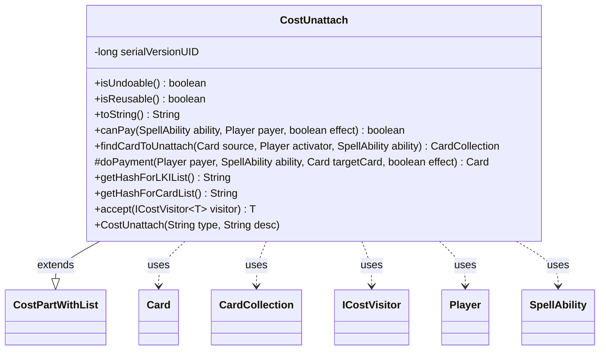

---
aliases:
  - CostUnattach
tags:
  - java/class
  - module/forge-game
  - pkg/forge/game/cost
fqn: forge.game.cost.CostUnattach
package: forge.game.cost
module: forge-game
kind: Class
---

# CostUnattach

**Package:** `forge.game.cost` &nbsp; **Module:** `forge-game` &nbsp; **Kind:** Class



## Relationships
**Extends:**
- [[forge.game.cost.CostPartWithList|CostPartWithList]]
**Uses:**
- [[forge.game.card.Card|Card]]
- [[forge.game.card.CardCollection|CardCollection]]
- [[forge.game.cost.ICostVisitor|ICostVisitor]]
- [[forge.game.player.Player|Player]]
- [[forge.game.spellability.SpellAbility|SpellAbility]]

## Design Description

CostUnattach represents a payable cost that detaches an Equipment (or other attachment) from the entity it is attached to. As a concrete subclass of `CostPartWithList`, it plugs into Forge's composable cost framework, initializing its parent with a "1" amount and participating in the visitor traversal via `accept(ICostVisitor)`. It collaborates with `Card`, `CardCollection`, `Player`, and `SpellAbility` to identify and act on the cards to unattach.

The class centralizes its eligibility logic in `findCardToUnattach`, which `canPay` reuses to confirm at least one valid target exists, and which `doPayment` ultimately resolves by calling `unattachFromEntity`. Its resolution intentionally branches across three modes: paying from the source equipment itself, from an `OriginalHost`, or from cards equipped by the source filtered by valid-type criteria (with deferred handling for X-cost types). Marked non-undoable but reusable, it supplies stable hash keys for last-known-information and card-list tracking.

## Source
`forge-game/src/main/java/forge/game/cost/CostUnattach.java`

```java
/*
 * Forge: Play Magic: the Gathering.
 * Copyright (C) 2011  Forge Team
 *
 * This program is free software: you can redistribute it and/or modify
 * it under the terms of the GNU General Public License as published by
 * the Free Software Foundation, either version 3 of the License, or
 * (at your option) any later version.
 * 
 * This program is distributed in the hope that it will be useful,
 * but WITHOUT ANY WARRANTY; without even the implied warranty of
 * MERCHANTABILITY or FITNESS FOR A PARTICULAR PURPOSE.  See the
 * GNU General Public License for more details.
 * 
 * You should have received a copy of the GNU General Public License
 * along with this program.  If not, see <http://www.gnu.org/licenses/>.
 */
package forge.game.cost;

import forge.game.card.Card;
import forge.game.card.CardCollection;
import forge.game.card.CardLists;
import forge.game.player.Player;
import forge.game.spellability.SpellAbility;
import forge.util.TextUtil;

/**
 * The Class CostUnattach.
 */
public class CostUnattach extends CostPartWithList {
    // Unattach<CARDNAME> if ability is on the Equipment
    // Unattach<Card.Attached+namedHeartseeker/Equipped Heartseeker> if equipped creature has the ability

    /**
     * Serializables need a version ID.
     */
    private static final long serialVersionUID = 1L;


    /**
     * Instantiates a new cost unattach.
     */
    public CostUnattach(final String type, final String desc) {
        super("1", type, desc);
    }

    @Override
    public boolean isUndoable() { return false; }

    @Override
    public boolean isReusable() { return true; }

    /*
     * (non-Javadoc)
     * 
     * @see forge.card.cost.CostPart#toString()
     */
    @Override
    public final String toString() {
        return TextUtil.concatWithSpace("Unattach", this.getTypeDescription());
    }

    /*
     * (non-Javadoc)
     * 
     * @see
     * forge.card.cost.CostPart#canPay(forge.card.spellability.SpellAbility,
     * forge.Card, forge.Player, forge.card.cost.Cost)
     */
    @Override
    public final boolean canPay(final SpellAbility ability, final Player payer, final boolean effect) {
        return !findCardToUnattach(ability.getHostCard(), payer, ability).isEmpty();
    }

    public CardCollection findCardToUnattach(final Card source, Player activator, SpellAbility ability) {
        CardCollection attachees = new CardCollection();
        if (payCostFromSource()) {
            if (source.isEquipping()) {
                attachees.add(source);
            }
        } else if (getType().equals("OriginalHost")) {
            Card originalEquipment = ability.getOriginalHost();
            if (originalEquipment.isEquipping()) {
                attachees.add(originalEquipment);
            }
        } else {
            attachees.addAll(source.getEquippedBy());
            if (!getType().contains("X") || ability.getXManaCostPaid() != null) {
                attachees = CardLists.getValidCards(attachees, this.getType(), activator, source, ability);
            }
        }
        return attachees;
    }

    /* (non-Javadoc)
     * @see forge.card.cost.CostPartWithList#executePayment(forge.card.spellability.SpellAbility, forge.Card)
     */
    @Override
    protected Card doPayment(Player payer, SpellAbility ability, Card targetCard, final boolean effect) {
        targetCard.unattachFromEntity(targetCard.getEntityAttachedTo());
        return targetCard;
    }

    @Override
    public String getHashForLKIList() {
        return "Unattached";
    }
    @Override
    public String getHashForCardList() {
    	return "UnattachedCards";
    }

    public <T> T accept(ICostVisitor<T> visitor) {
        return visitor.visit(this);
    }

}
```
