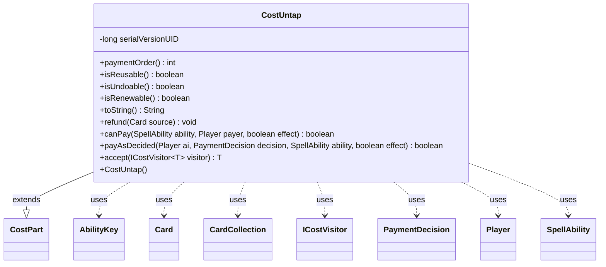

---
aliases:
  - CostUntap
tags:
  - java/class
  - module/forge-game
  - pkg/forge/game/cost
fqn: forge.game.cost.CostUntap
package: forge.game.cost
module: forge-game
kind: Class
---

# CostUntap

**Package:** `forge.game.cost` &nbsp; **Module:** `forge-game` &nbsp; **Kind:** Class



## Relationships
**Extends:**
- [[forge.game.cost.CostPart|CostPart]]
**Uses:**
- [[forge.game.ability.AbilityKey|AbilityKey]]
- [[forge.game.card.Card|Card]]
- [[forge.game.card.CardCollection|CardCollection]]
- [[forge.game.cost.ICostVisitor|ICostVisitor]]
- [[forge.game.cost.PaymentDecision|PaymentDecision]]
- [[forge.game.player.Player|Player]]
- [[forge.game.spellability.SpellAbility|SpellAbility]]

## Design Description

CostUntap models the "untap the source permanent" cost (rendered as `{Q}`), one concrete leaf in the cost hierarchy: it extends `CostPart` and overrides the cost-payment contract for this specific case. As a reusable, undoable, renewable cost with payment order 20, it integrates into Forge's larger cost-payment pipeline. Its `canPay` gates on the host card being legally untappable—not ability-sick and either free of STUN counters or able to remove them—while `payAsDecided` performs the untap and fires an `UntapAll` trigger via the game's `TriggerHandler`, collaborating with `AbilityKey`, `CardCollection`, and `Player` to assemble trigger parameters. The `refund` method restores the tapped state for undo support, and `accept` implements the visitor pattern over `ICostVisitor`, keeping cost-type-specific behavior decoupled from traversal logic.

## Source
`forge-game/src/main/java/forge/game/cost/CostUntap.java`

```java
/*
 * Forge: Play Magic: the Gathering.
 * Copyright (C) 2011  Forge Team
 *
 * This program is free software: you can redistribute it and/or modify
 * it under the terms of the GNU General Public License as published by
 * the Free Software Foundation, either version 3 of the License, or
 * (at your option) any later version.
 * 
 * This program is distributed in the hope that it will be useful,
 * but WITHOUT ANY WARRANTY; without even the implied warranty of
 * MERCHANTABILITY or FITNESS FOR A PARTICULAR PURPOSE.  See the
 * GNU General Public License for more details.
 * 
 * You should have received a copy of the GNU General Public License
 * along with this program.  If not, see <http://www.gnu.org/licenses/>.
 */
package forge.game.cost;

import com.google.common.collect.Maps;
import forge.game.ability.AbilityKey;
import forge.game.card.Card;
import forge.game.card.CardCollection;
import forge.game.card.CounterEnumType;
import forge.game.player.Player;
import forge.game.spellability.SpellAbility;
import forge.game.trigger.TriggerType;

import java.util.Map;

/**
 * The Class CostUntap.
 */
public class CostUntap extends CostPart {

    /**
     * Serializables need a version ID.
     */
    private static final long serialVersionUID = 1L;

    /**
     * Instantiates a new cost untap.
     */
    public CostUntap() {
    }

    @Override
    public int paymentOrder() { return 20; }

    @Override
    public boolean isReusable() { return true; }

    @Override
    public boolean isUndoable() { return true; }

    @Override
    public boolean isRenewable() { return true; }

    /*
     * (non-Javadoc)
     * 
     * @see forge.card.cost.CostPart#toString()
     */
    @Override
    public final String toString() {
        return "{Q}";
    }

    /*
     * (non-Javadoc)
     * 
     * @see forge.card.cost.CostPart#refund(forge.Card)
     */
    @Override
    public final void refund(final Card source) {
        source.setTapped(true);
    }

    @Override
    public final boolean canPay(final SpellAbility ability, final Player payer, final boolean effect) {
        final Card source = ability.getHostCard();
        return source.canUntap(null, false) && !source.isAbilitySick() &&
                (source.getCounters(CounterEnumType.STUN) == 0 || source.canRemoveCounters(CounterEnumType.STUN));
    }

    @Override
    public boolean payAsDecided(Player ai, PaymentDecision decision, SpellAbility ability, final boolean effect) {
        final Card c = ability.getHostCard();
        if (c.untap()) {
            final Map<AbilityKey, Object> runParams = AbilityKey.newMap();
            final Map<Player, CardCollection> map = Maps.newHashMap();
            map.put(ai, new CardCollection(c));
            runParams.put(AbilityKey.Map, map);
            ai.getGame().getTriggerHandler().runTrigger(TriggerType.UntapAll, runParams, false);
        }
        return true;
    }

    public <T> T accept(ICostVisitor<T> visitor) {
        return visitor.visit(this);
    }
}
```
