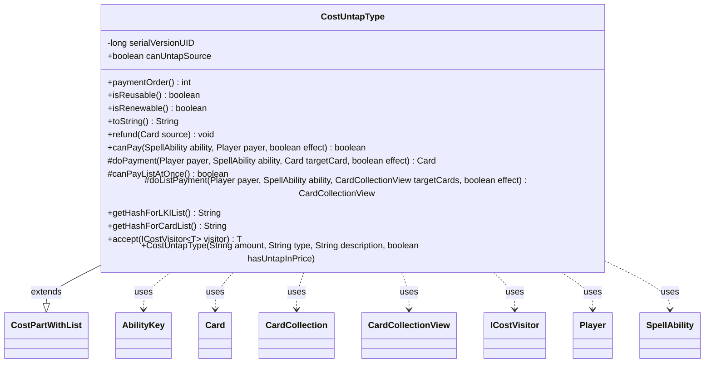

---
aliases:
  - CostUntapType
tags:
  - java/class
  - module/forge-game
  - pkg/forge/game/cost
fqn: forge.game.cost.CostUntapType
package: forge.game.cost
module: forge-game
kind: Class
---

# CostUntapType

**Package:** `forge.game.cost` &nbsp; **Module:** `forge-game` &nbsp; **Kind:** Class



## Relationships
**Extends:**
- [[forge.game.cost.CostPartWithList|CostPartWithList]]
**Uses:**
- [[forge.game.ability.AbilityKey|AbilityKey]]
- [[forge.game.card.Card|Card]]
- [[forge.game.card.CardCollection|CardCollection]]
- [[forge.game.card.CardCollectionView|CardCollectionView]]
- [[forge.game.cost.ICostVisitor|ICostVisitor]]
- [[forge.game.player.Player|Player]]
- [[forge.game.spellability.SpellAbility|SpellAbility]]

## Design Description

CostUntapType models the in-game cost of untapping one or more tapped permanents to pay for a spell or ability. As a concrete subclass of CostPartWithList, it manages a list of affected cards and plugs into Forge's cost-payment framework by implementing the type's hooks: canPay validates that enough eligible permanents exist on the battlefield (respecting the type filter, the canUntapSource flag, and stun-counter constraints), while doPayment and the batch doListPayment perform the actual untapping. It collaborates with SpellAbility and Player to resolve the activating context, and with Card/CardCollection(View) for target selection.

Notable design intent: payment runs as a single batch (canPayListAtOnce returns true) so the UntapAll trigger fires once via AbilityKey-keyed run-params; refund re-taps the affected cards to reverse a cancelled payment; stable hash keys support last-known-information tracking; and accept routes through ICostVisitor for cost traversal.

## Source
`forge-game/src/main/java/forge/game/cost/CostUntapType.java`

```java
/*
 * Forge: Play Magic: the Gathering.
 * Copyright (C) 2011  Forge Team
 *
 * This program is free software: you can redistribute it and/or modify
 * it under the terms of the GNU General Public License as published by
 * the Free Software Foundation, either version 3 of the License, or
 * (at your option) any later version.
 * 
 * This program is distributed in the hope that it will be useful,
 * but WITHOUT ANY WARRANTY; without even the implied warranty of
 * MERCHANTABILITY or FITNESS FOR A PARTICULAR PURPOSE.  See the
 * GNU General Public License for more details.
 * 
 * You should have received a copy of the GNU General Public License
 * along with this program.  If not, see <http://www.gnu.org/licenses/>.
 */
package forge.game.cost;

import com.google.common.collect.Maps;
import forge.game.ability.AbilityKey;
import forge.game.card.*;
import forge.game.player.Player;
import forge.game.spellability.SpellAbility;
import forge.game.trigger.TriggerType;
import forge.game.zone.ZoneType;

import java.util.Map;

/**
 * The Class CostUntapType.
 */
public class CostUntapType extends CostPartWithList {

    private static final long serialVersionUID = 1L;
    public final boolean canUntapSource;

    public CostUntapType(final String amount, final String type, final String description, boolean hasUntapInPrice) {
        super(amount, type, description);
        canUntapSource = !hasUntapInPrice;
    }

    @Override
    public int paymentOrder() { return 18; }

    @Override
    public boolean isReusable() { return true; }

    @Override
    public boolean isRenewable() { return true; }

    @Override
    public final String toString() {
        final StringBuilder sb = new StringBuilder();
        sb.append("Untap ");

        final Integer i = convertAmount();
        final String desc = getDescriptiveType();

        sb.append(Cost.convertAmountTypeToWords(i, getAmount(), " tapped " + desc));

        if (getType().contains("OppCtrl")) {
            sb.append(" an opponent controls");
        }
        else if (getType().contains("YouCtrl")) {
            sb.append(" you control");
        }
        return sb.toString();
    }

    @Override
    public final void refund(final Card source) {
        for (final Card c : getCardList()) {
            c.setTapped(true);
        }
    }

    @Override
    public final boolean canPay(final SpellAbility ability, final Player payer, final boolean effect) {
        final Player activator = ability.getActivatingPlayer();
        final Card source = ability.getHostCard();

        CardCollection typeList = CardLists.getValidCards(activator.getGame().getCardsIn(ZoneType.Battlefield), getType().split(";"), activator, source, ability);

        if (!canUntapSource) {
            typeList.remove(source);
        }
        typeList = CardLists.filter(typeList, c -> c.canUntap(null, false) &&
                (c.getCounters(CounterEnumType.STUN) == 0 || c.canRemoveCounters(CounterEnumType.STUN)));

        final int amount = this.getAbilityAmount(ability);
        return typeList.size() != 0 && typeList.size() >= amount;
    }

    @Override
    protected Card doPayment(Player payer, SpellAbility ability, Card targetCard, final boolean effect) {
        targetCard.untap();
        return targetCard;
    }

    @Override
    protected boolean canPayListAtOnce() {
        return true;
    }

    @Override
    protected CardCollectionView doListPayment(Player payer, SpellAbility ability, CardCollectionView targetCards, final boolean effect) {
        CardCollection untapped = new CardCollection();
        for (Card c : targetCards) {
            if (c.untap()) untapped.add(c);
        }
        if (!untapped.isEmpty()) {
            final Map<AbilityKey, Object> runParams = AbilityKey.newMap();
            final Map<Player, CardCollection> map = Maps.newHashMap();
            map.put(payer, untapped);
            runParams.put(AbilityKey.Map, map);
            payer.getGame().getTriggerHandler().runTrigger(TriggerType.UntapAll, runParams, false);
        }
        return targetCards;
    }
    @Override
    public String getHashForLKIList() {
        return "Untapped";
    }
    @Override
    public String getHashForCardList() {
    	return "UntappedCards";
    }

    public <T> T accept(ICostVisitor<T> visitor) {
        return visitor.visit(this);
    }
}
```

## Python
`forge/game/cost/CostUntapType.py`

```python
from forge.game.cost.CostPartWithList import CostPartWithList
from forge.game.cost.Cost import Cost
from forge.game.cost.ICostVisitor import ICostVisitor
from forge.game.ability.AbilityKey import AbilityKey
from forge.game.card.Card import Card
from forge.game.card.CardCollection import CardCollection
from forge.game.card.CardCollectionView import CardCollectionView
from forge.game.card.CardLists import CardLists
from forge.game.card.CounterEnumType import CounterEnumType
from forge.game.player.Player import Player
from forge.game.spellability.SpellAbility import SpellAbility
from forge.game.trigger.TriggerType import TriggerType
from forge.game.zone.ZoneType import ZoneType


class CostUntapType(CostPartWithList):
    """The Class CostUntapType."""

    serialVersionUID = 1

    def __init__(self, amount: str, type: str, description: str, hasUntapInPrice: bool):
        super().__init__(amount, type, description)
        self.canUntapSource = not hasUntapInPrice

    def paymentOrder(self) -> int:
        return 18

    def isReusable(self) -> bool:
        return True

    def isRenewable(self) -> bool:
        return True

    def toString(self) -> str:
        sb = []
        sb.append("Untap ")

        i = self.convertAmount()
        desc = self.getDescriptiveType()

        sb.append(Cost.convertAmountTypeToWords(i, self.getAmount(), " tapped " + desc))

        if "OppCtrl" in self.getType():
            sb.append(" an opponent controls")
        elif "YouCtrl" in self.getType():
            sb.append(" you control")
        return "".join(sb)

    def refund(self, source: Card) -> None:
        for c in self.getCardList():
            c.setTapped(True)

    def canPay(self, ability: SpellAbility, payer: Player, effect: bool) -> bool:
        activator = ability.getActivatingPlayer()
        source = ability.getHostCard()

        typeList = CardLists.getValidCards(activator.getGame().getCardsIn(ZoneType.Battlefield), self.getType().split(";"), activator, source, ability)

        if not self.canUntapSource:
            typeList.remove(source)
        typeList = CardLists.filter(typeList, lambda c: c.canUntap(None, False) and
                (c.getCounters(CounterEnumType.STUN) == 0 or c.canRemoveCounters(CounterEnumType.STUN)))

        amount = self.getAbilityAmount(ability)
        return typeList.size() != 0 and typeList.size() >= amount

    def doPayment(self, payer: Player, ability: SpellAbility, targetCard: Card, effect: bool) -> Card:
        targetCard.untap()
        return targetCard

    def canPayListAtOnce(self) -> bool:
        return True

    def doListPayment(self, payer: Player, ability: SpellAbility, targetCards: CardCollectionView, effect: bool) -> CardCollectionView:
        untapped = CardCollection()
        for c in targetCards:
            if c.untap():
                untapped.add(c)
        if not untapped.isEmpty():
            runParams = AbilityKey.newMap()
            map = {}
            map[payer] = untapped
            runParams[AbilityKey.Map] = map
            payer.getGame().getTriggerHandler().runTrigger(TriggerType.UntapAll, runParams, False)
        return targetCards

    def getHashForLKIList(self) -> str:
        return "Untapped"

    def getHashForCardList(self) -> str:
        return "UntappedCards"

    def accept(self, visitor: ICostVisitor):
        return visitor.visit(self)
```
