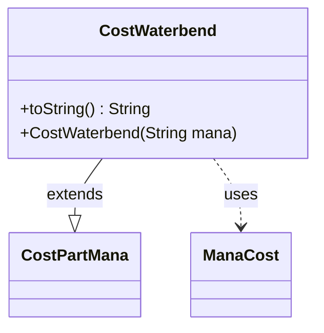

---
aliases:
  - CostWaterbend
tags:
  - java/class
  - module/forge-game
  - pkg/forge/game/cost
fqn: forge.game.cost.CostWaterbend
package: forge.game.cost
module: forge-game
kind: Class
---

# CostWaterbend

**Package:** `forge.game.cost` &nbsp; **Module:** `forge-game` &nbsp; **Kind:** Class



## Relationships
**Extends:**
- [[forge.game.cost.CostPartMana|CostPartMana]]
**Uses:**
- [[forge.card.mana.ManaCost|ManaCost]]

## Design Description

CostWaterbend is a concrete cost component representing the "Waterbend" mana payment mechanic. It specializes `CostPartMana` by constructing a fixed `ManaCost` from a supplied mana string, inheriting all the payment, accounting, and validation behavior its supertype provides for mana-based costs. Its only added behavior is recording the original mana string (via `maxWaterbend`) and rendering a human-readable label through `toString()`.

The design intent is minimal specialization: rather than reimplementing mana-cost handling, the class adapts the existing `CostPartMana` machinery to a named keyword cost, passing a null restriction and deferring to the parent for runtime semantics. It collaborates only with `ManaCost`, which it instantiates to translate the textual mana expression into the engine's structured cost representation.

## Source
`forge-game/src/main/java/forge/game/cost/CostWaterbend.java`

```java
package forge.game.cost;

import forge.card.mana.ManaCost;

public class CostWaterbend extends CostPartMana {

    public CostWaterbend(final String mana) {
        super(new ManaCost(mana), null);

        maxWaterbend = mana;
    }

    @Override
    public final String toString() {
        return "Waterbend " + getMana().toString();
    }
}
```
