---
aliases:
  - Base
tags:
  - java/class
  - module/forge-game
  - pkg/forge/game/cost
fqn: forge.game.cost.ICostVisitor.Base
package: forge.game.cost
module: forge-game
kind: Class
---

# Base

**Package:** `forge.game.cost`   **Module:** `forge-game`   **Kind:** Class



```mermaid
classDiagram
    class Base {
        +visit(CostGainControl cost) T
        +visit(CostChooseColor cost) T
        +visit(CostChooseCreatureType cost) T
        +visit(CostCollectEvidence cost) T
        +visit(CostDiscard cost) T
        +visit(CostBehold cost) T
        +visit(CostBeholdExile cost) T
        +visit(CostDamage cost) T
        +visit(CostDraw cost) T
        +visit(CostExile cost) T
        +visit(CostExileFromStack cost) T
        +visit(CostExiledMoveToGrave cost) T
        +visit(CostExert cost) T
        +visit(CostEnlist cost) T
        +visit(CostFlipCoin cost) T
        +visit(CostForage cost) T
        +visit(CostRollDice cost) T
        +visit(CostMill cost) T
        +visit(CostAddMana cost) T
        +visit(CostPayLife cost) T
        +visit(CostPayEnergy cost) T
        +visit(CostGainLife cost) T
        +visit(CostPartMana cost) T
        +visit(CostPromiseGift cost) T
        +visit(CostPutCardToLib cost) T
        +visit(CostTap cost) T
        +visit(CostSacrifice cost) T
        +visit(CostReturn cost) T
        +visit(CostReveal cost) T
        +visit(CostRevealChosen cost) T
        +visit(CostRemoveAnyCounter cost) T
        +visit(CostRemoveCounter cost) T
        +visit(CostPutCounter cost) T
        +visit(CostUntapType cost) T
        +visit(CostUntap cost) T
        +visit(CostUnattach cost) T
        +visit(CostTapType cost) T
        +visit(CostPayShards cost) T
        +visit(CostBlight cost) T
    }
    Base ..|> ICostVisitor : implements
    Base ..> CostAddMana : uses
    Base ..> CostBehold : uses
    Base ..> CostBeholdExile : uses
    Base ..> CostBlight : uses
    Base ..> CostChooseColor : uses
    Base ..> CostChooseCreatureType : uses
    Base ..> CostCollectEvidence : uses
    Base ..> CostDamage : uses
    Base ..> CostDiscard : uses
    Base ..> CostDraw : uses
    Base ..> CostEnlist : uses
    Base ..> CostExert : uses
    Base ..> CostExile : uses
    Base ..> CostExileFromStack : uses
    Base ..> CostExiledMoveToGrave : uses
    Base ..> CostFlipCoin : uses
    Base ..> CostForage : uses
    Base ..> CostGainControl : uses
    Base ..> CostGainLife : uses
    Base ..> CostMill : uses
    Base ..> CostPartMana : uses
    Base ..> CostPayEnergy : uses
    Base ..> CostPayLife : uses
    Base ..> CostPayShards : uses
    Base ..> CostPromiseGift : uses
    Base ..> CostPutCardToLib : uses
    Base ..> CostPutCounter : uses
    Base ..> CostRemoveAnyCounter : uses
    Base ..> CostRemoveCounter : uses
    Base ..> CostReturn : uses
    Base ..> CostReveal : uses
    Base ..> CostRevealChosen : uses
    Base ..> CostRollDice : uses
    Base ..> CostSacrifice : uses
    Base ..> CostTap : uses
    Base ..> CostTapType : uses
    Base ..> CostUnattach : uses
    Base ..> CostUntap : uses
    Base ..> CostUntapType : uses
```

## Relationships
**Implements:**
- [[forge.game.cost.ICostVisitor|ICostVisitor]]
**Uses:**
- [[forge.game.cost.CostAddMana|CostAddMana]]
- [[forge.game.cost.CostBehold|CostBehold]]
- [[forge.game.cost.CostBeholdExile|CostBeholdExile]]
- [[forge.game.cost.CostBlight|CostBlight]]
- [[forge.game.cost.CostChooseColor|CostChooseColor]]
- [[forge.game.cost.CostChooseCreatureType|CostChooseCreatureType]]
- [[forge.game.cost.CostCollectEvidence|CostCollectEvidence]]
- [[forge.game.cost.CostDamage|CostDamage]]
- [[forge.game.cost.CostDiscard|CostDiscard]]
- [[forge.game.cost.CostDraw|CostDraw]]
- [[forge.game.cost.CostEnlist|CostEnlist]]
- [[forge.game.cost.CostExert|CostExert]]
- [[forge.game.cost.CostExile|CostExile]]
- [[forge.game.cost.CostExileFromStack|CostExileFromStack]]
- [[forge.game.cost.CostExiledMoveToGrave|CostExiledMoveToGrave]]
- [[forge.game.cost.CostFlipCoin|CostFlipCoin]]
- [[forge.game.cost.CostForage|CostForage]]
- [[forge.game.cost.CostGainControl|CostGainControl]]
- [[forge.game.cost.CostGainLife|CostGainLife]]
- [[forge.game.cost.CostMill|CostMill]]
- [[forge.game.cost.CostPartMana|CostPartMana]]
- [[forge.game.cost.CostPayEnergy|CostPayEnergy]]
- [[forge.game.cost.CostPayLife|CostPayLife]]
- [[forge.game.cost.CostPayShards|CostPayShards]]
- [[forge.game.cost.CostPromiseGift|CostPromiseGift]]
- [[forge.game.cost.CostPutCardToLib|CostPutCardToLib]]
- [[forge.game.cost.CostPutCounter|CostPutCounter]]
- [[forge.game.cost.CostRemoveAnyCounter|CostRemoveAnyCounter]]
- [[forge.game.cost.CostRemoveCounter|CostRemoveCounter]]
- [[forge.game.cost.CostReturn|CostReturn]]
- [[forge.game.cost.CostReveal|CostReveal]]
- [[forge.game.cost.CostRevealChosen|CostRevealChosen]]
- [[forge.game.cost.CostRollDice|CostRollDice]]
- [[forge.game.cost.CostSacrifice|CostSacrifice]]
- [[forge.game.cost.CostTap|CostTap]]
- [[forge.game.cost.CostTapType|CostTapType]]
- [[forge.game.cost.CostUnattach|CostUnattach]]
- [[forge.game.cost.CostUntap|CostUntap]]
- [[forge.game.cost.CostUntapType|CostUntapType]]

## Design Description

Forge's cost model uses the visitor pattern: `ICostVisitor<T>` declares a `visit` overload for every concrete `CostPart` subtype (mana, life, energy, tap, sacrifice, discard, counters, dice, and the many mechanic-specific costs), letting clients perform type-specific operations on a cost without instanceof chains. `Base<T>` is a convenience adapter that implements the full interface with no-op `visit` methods, each returning `null`. By supplying default implementations for all cost types, it frees subclasses from overriding every method, so a concrete visitor need only override the handful of `visit` overloads relevant to the costs it cares about. This is the classic abstract-base/adapter idiom, trading exhaustive interface coverage for extensibility as new cost types are added.

## Source
`forge-game/src/main/java/forge/game/cost/ICostVisitor.java` — declaration excerpt

```java
    class Base<T> implements ICostVisitor<T> {

        @Override
        public T visit(CostGainControl cost) {
            return null;
        }

        @Override
        public T visit(CostChooseColor cost) {
            return null;
        }

        @Override
        public T visit(CostChooseCreatureType cost) {
            return null;
        }

        @Override
        public T visit(CostCollectEvidence cost) {
            return null;
        }

        @Override
        public T visit(CostDiscard cost) {
            return null;
        }
        @Override
        public T visit(CostBehold cost) {
            return null;
        }
        @Override
        public T visit(CostBeholdExile cost) {
            return null;
        }

        @Override
        public T visit(CostDamage cost) {
            return null;
        }

        @Override
        public T visit(CostDraw cost) {
            return null;
        }

        @Override
        public T visit(CostExile cost) {
            return null;
        }

        @Override
        public T visit(CostExileFromStack cost) {
            return null;
        }

        @Override
        public T visit(CostExiledMoveToGrave cost) {
            return null;
        }

        @Override
        public T visit(CostExert cost) {
            return null;
        }

        @Override
        public T visit(CostEnlist cost) {
            return null;
        }

        @Override
        public T visit(CostFlipCoin cost) {
            return null;
        }

        @Override
        public T visit(CostForage cost) {
            return null;
        }

        @Override
        public T visit(CostRollDice cost) {
            return null;
        }

        @Override
        public T visit(CostMill cost) {
            return null;
        }

        @Override
        public T visit(CostAddMana cost) {
            return null;
        }

        @Override
        public T visit(CostPayLife cost) {
            return null;
        }

        @Override
        public T visit(CostPayEnergy cost) {
            return null;
        }

        @Override
        public T visit(CostGainLife cost) {
            return null;
        }

        @Override
        public T visit(CostPartMana cost) {
            return null;
        }

        @Override
        public T visit(CostPromiseGift cost) {
            return null;
        }

        @Override
        public T visit(CostPutCardToLib cost) {
            return null;
        }

        @Override
        public T visit(CostTap cost) {
            return null;
        }

        @Override
        public T visit(CostSacrifice cost) {
            return null;
        }

        @Override
        public T visit(CostReturn cost) {
            return null;
        }

        @Override
        public T visit(CostReveal cost) {
            return null;
        }

        @Override
        public T visit(CostRevealChosen cost) {
            return null;
        }

        @Override
        public T visit(CostRemoveAnyCounter cost) {
            return null;
        }

        @Override
        public T visit(CostRemoveCounter cost) {
            return null;
        }

        @Override
        public T visit(CostPutCounter cost) {
            return null;
        }

        @Override
        public T visit(CostUntapType cost) {
            return null;
        }

        @Override
        public T visit(CostUntap cost) {
            return null;
        }

        @Override
        public T visit(CostUnattach cost) {
            return null;
        }

        @Override
        public T visit(CostTapType cost) {
            return null;
        }

        @Override
        public T visit(CostPayShards cost) {
            return null;
        }

        @Override
        public T visit(CostBlight cost) { return null; }
    }
```

## Python
`forge/game/cost/ICostVisitor/Base.py`

```python
from forge.game.cost.ICostVisitor import ICostVisitor
from forge.game.cost.CostAddMana import CostAddMana
from forge.game.cost.CostBehold import CostBehold
from forge.game.cost.CostBeholdExile import CostBeholdExile
from forge.game.cost.CostBlight import CostBlight
from forge.game.cost.CostChooseColor import CostChooseColor
from forge.game.cost.CostChooseCreatureType import CostChooseCreatureType
from forge.game.cost.CostCollectEvidence import CostCollectEvidence
from forge.game.cost.CostDamage import CostDamage
from forge.game.cost.CostDiscard import CostDiscard
from forge.game.cost.CostDraw import CostDraw
from forge.game.cost.CostEnlist import CostEnlist
from forge.game.cost.CostExert import CostExert
from forge.game.cost.CostExile import CostExile
from forge.game.cost.CostExileFromStack import CostExileFromStack
from forge.game.cost.CostExiledMoveToGrave import CostExiledMoveToGrave
from forge.game.cost.CostFlipCoin import CostFlipCoin
from forge.game.cost.CostForage import CostForage
from forge.game.cost.CostGainControl import CostGainControl
from forge.game.cost.CostGainLife import CostGainLife
from forge.game.cost.CostMill import CostMill
from forge.game.cost.CostPartMana import CostPartMana
from forge.game.cost.CostPayEnergy import CostPayEnergy
from forge.game.cost.CostPayLife import CostPayLife
from forge.game.cost.CostPayShards import CostPayShards
from forge.game.cost.CostPromiseGift import CostPromiseGift
from forge.game.cost.CostPutCardToLib import CostPutCardToLib
from forge.game.cost.CostPutCounter import CostPutCounter
from forge.game.cost.CostRemoveAnyCounter import CostRemoveAnyCounter
from forge.game.cost.CostRemoveCounter import CostRemoveCounter
from forge.game.cost.CostReturn import CostReturn
from forge.game.cost.CostReveal import CostReveal
from forge.game.cost.CostRevealChosen import CostRevealChosen
from forge.game.cost.CostRollDice import CostRollDice
from forge.game.cost.CostSacrifice import CostSacrifice
from forge.game.cost.CostTap import CostTap
from forge.game.cost.CostTapType import CostTapType
from forge.game.cost.CostUnattach import CostUnattach
from forge.game.cost.CostUntap import CostUntap
from forge.game.cost.CostUntapType import CostUntapType


class Base(ICostVisitor):

    def visit(self, cost: CostGainControl):
        return None

    def visit(self, cost: CostChooseColor):
        return None

    def visit(self, cost: CostChooseCreatureType):
        return None

    def visit(self, cost: CostCollectEvidence):
        return None

    def visit(self, cost: CostDiscard):
        return None

    def visit(self, cost: CostBehold):
        return None

    def visit(self, cost: CostBeholdExile):
        return None

    def visit(self, cost: CostDamage):
        return None

    def visit(self, cost: CostDraw):
        return None

    def visit(self, cost: CostExile):
        return None

    def visit(self, cost: CostExileFromStack):
        return None

    def visit(self, cost: CostExiledMoveToGrave):
        return None

    def visit(self, cost: CostExert):
        return None

    def visit(self, cost: CostEnlist):
        return None

    def visit(self, cost: CostFlipCoin):
        return None

    def visit(self, cost: CostForage):
        return None

    def visit(self, cost: CostRollDice):
        return None

    def visit(self, cost: CostMill):
        return None

    def visit(self, cost: CostAddMana):
        return None

    def visit(self, cost: CostPayLife):
        return None

    def visit(self, cost: CostPayEnergy):
        return None

    def visit(self, cost: CostGainLife):
        return None

    def visit(self, cost: CostPartMana):
        return None

    def visit(self, cost: CostPromiseGift):
        return None

    def visit(self, cost: CostPutCardToLib):
        return None

    def visit(self, cost: CostTap):
        return None

    def visit(self, cost: CostSacrifice):
        return None

    def visit(self, cost: CostReturn):
        return None

    def visit(self, cost: CostReveal):
        return None

    def visit(self, cost: CostRevealChosen):
        return None

    def visit(self, cost: CostRemoveAnyCounter):
        return None

    def visit(self, cost: CostRemoveCounter):
        return None

    def visit(self, cost: CostPutCounter):
        return None

    def visit(self, cost: CostUntapType):
        return None

    def visit(self, cost: CostUntap):
        return None

    def visit(self, cost: CostUnattach):
        return None

    def visit(self, cost: CostTapType):
        return None

    def visit(self, cost: CostPayShards):
        return None

    def visit(self, cost: CostBlight):
        return None
```
