---
aliases:
  - ICostVisitor
tags:
  - java/interface
  - module/forge-game
  - pkg/forge/game/cost
fqn: forge.game.cost.ICostVisitor
package: forge.game.cost
module: forge-game
kind: Interface
---

# ICostVisitor

**Package:** `forge.game.cost`   **Module:** `forge-game`   **Kind:** Interface



```mermaid
classDiagram
    class ICostVisitor {
        <<interface>>
        ~visit(CostBehold cost) T
        ~visit(CostBeholdExile cost) T
        ~visit(CostGainControl cost) T
        ~visit(CostChooseColor cost) T
        ~visit(CostChooseCreatureType cost) T
        ~visit(CostCollectEvidence cost) T
        ~visit(CostDiscard cost) T
        ~visit(CostDamage cost) T
        ~visit(CostDraw cost) T
        ~visit(CostExile cost) T
        ~visit(CostExileFromStack cost) T
        ~visit(CostExiledMoveToGrave cost) T
        ~visit(CostExert cost) T
        ~visit(CostEnlist cost) T
        ~visit(CostFlipCoin cost) T
        ~visit(CostForage cost) T
        ~visit(CostRollDice cost) T
        ~visit(CostMill cost) T
        ~visit(CostAddMana cost) T
        ~visit(CostPayLife cost) T
        ~visit(CostPayEnergy cost) T
        ~visit(CostGainLife cost) T
        ~visit(CostPartMana cost) T
        ~visit(CostPromiseGift cost) T
        ~visit(CostPutCardToLib cost) T
        ~visit(CostTap cost) T
        ~visit(CostSacrifice cost) T
        ~visit(CostReturn cost) T
        ~visit(CostReveal cost) T
        ~visit(CostRevealChosen cost) T
        ~visit(CostRemoveAnyCounter cost) T
        ~visit(CostRemoveCounter cost) T
        ~visit(CostPutCounter cost) T
        ~visit(CostUntapType cost) T
        ~visit(CostUntap cost) T
        ~visit(CostUnattach cost) T
        ~visit(CostTapType cost) T
        ~visit(CostPayShards cost) T
        ~visit(CostBlight cost) T
    }
    ICostVisitor ..> CostAddMana : uses
    ICostVisitor ..> CostBehold : uses
    ICostVisitor ..> CostBeholdExile : uses
    ICostVisitor ..> CostBlight : uses
    ICostVisitor ..> CostChooseColor : uses
    ICostVisitor ..> CostChooseCreatureType : uses
    ICostVisitor ..> CostCollectEvidence : uses
    ICostVisitor ..> CostDamage : uses
    ICostVisitor ..> CostDiscard : uses
    ICostVisitor ..> CostDraw : uses
    ICostVisitor ..> CostEnlist : uses
    ICostVisitor ..> CostExert : uses
    ICostVisitor ..> CostExile : uses
    ICostVisitor ..> CostExileFromStack : uses
    ICostVisitor ..> CostExiledMoveToGrave : uses
    ICostVisitor ..> CostFlipCoin : uses
    ICostVisitor ..> CostForage : uses
    ICostVisitor ..> CostGainControl : uses
    ICostVisitor ..> CostGainLife : uses
    ICostVisitor ..> CostMill : uses
    ICostVisitor ..> CostPartMana : uses
    ICostVisitor ..> CostPayEnergy : uses
    ICostVisitor ..> CostPayLife : uses
    ICostVisitor ..> CostPayShards : uses
    ICostVisitor ..> CostPromiseGift : uses
    ICostVisitor ..> CostPutCardToLib : uses
    ICostVisitor ..> CostPutCounter : uses
    ICostVisitor ..> CostRemoveAnyCounter : uses
    ICostVisitor ..> CostRemoveCounter : uses
    ICostVisitor ..> CostReturn : uses
    ICostVisitor ..> CostReveal : uses
    ICostVisitor ..> CostRevealChosen : uses
    ICostVisitor ..> CostRollDice : uses
    ICostVisitor ..> CostSacrifice : uses
    ICostVisitor ..> CostTap : uses
    ICostVisitor ..> CostTapType : uses
    ICostVisitor ..> CostUnattach : uses
    ICostVisitor ..> CostUntap : uses
    ICostVisitor ..> CostUntapType : uses
```

## Relationships
**Uses:**
- [[forge.game.cost.CostAddMana|CostAddMana]]
- [[forge.game.cost.CostBehold|CostBehold]]
- [[forge.game.cost.CostBeholdExile|CostBeholdExile]]
- [[forge.game.cost.CostBlight|CostBlight]]
- [[forge.game.cost.CostChooseColor|CostChooseColor]]
- [[forge.game.cost.CostChooseCreatureType|CostChooseCreatureType]]
- [[forge.game.cost.CostCollectEvidence|CostCollectEvidence]]
- [[forge.game.cost.CostDamage|CostDamage]]
- [[forge.game.cost.CostDiscard|CostDiscard]]
- [[forge.game.cost.CostDraw|CostDraw]]
- [[forge.game.cost.CostEnlist|CostEnlist]]
- [[forge.game.cost.CostExert|CostExert]]
- [[forge.game.cost.CostExile|CostExile]]
- [[forge.game.cost.CostExileFromStack|CostExileFromStack]]
- [[forge.game.cost.CostExiledMoveToGrave|CostExiledMoveToGrave]]
- [[forge.game.cost.CostFlipCoin|CostFlipCoin]]
- [[forge.game.cost.CostForage|CostForage]]
- [[forge.game.cost.CostGainControl|CostGainControl]]
- [[forge.game.cost.CostGainLife|CostGainLife]]
- [[forge.game.cost.CostMill|CostMill]]
- [[forge.game.cost.CostPartMana|CostPartMana]]
- [[forge.game.cost.CostPayEnergy|CostPayEnergy]]
- [[forge.game.cost.CostPayLife|CostPayLife]]
- [[forge.game.cost.CostPayShards|CostPayShards]]
- [[forge.game.cost.CostPromiseGift|CostPromiseGift]]
- [[forge.game.cost.CostPutCardToLib|CostPutCardToLib]]
- [[forge.game.cost.CostPutCounter|CostPutCounter]]
- [[forge.game.cost.CostRemoveAnyCounter|CostRemoveAnyCounter]]
- [[forge.game.cost.CostRemoveCounter|CostRemoveCounter]]
- [[forge.game.cost.CostReturn|CostReturn]]
- [[forge.game.cost.CostReveal|CostReveal]]
- [[forge.game.cost.CostRevealChosen|CostRevealChosen]]
- [[forge.game.cost.CostRollDice|CostRollDice]]
- [[forge.game.cost.CostSacrifice|CostSacrifice]]
- [[forge.game.cost.CostTap|CostTap]]
- [[forge.game.cost.CostTapType|CostTapType]]
- [[forge.game.cost.CostUnattach|CostUnattach]]
- [[forge.game.cost.CostUntap|CostUntap]]
- [[forge.game.cost.CostUntapType|CostUntapType]]

## Design Description

ICostVisitor is a generic visitor interface (parameterized by return type `T`) that defines the type-safe dispatch contract for Forge's cost system. It declares one overloaded `visit` method for every concrete `Cost` subtype—tap, sacrifice, pay life, mill, counter manipulation, and dozens of mechanic-specific costs—allowing callers to perform a type-specific operation on a heterogeneous cost without instanceof checks or downcasting. Each `Cost` subtype is expected to accept a visitor and route to its matching overload, implementing the classic Visitor pattern.

The nested `Base<T>` inner class supplies a no-op default implementation that returns `null` for every overload, letting clients subclass and override only the cost types they care about. This keeps concrete visitors concise and decouples cost-processing logic from the cost class hierarchy, so new behaviors can be added without modifying the individual `Cost` classes.

## Source
`forge-game/src/main/java/forge/game/cost/ICostVisitor.java`

```java
package forge.game.cost;

public interface ICostVisitor<T> {

    T visit(CostBehold cost);
    T visit(CostBeholdExile cost);
    T visit(CostGainControl cost);
    T visit(CostChooseColor cost);
    T visit(CostChooseCreatureType cost);
    T visit(CostCollectEvidence cost);
    T visit(CostDiscard cost);
    T visit(CostDamage cost);
    T visit(CostDraw cost);
    T visit(CostExile cost);
    T visit(CostExileFromStack cost);
    T visit(CostExiledMoveToGrave cost);
    T visit(CostExert cost);
    T visit(CostEnlist cost);
    T visit(CostFlipCoin cost);
    T visit(CostForage cost);
    T visit(CostRollDice cost);
    T visit(CostMill cost);
    T visit(CostAddMana cost);
    T visit(CostPayLife cost);
    T visit(CostPayEnergy cost);
    T visit(CostGainLife cost);
    T visit(CostPartMana cost);
    T visit(CostPromiseGift cost);
    T visit(CostPutCardToLib cost);
    T visit(CostTap cost);
    T visit(CostSacrifice cost);
    T visit(CostReturn cost);
    T visit(CostReveal cost);
    T visit(CostRevealChosen cost);
    T visit(CostRemoveAnyCounter cost);
    T visit(CostRemoveCounter cost);
    T visit(CostPutCounter cost);
    T visit(CostUntapType cost);
    T visit(CostUntap cost);
    T visit(CostUnattach cost);
    T visit(CostTapType cost);
    T visit(CostPayShards cost);
    T visit(CostBlight cost);

    class Base<T> implements ICostVisitor<T> {

        @Override
        public T visit(CostGainControl cost) {
            return null;
        }

        @Override
        public T visit(CostChooseColor cost) {
            return null;
        }

        @Override
        public T visit(CostChooseCreatureType cost) {
            return null;
        }

        @Override
        public T visit(CostCollectEvidence cost) {
            return null;
        }

        @Override
        public T visit(CostDiscard cost) {
            return null;
        }
        @Override
        public T visit(CostBehold cost) {
            return null;
        }
        @Override
        public T visit(CostBeholdExile cost) {
            return null;
        }

        @Override
        public T visit(CostDamage cost) {
            return null;
        }

        @Override
        public T visit(CostDraw cost) {
            return null;
        }

        @Override
        public T visit(CostExile cost) {
            return null;
        }

        @Override
        public T visit(CostExileFromStack cost) {
            return null;
        }

        @Override
        public T visit(CostExiledMoveToGrave cost) {
            return null;
        }

        @Override
        public T visit(CostExert cost) {
            return null;
        }

        @Override
        public T visit(CostEnlist cost) {
            return null;
        }

        @Override
        public T visit(CostFlipCoin cost) {
            return null;
        }

        @Override
        public T visit(CostForage cost) {
            return null;
        }

        @Override
        public T visit(CostRollDice cost) {
            return null;
        }

        @Override
        public T visit(CostMill cost) {
            return null;
        }

        @Override
        public T visit(CostAddMana cost) {
            return null;
        }

        @Override
        public T visit(CostPayLife cost) {
            return null;
        }

        @Override
        public T visit(CostPayEnergy cost) {
            return null;
        }

        @Override
        public T visit(CostGainLife cost) {
            return null;
        }

        @Override
        public T visit(CostPartMana cost) {
            return null;
        }

        @Override
        public T visit(CostPromiseGift cost) {
            return null;
        }

        @Override
        public T visit(CostPutCardToLib cost) {
            return null;
        }

        @Override
        public T visit(CostTap cost) {
            return null;
        }

        @Override
        public T visit(CostSacrifice cost) {
            return null;
        }

        @Override
        public T visit(CostReturn cost) {
            return null;
        }

        @Override
        public T visit(CostReveal cost) {
            return null;
        }

        @Override
        public T visit(CostRevealChosen cost) {
            return null;
        }

        @Override
        public T visit(CostRemoveAnyCounter cost) {
            return null;
        }

        @Override
        public T visit(CostRemoveCounter cost) {
            return null;
        }

        @Override
        public T visit(CostPutCounter cost) {
            return null;
        }

        @Override
        public T visit(CostUntapType cost) {
            return null;
        }

        @Override
        public T visit(CostUntap cost) {
            return null;
        }

        @Override
        public T visit(CostUnattach cost) {
            return null;
        }

        @Override
        public T visit(CostTapType cost) {
            return null;
        }

        @Override
        public T visit(CostPayShards cost) {
            return null;
        }

        @Override
        public T visit(CostBlight cost) { return null; }
    }
}
```

## Python
`forge/game/cost/ICostVisitor.py`

```python
from abc import ABC, abstractmethod
from functools import singledispatchmethod
from typing import Generic, TypeVar

from forge.game.cost.CostAddMana import CostAddMana
from forge.game.cost.CostBehold import CostBehold
from forge.game.cost.CostBeholdExile import CostBeholdExile
from forge.game.cost.CostBlight import CostBlight
from forge.game.cost.CostChooseColor import CostChooseColor
from forge.game.cost.CostChooseCreatureType import CostChooseCreatureType
from forge.game.cost.CostCollectEvidence import CostCollectEvidence
from forge.game.cost.CostDamage import CostDamage
from forge.game.cost.CostDiscard import CostDiscard
from forge.game.cost.CostDraw import CostDraw
from forge.game.cost.CostEnlist import CostEnlist
from forge.game.cost.CostExert import CostExert
from forge.game.cost.CostExile import CostExile
from forge.game.cost.CostExileFromStack import CostExileFromStack
from forge.game.cost.CostExiledMoveToGrave import CostExiledMoveToGrave
from forge.game.cost.CostFlipCoin import CostFlipCoin
from forge.game.cost.CostForage import CostForage
from forge.game.cost.CostGainControl import CostGainControl
from forge.game.cost.CostGainLife import CostGainLife
from forge.game.cost.CostMill import CostMill
from forge.game.cost.CostPartMana import CostPartMana
from forge.game.cost.CostPayEnergy import CostPayEnergy
from forge.game.cost.CostPayLife import CostPayLife
from forge.game.cost.CostPayShards import CostPayShards
from forge.game.cost.CostPromiseGift import CostPromiseGift
from forge.game.cost.CostPutCardToLib import CostPutCardToLib
from forge.game.cost.CostPutCounter import CostPutCounter
from forge.game.cost.CostRemoveAnyCounter import CostRemoveAnyCounter
from forge.game.cost.CostRemoveCounter import CostRemoveCounter
from forge.game.cost.CostReturn import CostReturn
from forge.game.cost.CostReveal import CostReveal
from forge.game.cost.CostRevealChosen import CostRevealChosen
from forge.game.cost.CostRollDice import CostRollDice
from forge.game.cost.CostSacrifice import CostSacrifice
from forge.game.cost.CostTap import CostTap
from forge.game.cost.CostTapType import CostTapType
from forge.game.cost.CostUnattach import CostUnattach
from forge.game.cost.CostUntap import CostUntap
from forge.game.cost.CostUntapType import CostUntapType

T = TypeVar("T")


class ICostVisitor(ABC, Generic[T]):

    @abstractmethod
    def visit(self, cost) -> T:
        ...


class Base(ICostVisitor[T], Generic[T]):

    @singledispatchmethod
    def visit(self, cost) -> T:
        return None

    @visit.register
    def _(self, cost: CostGainControl) -> T:
        return None

    @visit.register
    def _(self, cost: CostChooseColor) -> T:
        return None

    @visit.register
    def _(self, cost: CostChooseCreatureType) -> T:
        return None

    @visit.register
    def _(self, cost: CostCollectEvidence) -> T:
        return None

    @visit.register
    def _(self, cost: CostDiscard) -> T:
        return None

    @visit.register
    def _(self, cost: CostBehold) -> T:
        return None

    @visit.register
    def _(self, cost: CostBeholdExile) -> T:
        return None

    @visit.register
    def _(self, cost: CostDamage) -> T:
        return None

    @visit.register
    def _(self, cost: CostDraw) -> T:
        return None

    @visit.register
    def _(self, cost: CostExile) -> T:
        return None

    @visit.register
    def _(self, cost: CostExileFromStack) -> T:
        return None

    @visit.register
    def _(self, cost: CostExiledMoveToGrave) -> T:
        return None

    @visit.register
    def _(self, cost: CostExert) -> T:
        return None

    @visit.register
    def _(self, cost: CostEnlist) -> T:
        return None

    @visit.register
    def _(self, cost: CostFlipCoin) -> T:
        return None

    @visit.register
    def _(self, cost: CostForage) -> T:
        return None

    @visit.register
    def _(self, cost: CostRollDice) -> T:
        return None

    @visit.register
    def _(self, cost: CostMill) -> T:
        return None

    @visit.register
    def _(self, cost: CostAddMana) -> T:
        return None

    @visit.register
    def _(self, cost: CostPayLife) -> T:
        return None

    @visit.register
    def _(self, cost: CostPayEnergy) -> T:
        return None

    @visit.register
    def _(self, cost: CostGainLife) -> T:
        return None

    @visit.register
    def _(self, cost: CostPartMana) -> T:
        return None

    @visit.register
    def _(self, cost: CostPromiseGift) -> T:
        return None

    @visit.register
    def _(self, cost: CostPutCardToLib) -> T:
        return None

    @visit.register
    def _(self, cost: CostTap) -> T:
        return None

    @visit.register
    def _(self, cost: CostSacrifice) -> T:
        return None

    @visit.register
    def _(self, cost: CostReturn) -> T:
        return None

    @visit.register
    def _(self, cost: CostReveal) -> T:
        return None

    @visit.register
    def _(self, cost: CostRevealChosen) -> T:
        return None

    @visit.register
    def _(self, cost: CostRemoveAnyCounter) -> T:
        return None

    @visit.register
    def _(self, cost: CostRemoveCounter) -> T:
        return None

    @visit.register
    def _(self, cost: CostPutCounter) -> T:
        return None

    @visit.register
    def _(self, cost: CostUntapType) -> T:
        return None

    @visit.register
    def _(self, cost: CostUntap) -> T:
        return None

    @visit.register
    def _(self, cost: CostUnattach) -> T:
        return None

    @visit.register
    def _(self, cost: CostTapType) -> T:
        return None

    @visit.register
    def _(self, cost: CostPayShards) -> T:
        return None

    @visit.register
    def _(self, cost: CostBlight) -> T:
        return None


ICostVisitor.Base = Base
```
