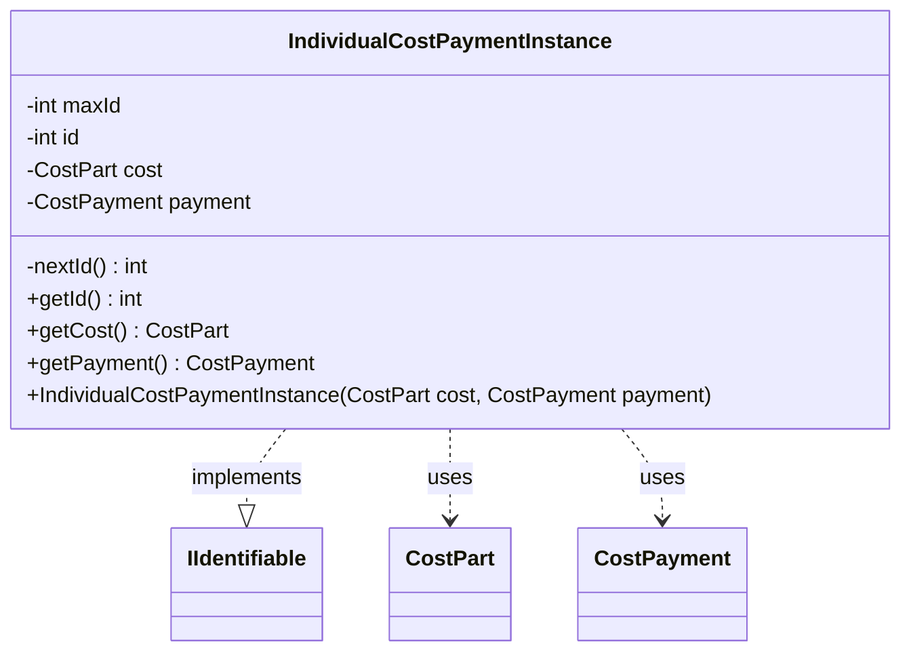

---
aliases:
  - IndividualCostPaymentInstance
tags:
  - java/class
  - module/forge-game
  - pkg/forge/game/cost
fqn: forge.game.cost.IndividualCostPaymentInstance
package: forge.game.cost
module: forge-game
kind: Class
---

# IndividualCostPaymentInstance

**Package:** `forge.game.cost`   **Module:** `forge-game`   **Kind:** Class



## Relationships
**Implements:**
- [[forge.game.IIdentifiable|IIdentifiable]]
**Uses:**
- [[forge.game.cost.CostPart|CostPart]]
- [[forge.game.cost.CostPayment|CostPayment]]

## Design Description

`IndividualCostPaymentInstance` represents a single, identifiable instance of paying one component of a larger cost during gameplay. It pairs a `CostPart` (the specific cost being paid) with the enclosing `CostPayment` (the overall payment context), serving as an immutable record that ties an individual cost element to its payment operation. By implementing `IIdentifiable`, it exposes a unique integer `id` so the payment instance can be tracked, referenced, and distinguished elsewhere in the game engine.

The design intent is clear from its immutability and identity scheme: all fields are `final` and assigned at construction, while a static counter (`maxId`/`nextId()`) auto-generates a process-unique id for each instance. The class is a lightweight, behavior-free value holder—offering only getters—delegating all cost-resolution logic to the collaborating `CostPart` and `CostPayment` types it merely associates.

## Source
`forge-game/src/main/java/forge/game/cost/IndividualCostPaymentInstance.java`

```java
package forge.game.cost;

import forge.game.IIdentifiable;

public class IndividualCostPaymentInstance implements IIdentifiable {
    private static int maxId = 0;
    private static int nextId() { return ++maxId; }

    private final int id;
    private final CostPart cost;
    private final CostPayment payment;

    public IndividualCostPaymentInstance(final CostPart cost, final CostPayment payment) {
        id = nextId();
        this.cost = cost;
        this.payment = payment;
    }

    public int getId() { return id; }

    public CostPart getCost() { return cost; }
    public CostPayment getPayment() { return payment; }

}
```

## Python
`forge/game/cost/IndividualCostPaymentInstance.py`

```python
from forge.game.IIdentifiable import IIdentifiable
from forge.game.cost.CostPart import CostPart
from forge.game.cost.CostPayment import CostPayment


class IndividualCostPaymentInstance(IIdentifiable):
    maxId = 0

    @staticmethod
    def nextId() -> int:
        IndividualCostPaymentInstance.maxId += 1
        return IndividualCostPaymentInstance.maxId

    def __init__(self, cost: CostPart, payment: CostPayment):
        self.id = IndividualCostPaymentInstance.nextId()
        self.cost = cost
        self.payment = payment

    def getId(self) -> int:
        return self.id

    def getCost(self) -> CostPart:
        return self.cost

    def getPayment(self) -> CostPayment:
        return self.payment
```
