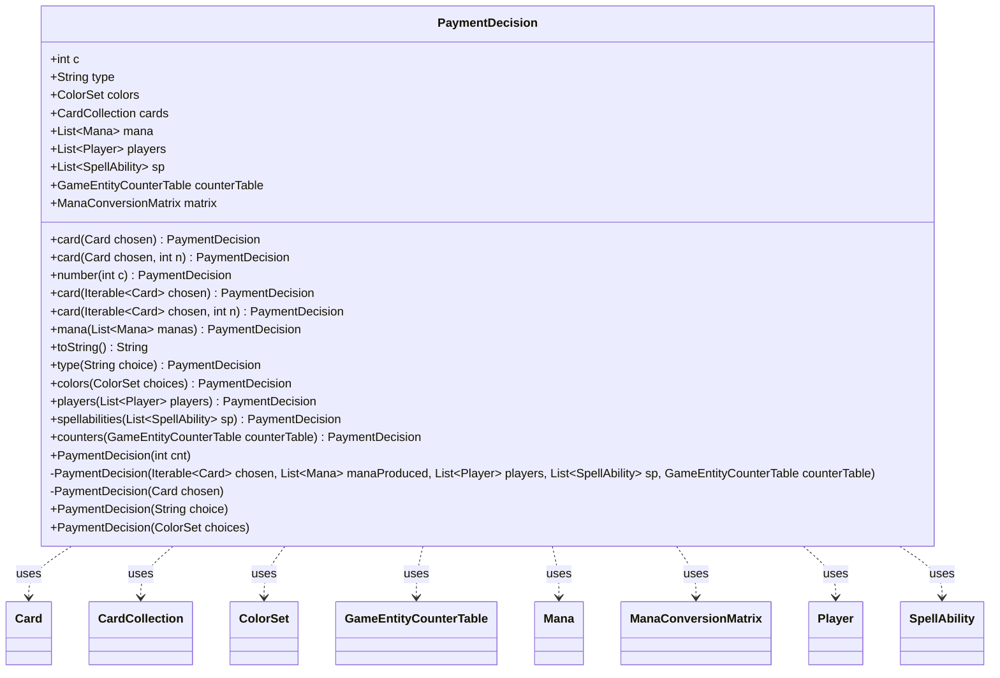

---
aliases:
  - PaymentDecision
tags:
  - java/class
  - module/forge-game
  - pkg/forge/game/cost
fqn: forge.game.cost.PaymentDecision
package: forge.game.cost
module: forge-game
kind: Class
---

# PaymentDecision

**Package:** `forge.game.cost` &nbsp; **Module:** `forge-game` &nbsp; **Kind:** Class



## Relationships
**Uses:**
- [[forge.card.ColorSet|ColorSet]]
- [[forge.game.GameEntityCounterTable|GameEntityCounterTable]]
- [[forge.game.card.Card|Card]]
- [[forge.game.card.CardCollection|CardCollection]]
- [[forge.game.mana.Mana|Mana]]
- [[forge.game.mana.ManaConversionMatrix|ManaConversionMatrix]]
- [[forge.game.player.Player|Player]]
- [[forge.game.spellability.SpellAbility|SpellAbility]]

## Design Description

PaymentDecision is a lightweight, immutable-leaning value object in `forge.game.cost` that captures the player's concrete choices for paying a single cost component. It aggregates the various forms a payment answer can take—a count, a set of chosen cards, produced mana, target players, spell abilities, a color selection, a type string, or a counter table—so that cost-payment logic can return a uniform result regardless of the cost kind.

Its design centers on static factory methods (`card`, `number`, `mana`, `colors`, `players`, `spellabilities`, `counters`, `type`) layered over private constructors, giving callers an expressive, self-documenting way to build the appropriate decision while keeping the many optional fields consistent. It collaborates broadly but owns nothing: it merely references domain types like Card, CardCollection, Mana, Player, SpellAbility, ColorSet, and GameEntityCounterTable (the last noted as serving CostRemoveAnyCounter), acting as a simple data carrier between cost evaluation and cost execution rather than implementing behavior itself.

## Source
`forge-game/src/main/java/forge/game/cost/PaymentDecision.java`

```java
package forge.game.cost;

import forge.card.ColorSet;
import forge.game.GameEntityCounterTable;
import forge.game.card.Card;
import forge.game.card.CardCollection;
import forge.game.mana.Mana;
import forge.game.mana.ManaConversionMatrix;
import forge.game.player.Player;
import forge.game.spellability.SpellAbility;
import forge.util.TextUtil;

import java.util.List;

public class PaymentDecision {
    public int c = 0;
    public String type;
    public ColorSet colors;

    public final CardCollection cards = new CardCollection();
    public final List<Mana> mana;
    public final List<Player> players;
    public final List<SpellAbility> sp;

    // used for CostRemoveAnyCounter
    public final GameEntityCounterTable counterTable;
    public ManaConversionMatrix matrix = null;

    public PaymentDecision(int cnt) {
        this(null, null, null, null, null);
        c = cnt;
    }

    private PaymentDecision(Iterable<Card> chosen, List<Mana> manaProduced, List<Player> players,
                List<SpellAbility> sp, GameEntityCounterTable counterTable) {
        if (chosen != null) {
            cards.addAll(chosen);
        }
        mana = manaProduced;
        this.players = players;
        this.sp = sp;
        this.counterTable = counterTable;
    }

    private PaymentDecision(Card chosen) {
        this(null, null, null, null, null);
        cards.add(chosen);
    }

    public PaymentDecision(String choice) {
        this(null, null, null, null, null);
        type = choice;
    }

    public PaymentDecision(ColorSet choices) {
        this(null, null, null, null, null);
        colors = choices;
    }

    public static PaymentDecision card(Card chosen) {
        return new PaymentDecision(chosen);
    }

    public static PaymentDecision card(Card chosen, int n) {
        PaymentDecision res = new PaymentDecision(chosen);
        res.c = n;
        return res;
    }

    public static PaymentDecision number(int c) {
        return new PaymentDecision(c);
    }

    public static PaymentDecision card(Iterable<Card> chosen) {
        return new PaymentDecision(chosen, null, null, null, null);
    }

    public static PaymentDecision card(Iterable<Card> chosen, int n) {
        PaymentDecision res = new PaymentDecision(chosen, null, null, null, null);
        res.c = n;
        return res;
    }

    public static PaymentDecision mana(List<Mana> manas) {
        return new PaymentDecision(null, manas, null, null, null);
    }

    /* (non-Javadoc)
     * @see java.lang.Object#toString()
     */
    @Override
    public String toString() {
        return TextUtil.concatWithSpace("Payment Decision:", TextUtil.addSuffix(String.valueOf(c),","), cards.toString());
    }

    public static PaymentDecision type(String choice) {
        return new PaymentDecision(choice);
    }

    public static PaymentDecision colors(ColorSet choices) {
        return new PaymentDecision(choices);
    }

    public static PaymentDecision players(List<Player> players) {
        return new PaymentDecision(null, null, players, null, null);
    }

    public static PaymentDecision spellabilities(List<SpellAbility> sp) {
        return new PaymentDecision(null, null, null, sp, null);
    }

    public static PaymentDecision counters(GameEntityCounterTable counterTable) {
        return new PaymentDecision(null, null, null, null, counterTable);
    }
}
```
