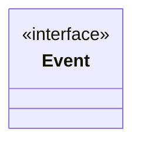

---
aliases:
  - Event
tags:
  - java/interface
  - module/forge-game
  - pkg/forge/game/event
fqn: forge.game.event.Event
package: forge.game.event
module: forge-game
kind: Interface
---

# Event

**Package:** `forge.game.event`   **Module:** `forge-game`   **Kind:** Interface



## Design Description

A static, empty marker interface that serves as the common supertype for all game events in Forge's `forge.game.event` package. It declares no methods, acting purely as a type-level contract: concrete event classes (and the visitor-style `IGameEventVisitor` dispatch mechanism that typically accompanies this pattern) implement or accept `Event` so that heterogeneous game occurrences can be published through a single event-bus channel and handled polymorphically. Its design intent is deliberate minimalism — by carrying no state or behavior, it imposes zero constraints on implementors while enabling type-safe registration, queuing, and dispatch of game state changes to listeners across the engine.

## Source
`forge-game/src/main/java/forge/game/event/Event.java`

```java
package forge.game.event;

public interface Event {

}
```

## Python
`forge/game/event/Event.py`

```python
package = None


from forge.game.event.IGameEventVisitor import IGameEventVisitor


class Event:
    pass
```
