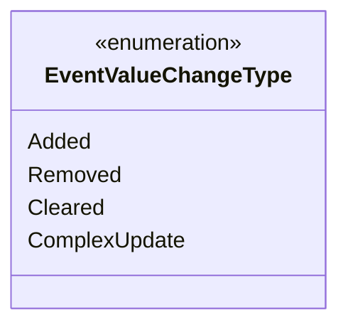

---
aliases:
  - EventValueChangeType
tags:
  - java/enum
  - module/forge-game
  - pkg/forge/game/event
fqn: forge.game.event.EventValueChangeType
package: forge.game.event
module: forge-game
kind: Enum
---

# EventValueChangeType

**Package:** `forge.game.event` &nbsp; **Module:** `forge-game` &nbsp; **Kind:** Enum



## Design Description

`EventValueChangeType` is a lightweight enumeration in the `forge.game.event` package that classifies the nature of a mutation reported by a game event. Its four constants — `Added`, `Removed`, `Cleared`, and `ComplexUpdate` — let event consumers distinguish incremental changes to a tracked value or collection (an element added or removed, the whole set cleared) from a wholesale `ComplexUpdate` requiring a full refresh. As a pure constant set with no fields, methods, or dependencies, it carries no behavior; it serves purely as a type-safe tag passed alongside event payloads so that listeners (such as UI observers) can react proportionally to the kind of change rather than indiscriminately rebuilding state. This separation keeps event-handling logic explicit and supports efficient, targeted updates.

## Source
`forge-game/src/main/java/forge/game/event/EventValueChangeType.java`

```java
package forge.game.event;

public enum EventValueChangeType {
    Added,
    Removed,
    Cleared,
    ComplexUpdate
}
```
