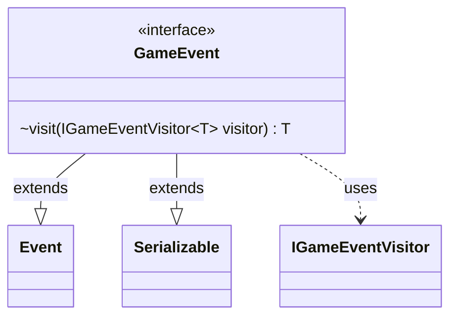

---
aliases:
  - GameEvent
tags:
  - java/interface
  - module/forge-game
  - pkg/forge/game/event
fqn: forge.game.event.GameEvent
package: forge.game.event
module: forge-game
kind: Interface
---

# GameEvent

**Package:** `forge.game.event` &nbsp; **Module:** `forge-game` &nbsp; **Kind:** Interface



## Relationships
**Extends:**
- [[forge.game.event.Event|Event]]
**Uses:**
- [[forge.game.event.IGameEventVisitor|IGameEventVisitor]]

## Design Description

`GameEvent` is the root abstraction for all in-game events in Forge's `forge.game.event` package, representing something that has occurred during a match (a card cast, a phase change, damage dealt, etc.). It extends `Event` to participate in the engine's general event hierarchy and `Serializable` so events can be persisted or transmitted across game states. Its single `visit` method implements the visitor pattern: rather than exposing event-specific data through type checks or casts, each concrete event dispatches itself to an `IGameEventVisitor<T>`, which returns a result of the visitor's chosen type. This double-dispatch design decouples event producers from the varied consumers (UI, AI, logging) that interpret them, letting new handling behavior be added as visitor implementations without modifying the event classes themselves.

## Source
`forge-game/src/main/java/forge/game/event/GameEvent.java`

```java
package forge.game.event;

import java.io.Serializable;

public interface GameEvent extends Event, Serializable {

    <T> T visit(IGameEventVisitor<T> visitor);
}
```

## Python
`forge/game/event/GameEvent.py`

```python
from forge.game.event.Event import Event
from forge.game.event.IGameEventVisitor import IGameEventVisitor

from abc import ABC, abstractmethod
from typing import TypeVar

T = TypeVar("T")


class GameEvent(Event, ABC):

    @abstractmethod
    def visit(self, visitor: IGameEventVisitor[T]) -> T:
        ...
```
