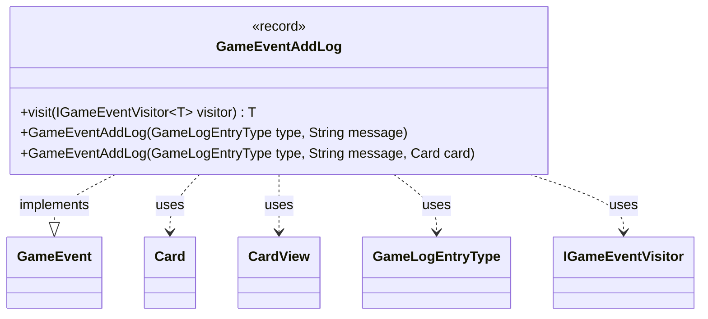

---
aliases:
  - GameEventAddLog
tags:
  - java/record
  - module/forge-game
  - pkg/forge/game/event
fqn: forge.game.event.GameEventAddLog
package: forge.game.event
module: forge-game
kind: Record
---

# GameEventAddLog

**Package:** `forge.game.event` &nbsp; **Module:** `forge-game` &nbsp; **Kind:** Record



## Relationships
**Implements:**
- [[forge.game.event.GameEvent|GameEvent]]
**Uses:**
- [[forge.game.GameLogEntryType|GameLogEntryType]]
- [[forge.game.card.Card|Card]]
- [[forge.game.card.CardView|CardView]]
- [[forge.game.event.IGameEventVisitor|IGameEventVisitor]]

## Design Description

The `GameEventAddLog` record represents a game event signaling that an entry should be appended to the game log. As an immutable carrier of a `GameLogEntryType`, a message string, and an optional originating `CardView`, it implements the `GameEvent` interface and participates in the engine's visitor-based event dispatch: its `visit` method routes to the appropriate handler on an `IGameEventVisitor`, decoupling event production from consumption.

The design favors immutability and ergonomic construction. Convenience constructors let callers omit the source card or supply a live `Card` directly, which is eagerly converted to a view-layer `CardView` via `CardView.get`. This conversion at construction time deliberately captures a stable snapshot and keeps the event decoupled from the mutable game-model `Card`, making it safe to hand off to UI or logging consumers.

## Source
`forge-game/src/main/java/forge/game/event/GameEventAddLog.java`

```java
package forge.game.event;

import forge.game.GameLogEntryType;
import forge.game.card.Card;
import forge.game.card.CardView;

public record GameEventAddLog(GameLogEntryType type, String message, CardView sourceCard) implements GameEvent {

    public GameEventAddLog(GameLogEntryType type, String message) {
        this(type, message, (CardView) null);
    }

    public GameEventAddLog(GameLogEntryType type, String message, Card card) {
        this(type, message, card != null ? CardView.get(card) : null);
    }

    @Override
    public <T> T visit(IGameEventVisitor<T> visitor) {
        return visitor.visit(this);
    }
}
```

## Python
`forge/game/event/GameEventAddLog.py`

```python
from forge.game.GameLogEntryType import GameLogEntryType
from forge.game.card.Card import Card
from forge.game.card.CardView import CardView
from forge.game.event.GameEvent import GameEvent
from forge.game.event.IGameEventVisitor import IGameEventVisitor


class GameEventAddLog(GameEvent):

    def __init__(self, type: GameLogEntryType, message: str, sourceCard=None):
        self.type = type
        self.message = message
        if isinstance(sourceCard, Card):
            self.sourceCard = CardView.get(sourceCard) if sourceCard is not None else None
        else:
            self.sourceCard = sourceCard

    def visit(self, visitor: IGameEventVisitor):
        return visitor.visit(self)
```
