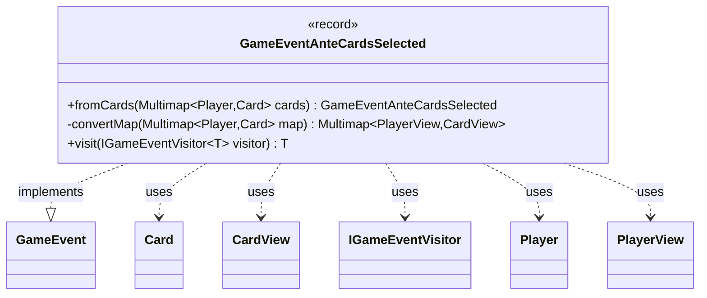

---
aliases:
  - GameEventAnteCardsSelected
tags:
  - java/record
  - module/forge-game
  - pkg/forge/game/event
fqn: forge.game.event.GameEventAnteCardsSelected
package: forge.game.event
module: forge-game
kind: Record
---

# GameEventAnteCardsSelected

**Package:** `forge.game.event` &nbsp; **Module:** `forge-game` &nbsp; **Kind:** Record



## Relationships
**Implements:**
- [[forge.game.event.GameEvent|GameEvent]]
**Uses:**
- [[forge.game.card.Card|Card]]
- [[forge.game.card.CardView|CardView]]
- [[forge.game.event.IGameEventVisitor|IGameEventVisitor]]
- [[forge.game.player.Player|Player]]
- [[forge.game.player.PlayerView|PlayerView]]

## Design Description

`GameEventAnteCardsSelected` is an immutable event record that signals which cards each player has put up as ante at the start of a game. As a `GameEvent` implementation, it participates in Forge's visitor-based event dispatch: its `visit` method double-dispatches to the appropriate `IGameEventVisitor` callback, letting observers react without the event knowing their concrete types.

Its notable design intent is the separation of model and view. The record stores only view types (`Multimap<PlayerView, CardView>`), while the static `fromCards` factory accepts the game-model `Player`/`Card` objects and uses `convertMap` to translate them into their lightweight `PlayerView`/`CardView` counterparts. This snapshots the data into UI-safe representations at construction time, shielding presentation-layer consumers from the mutable game state and ensuring the event remains a stable, immutable record of the ante selection.

## Source
`forge-game/src/main/java/forge/game/event/GameEventAnteCardsSelected.java`

```java
package forge.game.event;

import java.util.Map;

import com.google.common.collect.HashMultimap;
import com.google.common.collect.Multimap;

import forge.game.card.Card;
import forge.game.card.CardView;
import forge.game.player.Player;
import forge.game.player.PlayerView;

public record GameEventAnteCardsSelected(Multimap<PlayerView, CardView> cards) implements GameEvent {

    public static GameEventAnteCardsSelected fromCards(Multimap<Player, Card> cards) {
        return new GameEventAnteCardsSelected(convertMap(cards));
    }

    private static Multimap<PlayerView, CardView> convertMap(Multimap<Player, Card> map) {
        Multimap<PlayerView, CardView> result = HashMultimap.create();
        for (Map.Entry<Player, Card> entry : map.entries()) {
            result.put(PlayerView.get(entry.getKey()), CardView.get(entry.getValue()));
        }
        return result;
    }

    @Override
    public <T> T visit(IGameEventVisitor<T> visitor) {
        return visitor.visit(this);
    }
}
```
