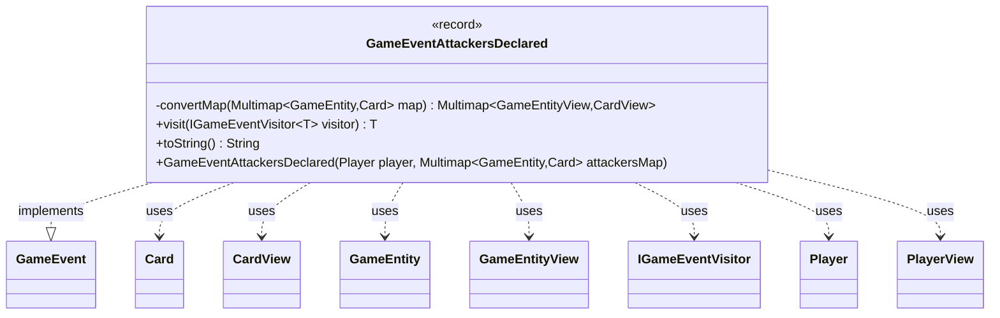

---
aliases:
  - GameEventAttackersDeclared
tags:
  - java/record
  - module/forge-game
  - pkg/forge/game/event
fqn: forge.game.event.GameEventAttackersDeclared
package: forge.game.event
module: forge-game
kind: Record
---

# GameEventAttackersDeclared

**Package:** `forge.game.event` &nbsp; **Module:** `forge-game` &nbsp; **Kind:** Record



## Relationships
**Implements:**
- [[forge.game.event.GameEvent|GameEvent]]
**Uses:**
- [[forge.game.GameEntity|GameEntity]]
- [[forge.game.GameEntityView|GameEntityView]]
- [[forge.game.card.Card|Card]]
- [[forge.game.card.CardView|CardView]]
- [[forge.game.event.IGameEventVisitor|IGameEventVisitor]]
- [[forge.game.player.Player|Player]]
- [[forge.game.player.PlayerView|PlayerView]]

## Design Description

`GameEventAttackersDeclared` is an immutable event record signalling that a player has finalized the combat step of declaring attackers. As a `GameEvent` implementation, it captures the attacking `Player` and a `Multimap` associating each defending `GameEntity` with the `Card`s assaulting it, recording a complete snapshot of the attack assignment at the moment it occurs.

Its central design intent is the separation between the engine's mutable game model and the view layer consumed by the UI and clients. The convenience constructor accepts raw `Player`, `GameEntity`, and `Card` objects, then eagerly converts them—via `convertMap`—into their lightweight `PlayerView`, `GameEntityView`, and `CardView` counterparts, so the event safely carries only immutable view data. It participates in the visitor pattern through `visit`, dispatching itself to an `IGameEventVisitor` for type-specific handling, and overrides `toString` for readable diagnostic logging.

## Source
`forge-game/src/main/java/forge/game/event/GameEventAttackersDeclared.java`

```java
package forge.game.event;

import java.util.Map;

import com.google.common.collect.HashMultimap;
import com.google.common.collect.Multimap;

import forge.game.GameEntity;
import forge.game.GameEntityView;
import forge.game.card.Card;
import forge.game.card.CardView;
import forge.game.player.Player;
import forge.game.player.PlayerView;

public record GameEventAttackersDeclared(PlayerView player, Multimap<GameEntityView, CardView> attackersMap) implements GameEvent {

    public GameEventAttackersDeclared(Player player, Multimap<GameEntity, Card> attackersMap) {
        this(PlayerView.get(player), convertMap(attackersMap));
    }

    private static Multimap<GameEntityView, CardView> convertMap(Multimap<GameEntity, Card> map) {
        Multimap<GameEntityView, CardView> result = HashMultimap.create();
        for (Map.Entry<GameEntity, Card> entry : map.entries()) {
            result.put(GameEntityView.get(entry.getKey()), CardView.get(entry.getValue()));
        }
        return result;
    }

    /* (non-Javadoc)
     * @see forge.game.event.GameEvent#visit(forge.game.event.IGameEventVisitor)
     */
    @Override
    public <T> T visit(IGameEventVisitor<T> visitor) {
        return visitor.visit(this);
    }

    /* (non-Javadoc)
     * @see java.lang.Object#toString()
     */
    @Override
    public String toString() {
        return "" + player + " declared attackers: " + attackersMap;
    }
}
```
