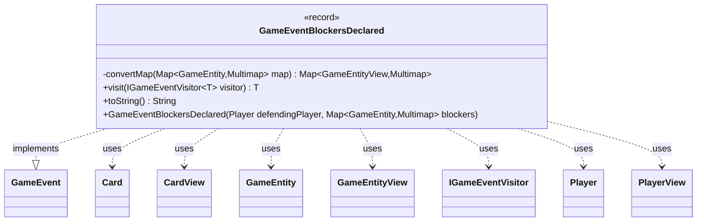

---
aliases:
  - GameEventBlockersDeclared
tags:
  - java/record
  - module/forge-game
  - pkg/forge/game/event
fqn: forge.game.event.GameEventBlockersDeclared
package: forge.game.event
module: forge-game
kind: Record
---

# GameEventBlockersDeclared

**Package:** `forge.game.event` &nbsp; **Module:** `forge-game` &nbsp; **Kind:** Record



## Relationships
**Implements:**
- [[forge.game.event.GameEvent|GameEvent]]
**Uses:**
- [[forge.game.GameEntity|GameEntity]]
- [[forge.game.GameEntityView|GameEntityView]]
- [[forge.game.card.Card|Card]]
- [[forge.game.card.CardView|CardView]]
- [[forge.game.event.IGameEventVisitor|IGameEventVisitor]]
- [[forge.game.player.Player|Player]]
- [[forge.game.player.PlayerView|PlayerView]]

## Design Description

The `GameEventBlockersDeclared` record is an immutable, view-layer event notification fired when a defending player declares blockers during combat. As a `GameEvent` implementation, it participates in Forge's visitor-based event dispatch: its `visit` method double-dispatches to an `IGameEventVisitor`, letting observers (typically UI components) react without the event knowing their concrete types. It carries the defending `PlayerView` and a map associating each attacked `GameEntityView` with a multimap of blocker-to-attacker `CardView` pairs.

Its key design intent is decoupling the game model from its presentation. The convenience constructor accepts live model objects (`Player`, `GameEntity`, `Card`) and the private `convertMap` helper eagerly translates them into their corresponding `*View` snapshots, ensuring the event exposes only stable, serializable view types rather than mutable engine state. The `toString` override flattens all blocker cards into a human-readable combat summary.

## Source
`forge-game/src/main/java/forge/game/event/GameEventBlockersDeclared.java`

```java
package forge.game.event;

import java.util.ArrayList;
import java.util.HashMap;
import java.util.List;
import java.util.Map;

import com.google.common.collect.HashMultimap;
import com.google.common.collect.Multimap;

import forge.game.GameEntity;
import forge.game.GameEntityView;
import forge.game.card.Card;
import forge.game.card.CardView;
import forge.game.player.Player;
import forge.game.player.PlayerView;
import forge.util.Lang;
import forge.util.TextUtil;

public record GameEventBlockersDeclared(PlayerView defendingPlayer, Map<GameEntityView, Multimap<CardView, CardView>> blockers) implements GameEvent {

    public GameEventBlockersDeclared(Player defendingPlayer, Map<GameEntity, Multimap<Card, Card>> blockers) {
        this(PlayerView.get(defendingPlayer), convertMap(blockers));
    }

    private static Map<GameEntityView, Multimap<CardView, CardView>> convertMap(Map<GameEntity, Multimap<Card, Card>> map) {
        Map<GameEntityView, Multimap<CardView, CardView>> result = new HashMap<>();
        for (Map.Entry<GameEntity, Multimap<Card, Card>> entry : map.entrySet()) {
            Multimap<CardView, CardView> innerResult = HashMultimap.create();
            for (Map.Entry<Card, Card> innerEntry : entry.getValue().entries()) {
                innerResult.put(CardView.get(innerEntry.getKey()), CardView.get(innerEntry.getValue()));
            }
            result.put(GameEntityView.get(entry.getKey()), innerResult);
        }
        return result;
    }

    @Override
    public <T> T visit(IGameEventVisitor<T> visitor) {
        return visitor.visit(this);
    }

    /* (non-Javadoc)
     * @see java.lang.Object#toString()
     */
    @Override
    public String toString() {
        List<CardView> blockerCards = new ArrayList<>();
        for (Multimap<CardView, CardView> vv : blockers.values()) {
            blockerCards.addAll(vv.values());
        }
        return TextUtil.concatWithSpace(defendingPlayer.getName(), "declared", String.valueOf(blockerCards.size()), "blockers:", Lang.joinHomogenous(blockerCards));
    }
}
```
