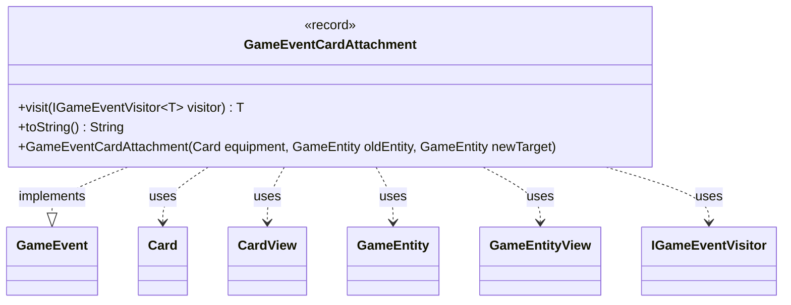

---
aliases:
  - GameEventCardAttachment
tags:
  - java/record
  - module/forge-game
  - pkg/forge/game/event
fqn: forge.game.event.GameEventCardAttachment
package: forge.game.event
module: forge-game
kind: Record
---

# GameEventCardAttachment

**Package:** `forge.game.event` &nbsp; **Module:** `forge-game` &nbsp; **Kind:** Record



## Relationships
**Implements:**
- [[forge.game.event.GameEvent|GameEvent]]
**Uses:**
- [[forge.game.GameEntity|GameEntity]]
- [[forge.game.GameEntityView|GameEntityView]]
- [[forge.game.card.Card|Card]]
- [[forge.game.card.CardView|CardView]]
- [[forge.game.event.IGameEventVisitor|IGameEventVisitor]]

## Design Description

A `record` in `forge.game.event`, `GameEventCardAttachment` is one concrete event in Forge's game-event hierarchy, signalling that a card—typically an Equipment or Aura—has been attached to, moved between, or detached from a game entity. It carries view-layer snapshots (`CardView`, `GameEntityView` for the old and new targets) rather than live model objects, decoupling event consumers from mutable game state.

As an implementer of `GameEvent`, it participates in the visitor pattern: its `visit` method dispatches to the appropriate `IGameEventVisitor` overload, letting listeners handle event types without instanceof checks. A convenience constructor accepts the live `Card` and `GameEntity` model objects and converts them to views via the static `get` factories, so producers can fire the event without manual view conversion. The `toString` override yields a human-readable attach/detach/move message for logging and debugging.

## Source
`forge-game/src/main/java/forge/game/event/GameEventCardAttachment.java`

```java
package forge.game.event;

import forge.game.GameEntity;
import forge.game.GameEntityView;
import forge.game.card.Card;
import forge.game.card.CardView;

public record GameEventCardAttachment(CardView equipment, GameEntityView oldEntity, GameEntityView newTarget) implements GameEvent {

    public GameEventCardAttachment(Card equipment, GameEntity oldEntity, GameEntity newTarget) {
        this(CardView.get(equipment), GameEntityView.get(oldEntity), GameEntityView.get(newTarget));
    }

    @Override
    public <T> T visit(IGameEventVisitor<T> visitor) {
        return visitor.visit(this);
    }

    /* (non-Javadoc)
     * @see java.lang.Object#toString()
     */
    @Override
    public String toString() {
        return newTarget == null ? "Detached " + equipment + " from " + oldEntity : "Attached " + equipment + (oldEntity == null ? "" : " from " + oldEntity) + " to " + newTarget;
    }
}
```
