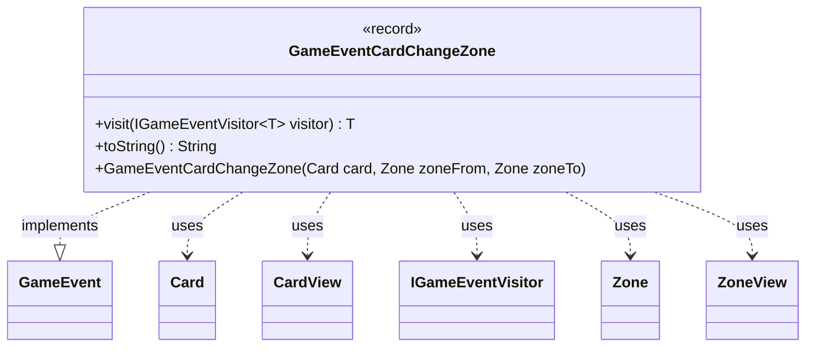

---
aliases:
  - GameEventCardChangeZone
tags:
  - java/record
  - module/forge-game
  - pkg/forge/game/event
fqn: forge.game.event.GameEventCardChangeZone
package: forge.game.event
module: forge-game
kind: Record
---

# GameEventCardChangeZone

**Package:** `forge.game.event` &nbsp; **Module:** `forge-game` &nbsp; **Kind:** Record



## Relationships
**Implements:**
- [[forge.game.event.GameEvent|GameEvent]]
**Uses:**
- [[forge.game.card.Card|Card]]
- [[forge.game.card.CardView|CardView]]
- [[forge.game.event.IGameEventVisitor|IGameEventVisitor]]
- [[forge.game.zone.Zone|Zone]]
- [[forge.game.zone.ZoneView|ZoneView]]

## Design Description

The class `GameEventCardChangeZone` is an immutable record that captures a single domain event: a card moving from one game zone to another within Forge's MTG engine. As an implementation of the `GameEvent` interface, it participates in a visitor-pattern event system, exposing a generic `visit(IGameEventVisitor<T>)` method that dispatches to the appropriate visitor callback, allowing event handlers to react without the event itself knowing their concrete types.

Its notable design intent lies in the convenience constructor: while the record's canonical components are the lightweight view types (`CardView`, `ZoneView`), the secondary constructor accepts the live model objects (`Card`, `Zone`) and converts them to views, null-guarding absent zones. This decouples the event payload from mutable game state, ensuring observers receive a stable snapshot. The `toString()` override renders a readable `card : [from] -> [to]` summary for logging and debugging.

## Source
`forge-game/src/main/java/forge/game/event/GameEventCardChangeZone.java`

```java
package forge.game.event;

import forge.game.card.Card;
import forge.game.card.CardView;
import forge.game.zone.Zone;
import forge.game.zone.ZoneView;
import forge.util.TextUtil;

public record GameEventCardChangeZone(CardView card, ZoneView from, ZoneView to) implements GameEvent {

    public GameEventCardChangeZone(Card card, Zone zoneFrom, Zone zoneTo) {
        this(CardView.get(card),
             zoneFrom == null ? null : zoneFrom.getView(),
             zoneTo == null ? null : zoneTo.getView());
    }

    @Override
    public <T> T visit(IGameEventVisitor<T> visitor) {
        return visitor.visit(this);
    }

    /* (non-Javadoc)
     * @see java.lang.Object#toString()
     */
    @Override
    public String toString() {
        final String fromStr = from != null ? "" + from.zoneType() : "null";
        final String toStr = to != null ? "" + to.zoneType() : "null";
        return TextUtil.concatWithSpace("" + card, ":", TextUtil.enclosedBracket(fromStr), "->", TextUtil.enclosedBracket(toStr));
    }
}
```
