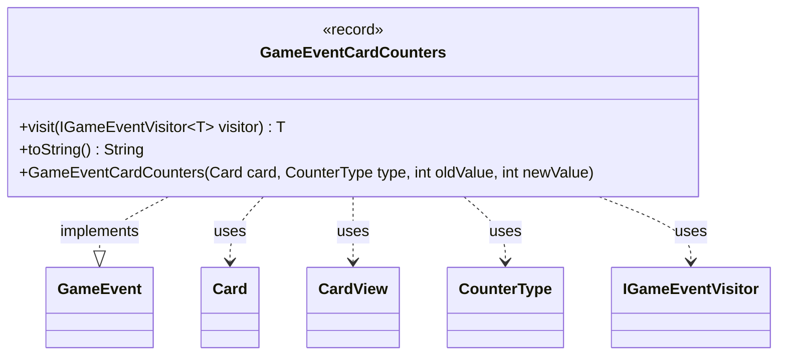

---
aliases:
  - GameEventCardCounters
tags:
  - java/record
  - module/forge-game
  - pkg/forge/game/event
fqn: forge.game.event.GameEventCardCounters
package: forge.game.event
module: forge-game
kind: Record
---

# GameEventCardCounters

**Package:** `forge.game.event` &nbsp; **Module:** `forge-game` &nbsp; **Kind:** Record



## Relationships
**Implements:**
- [[forge.game.event.GameEvent|GameEvent]]
**Uses:**
- [[forge.game.card.Card|Card]]
- [[forge.game.card.CardView|CardView]]
- [[forge.game.card.CounterType|CounterType]]
- [[forge.game.event.IGameEventVisitor|IGameEventVisitor]]

## Design Description

GameEventCardCounters is an immutable record that signals a change to the number of counters on a card during play. As a `GameEvent` implementation, it participates in Forge's event-dispatch system: its `visit` method routes itself to the appropriate handler on a typed `IGameEventVisitor<T>`, applying the visitor pattern so observers (such as UI or logging) can react without the event needing to know their concrete types. It captures the affected card, the `CounterType`, and the old and new counter values, providing a human-readable `toString` for logs. Notably, the convenience constructor accepts a domain `Card` but stores a `CardView` via `CardView.get(...)`, decoupling the event payload from the mutable game model so listeners receive a stable view-layer snapshot.

## Source
`forge-game/src/main/java/forge/game/event/GameEventCardCounters.java`

```java
package forge.game.event;

import forge.game.card.Card;
import forge.game.card.CardView;
import forge.game.card.CounterType;

public record GameEventCardCounters(CardView card, CounterType type, int oldValue, int newValue) implements GameEvent {
    public GameEventCardCounters(Card card, CounterType type, int oldValue, int newValue) {
        this(CardView.get(card), type, oldValue, newValue);
    }
    @Override
    public <T> T visit(IGameEventVisitor<T> visitor) {
        return visitor.visit(this);
    }

    /* (non-Javadoc)
     * @see java.lang.Object#toString()
     */
    @Override
    public String toString() {
        return "" + card + " " + type + " counters: " + oldValue + " -> " + newValue;
    }
}
```
