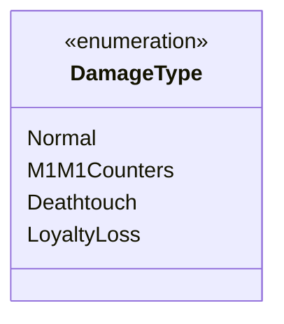

---
aliases:
  - DamageType
tags:
  - java/enum
  - module/forge-game
  - pkg/forge/game/event
fqn: forge.game.event.GameEventCardDamaged.DamageType
package: forge.game.event
module: forge-game
kind: Enum
---

# DamageType

**Package:** `forge.game.event`   **Module:** `forge-game`   **Kind:** Enum



## Design Description

The `DamageType` enum is a static, nested classification type embedded within the `GameEventCardDamaged` event class in the game's event subsystem. Its sole responsibility is to enumerate the distinct categories of damage that a card can sustain—ordinary combat or spell damage (`Normal`), the placement of −1/−1 counters (`M1M1Counters`), lethal `Deathtouch` damage, and planeswalker `LoyaltyLoss`. By modeling these as discrete enum constants, it lets damage events carry semantic intent rather than relying on magic numbers or flags, enabling consumers of the event to react differently to each damage source.

As a nested member of `GameEventCardDamaged`, it is tightly scoped to the damage-event context and not intended for broader reuse, reflecting a deliberate design choice to keep the damage taxonomy co-located with the event that consumes it. The enum carries no fields or behavior, serving purely as a type-safe tag that disambiguates how reported damage should be interpreted by listeners in the game engine.

## Source
`forge-game/src/main/java/forge/game/event/GameEventCardDamaged.java` — declaration excerpt

```java
    public enum DamageType {
        Normal, 
        M1M1Counters, 
        Deathtouch, 
        LoyaltyLoss
    }
```
