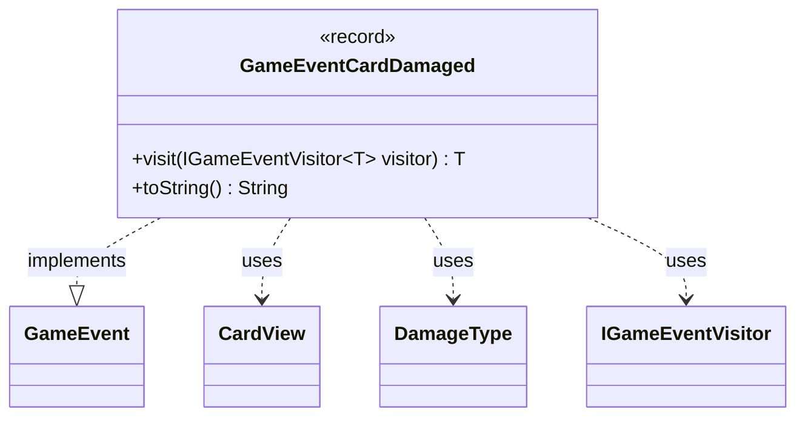

---
aliases:
  - GameEventCardDamaged
tags:
  - java/record
  - module/forge-game
  - pkg/forge/game/event
fqn: forge.game.event.GameEventCardDamaged
package: forge.game.event
module: forge-game
kind: Record
---

# GameEventCardDamaged

**Package:** `forge.game.event` &nbsp; **Module:** `forge-game` &nbsp; **Kind:** Record



## Relationships
**Implements:**
- [[forge.game.event.GameEvent|GameEvent]]
**Uses:**
- [[forge.game.card.CardView|CardView]]
- [[forge.game.event.GameEventCardDamaged.DamageType|DamageType]]
- [[forge.game.event.IGameEventVisitor|IGameEventVisitor]]

## Design Description

GameEventCardDamaged is an immutable record that signals a single damage event within the Forge game engine, capturing the damaged card, the damage source, the amount dealt, and a categorizing DamageType (Normal, M1M1Counters, Deathtouch, or LoyaltyLoss). As a value-style notification, it carries no behavior beyond reporting what happened.

It implements the GameEvent interface and participates in a visitor pattern: its `visit` method dispatches to an `IGameEventVisitor`, double-dispatching on the concrete event type so listeners can react to damage without instanceof checks. It collaborates with CardView for UI-safe references to the involved cards rather than holding live game objects, reflecting a deliberate separation between game state and event reporting. The overridden `toString` yields a human-readable damage summary useful for logging and debugging.

## Source
`forge-game/src/main/java/forge/game/event/GameEventCardDamaged.java`

```java
package forge.game.event;

import forge.game.card.CardView;

public record GameEventCardDamaged(CardView card, CardView source, int amount, DamageType type) implements GameEvent {

    public enum DamageType {
        Normal, 
        M1M1Counters, 
        Deathtouch, 
        LoyaltyLoss
    }

    @Override
    public <T> T visit(IGameEventVisitor<T> visitor) {
        return visitor.visit(this);
    }

    /* (non-Javadoc)
     * @see java.lang.Object#toString()
     */
    @Override
    public String toString() {
        return "" + source + " dealt " + amount + " " + type + " damage to " + card;
    }
}
```
