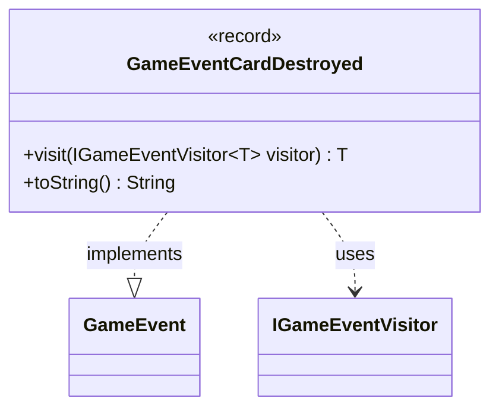

---
aliases:
  - GameEventCardDestroyed
tags:
  - java/record
  - module/forge-game
  - pkg/forge/game/event
fqn: forge.game.event.GameEventCardDestroyed
package: forge.game.event
module: forge-game
kind: Record
---

# GameEventCardDestroyed

**Package:** `forge.game.event`   **Module:** `forge-game`   **Kind:** Record



## Relationships
**Implements:**
- [[forge.game.event.GameEvent|GameEvent]]
**Uses:**
- [[forge.game.event.IGameEventVisitor|IGameEventVisitor]]

## Design Description

`GameEventCardDestroyed` is an immutable event record signaling that a card has been removed from play via destruction. As a parameterless record implementing the `GameEvent` interface, it carries no payload—its mere occurrence is the message—reflecting a deliberately lightweight, value-based design for one discrete moment in the game's lifecycle.

It participates in a visitor pattern: `visit` double-dispatches to the supplied `IGameEventVisitor`, letting subscribers handle each concrete event type without the event itself knowing their logic, which keeps event definitions trivial and decouples them from consumers. The overridden `toString` returns the fixed human-readable label `"Card destroyed"` for logging and diagnostics. Sharing the `GameEvent`/`IGameEventVisitor` contract with its sibling event records, it slots uniformly into Forge's game-event dispatch and notification machinery.

## Source
`forge-game/src/main/java/forge/game/event/GameEventCardDestroyed.java`

```java
package forge.game.event;

public record GameEventCardDestroyed() implements GameEvent {

    @Override
    public <T> T visit(IGameEventVisitor<T> visitor) {
        return visitor.visit(this);
    }

    /* (non-Javadoc)
     * @see java.lang.Object#toString()
     */
    @Override
    public String toString() {
        return "Card destroyed";
    }
}
```

## Python
`forge/game/event/GameEventCardDestroyed.py`

```python
package = "forge.game.event"


from forge.game.event.GameEvent import GameEvent
from forge.game.event.IGameEventVisitor import IGameEventVisitor


class GameEventCardDestroyed(GameEvent):

    def visit(self, visitor: IGameEventVisitor):
        return visitor.visit(self)

    def __str__(self) -> str:
        return "Card destroyed"
```
