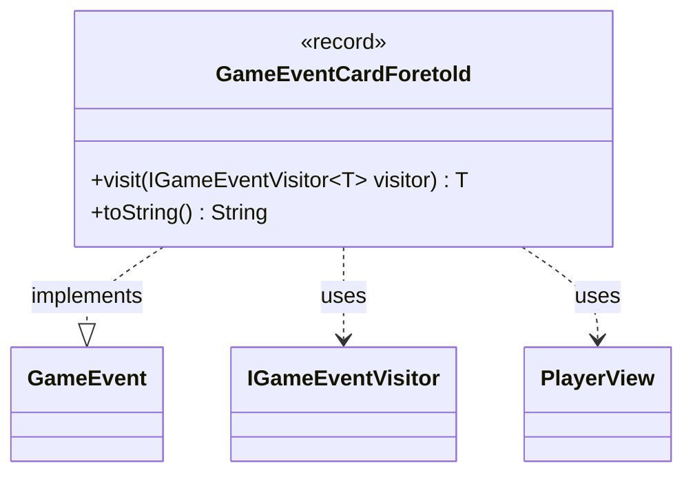

---
aliases:
  - GameEventCardForetold
tags:
  - java/record
  - module/forge-game
  - pkg/forge/game/event
fqn: forge.game.event.GameEventCardForetold
package: forge.game.event
module: forge-game
kind: Record
---

# GameEventCardForetold

**Package:** `forge.game.event`   **Module:** `forge-game`   **Kind:** Record



## Relationships
**Implements:**
- [[forge.game.event.GameEvent|GameEvent]]
**Uses:**
- [[forge.game.event.IGameEventVisitor|IGameEventVisitor]]
- [[forge.game.player.PlayerView|PlayerView]]

## Design Description

`GameEventCardForetold` is an immutable record that signals the moment a player foretells a card, capturing the single `PlayerView` of the activating player. It belongs to the `forge.game.event` event-notification family, implementing the `GameEvent` interface so it can be dispatched uniformly through the engine's event stream. Its `visit` method realizes the visitor pattern: by delegating to `IGameEventVisitor.visit(this)`, each concrete visitor (UI listeners, logs, AI observers) handles the event according to its own needs without the event itself knowing its consumers. The overridden `toString` yields a human-readable log line. Choosing a record reflects clear design intent—these events are lightweight, value-based, immutable data carriers whose sole responsibility is to convey that a foretell occurred and by whom, leaving all interpretation to the visiting handlers.

## Source
`forge-game/src/main/java/forge/game/event/GameEventCardForetold.java`

```java
package forge.game.event;

import forge.game.player.PlayerView;

public record GameEventCardForetold(PlayerView activatingPlayer) implements GameEvent {

    @Override
    public <T> T visit(IGameEventVisitor<T> visitor) {
        return visitor.visit(this);
    }

    /* (non-Javadoc)
     * @see java.lang.Object#toString()
     */
    @Override
    public String toString() {
        return activatingPlayer.toString() + " has foretold.";
    }
}
```

## Python
`forge/game/event/GameEventCardForetold.py`

```python
from forge.game.event.GameEvent import GameEvent
from forge.game.event.IGameEventVisitor import IGameEventVisitor
from forge.game.player.PlayerView import PlayerView


class GameEventCardForetold(GameEvent):

    def __init__(self, activatingPlayer: PlayerView):
        self.activatingPlayer = activatingPlayer

    def visit(self, visitor: IGameEventVisitor):
        return visitor.visit(self)

    # (non-Javadoc)
    # @see java.lang.Object#toString()
    def __str__(self) -> str:
        return self.activatingPlayer.toString() + " has foretold."
```
