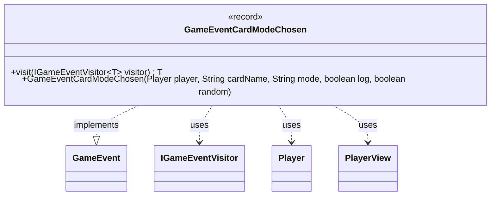

---
aliases:
  - GameEventCardModeChosen
tags:
  - java/record
  - module/forge-game
  - pkg/forge/game/event
fqn: forge.game.event.GameEventCardModeChosen
package: forge.game.event
module: forge-game
kind: Record
---

# GameEventCardModeChosen

**Package:** `forge.game.event` &nbsp; **Module:** `forge-game` &nbsp; **Kind:** Record



## Relationships
**Implements:**
- [[forge.game.event.GameEvent|GameEvent]]
**Uses:**
- [[forge.game.event.IGameEventVisitor|IGameEventVisitor]]
- [[forge.game.player.Player|Player]]
- [[forge.game.player.PlayerView|PlayerView]]

## Design Description

`GameEventCardModeChosen` is an immutable record that captures the occurrence of a player choosing a named mode for a card (typically a modal spell or ability), recording the responsible player, the card name, the chosen mode, and flags controlling whether the choice is logged or was made at random. As a record implementing `GameEvent`, it serves as a lightweight, value-based notification within Forge's event system, decoupling game-state changes from the UI and other observers that react to them.

It participates in the visitor pattern through its `visit` method, dispatching itself to any `IGameEventVisitor<T>` so handlers can process the event without type-checking. A notable design choice is the convenience constructor that accepts a mutable `Player` and immediately converts it to an immutable `PlayerView` via `PlayerView.get`, ensuring the event holds only a stable, presentation-safe snapshot rather than a live game object.

## Source
`forge-game/src/main/java/forge/game/event/GameEventCardModeChosen.java`

```java
package forge.game.event;

import forge.game.player.Player;
import forge.game.player.PlayerView;

public record GameEventCardModeChosen(PlayerView player, String cardName, String mode, boolean log, boolean random) implements GameEvent {

    public GameEventCardModeChosen(Player player, String cardName, String mode, boolean log, boolean random) {
        this(PlayerView.get(player), cardName, mode, log, random);
    }

    @Override
    public <T> T visit(IGameEventVisitor<T> visitor) {
        return visitor.visit(this);
    }
}
```
