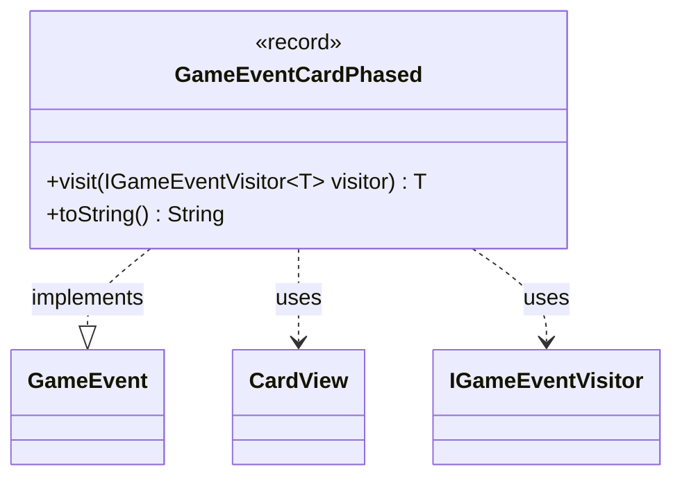

---
aliases:
  - GameEventCardPhased
tags:
  - java/record
  - module/forge-game
  - pkg/forge/game/event
fqn: forge.game.event.GameEventCardPhased
package: forge.game.event
module: forge-game
kind: Record
---

# GameEventCardPhased

**Package:** `forge.game.event` &nbsp; **Module:** `forge-game` &nbsp; **Kind:** Record



## Relationships
**Implements:**
- [[forge.game.event.GameEvent|GameEvent]]
**Uses:**
- [[forge.game.card.CardView|CardView]]
- [[forge.game.event.IGameEventVisitor|IGameEventVisitor]]

## Design Description

GameEventCardPhased is an immutable record that captures the moment a card's phased-out state changes, bundling the affected `CardView` together with the new boolean `phaseState`. As one of many concrete event types implementing the `GameEvent` interface, it serves as a lightweight, read-only notification object passed through Forge's game-event system to inform observers (such as the UI) of a state change without exposing mutable model internals.

Its design follows the visitor pattern: `visit` dispatches to the appropriate `IGameEventVisitor` handler, letting event-processing logic live in visitors rather than the event itself, so new handling behavior can be added without modifying the event classes. The overridden `toString` provides a human-readable summary, defensively guarding against a null `card` by falling back to `"(unknown)"`.

## Source
`forge-game/src/main/java/forge/game/event/GameEventCardPhased.java`

```java
package forge.game.event;

import forge.game.card.CardView;

public record GameEventCardPhased(CardView card, boolean phaseState) implements GameEvent {

    @Override
    public <T> T visit(IGameEventVisitor<T> visitor) {
        return visitor.visit(this);
    }

    /* (non-Javadoc)
     * @see java.lang.Object#toString()
     */
    @Override
    public String toString() {
        return card != null ? card.toString() : "(unknown)" + " changed its phased-out state to " + phaseState; 
    }
}
```

## Python
`forge/game/event/GameEventCardPhased.py`

```python
from forge.game.event.GameEvent import GameEvent
from forge.game.card.CardView import CardView
from forge.game.event.IGameEventVisitor import IGameEventVisitor


class GameEventCardPhased(GameEvent):

    def __init__(self, card: CardView, phaseState: bool):
        self.card = card
        self.phaseState = phaseState

    def visit(self, visitor: IGameEventVisitor):
        return visitor.visit(self)

    # (non-Javadoc)
    # @see java.lang.Object#toString()
    def __str__(self) -> str:
        return self.card.__str__() if self.card is not None else "(unknown)" + " changed its phased-out state to " + str(self.phaseState)
```
