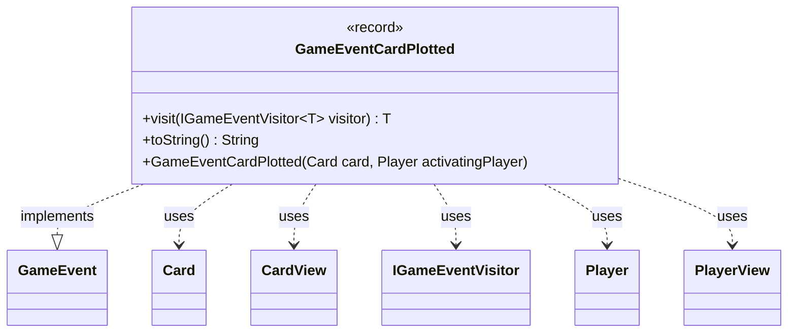

---
aliases:
  - GameEventCardPlotted
tags:
  - java/record
  - module/forge-game
  - pkg/forge/game/event
fqn: forge.game.event.GameEventCardPlotted
package: forge.game.event
module: forge-game
kind: Record
---

# GameEventCardPlotted

**Package:** `forge.game.event`   **Module:** `forge-game`   **Kind:** Record



## Relationships
**Implements:**
- [[forge.game.event.GameEvent|GameEvent]]
**Uses:**
- [[forge.game.card.Card|Card]]
- [[forge.game.card.CardView|CardView]]
- [[forge.game.event.IGameEventVisitor|IGameEventVisitor]]
- [[forge.game.player.Player|Player]]
- [[forge.game.player.PlayerView|PlayerView]]

## Design Description

`GameEventCardPlotted` is an immutable record that signals a card has been plotted by a player, capturing a snapshot of the relevant state at the moment the event occurs. As a concrete implementation of the `GameEvent` interface, it participates in Forge's visitor-based event dispatch: its `visit` method double-dispatches to an `IGameEventVisitor`, letting observers (such as UI or logging components) handle the event without the event itself knowing their concrete types.

Notably, the canonical constructor stores view objects—`CardView` and `PlayerView`—rather than the live `Card` and `Player` domain models. The convenience constructor accepts the domain types and converts them via `CardView.get` and `PlayerView.get`, decoupling event consumers from mutable game state and ensuring the event reflects a stable view. The `toString` override yields a human-readable summary, defensively guarding against a null card.

## Source
`forge-game/src/main/java/forge/game/event/GameEventCardPlotted.java`

```java
package forge.game.event;

import forge.game.card.Card;
import forge.game.card.CardView;
import forge.game.player.Player;
import forge.game.player.PlayerView;

public record GameEventCardPlotted(CardView card, PlayerView activatingPlayer) implements GameEvent {

    public GameEventCardPlotted(Card card, Player activatingPlayer) {
        this(CardView.get(card), PlayerView.get(activatingPlayer));
    }

    @Override
    public <T> T visit(IGameEventVisitor<T> visitor) {
        return visitor.visit(this);
    }

    /* (non-Javadoc)
     * @see java.lang.Object#toString()
     */
    @Override
    public String toString() {
        return activatingPlayer.toString() + " has plotted " + (card != null ? card.toString() : "(unknown)");
    }
}
```

## Python
`forge/game/event/GameEventCardPlotted.py`

```python
from forge.game.card.Card import Card
from forge.game.card.CardView import CardView
from forge.game.event.GameEvent import GameEvent
from forge.game.event.IGameEventVisitor import IGameEventVisitor
from forge.game.player.Player import Player
from forge.game.player.PlayerView import PlayerView


class GameEventCardPlotted(GameEvent):

    def __init__(self, card, activatingPlayer):
        if isinstance(card, Card):
            self.card = CardView.get(card)
            self.activatingPlayer = PlayerView.get(activatingPlayer)
        else:
            self.card = card
            self.activatingPlayer = activatingPlayer

    def visit(self, visitor):
        return visitor.visit(self)

    # (non-Javadoc)
    # @see java.lang.Object#toString()
    def __str__(self):
        return self.activatingPlayer.toString() + " has plotted " + (self.card.toString() if self.card is not None else "(unknown)")
```
